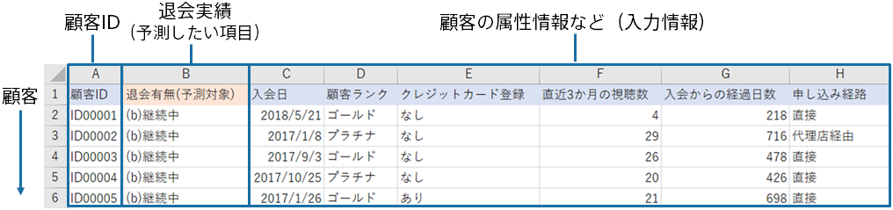

予測分析では、下記のような、顧客データと退会データをまとめた予測モデル作成(学習)用データを用いて、退会を予測する予測モデルを作成します。予測モデルは、予測モデル作成(学習)用データからこういった顧客はコールによって退会する・しないといったことを学習します。
本チュートリアルでは、すでに準備してあるサンプルデータを利用します。

{}

以降のページでは、Prediction One の操作について説明します。
