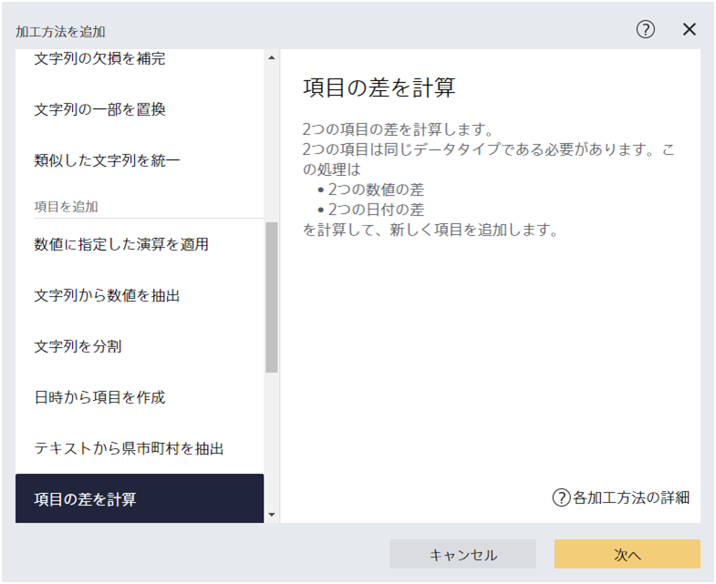
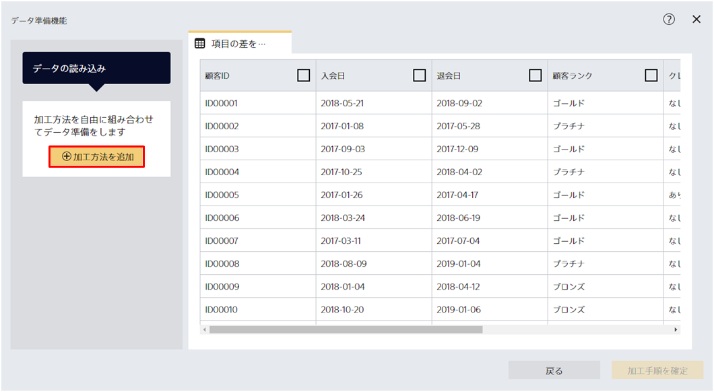
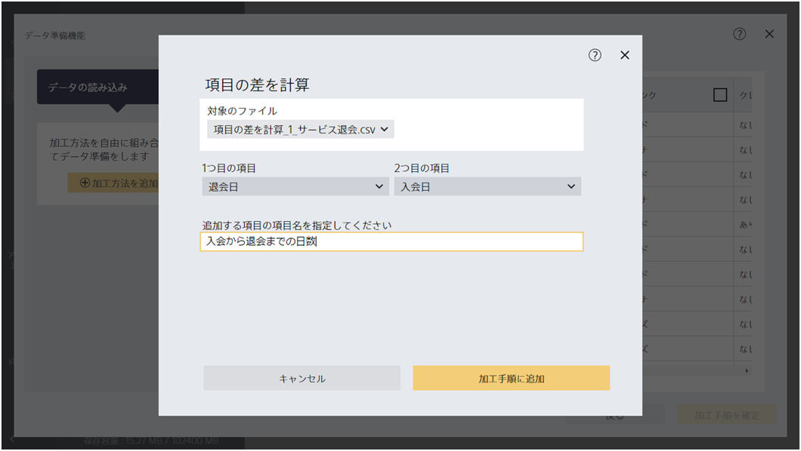
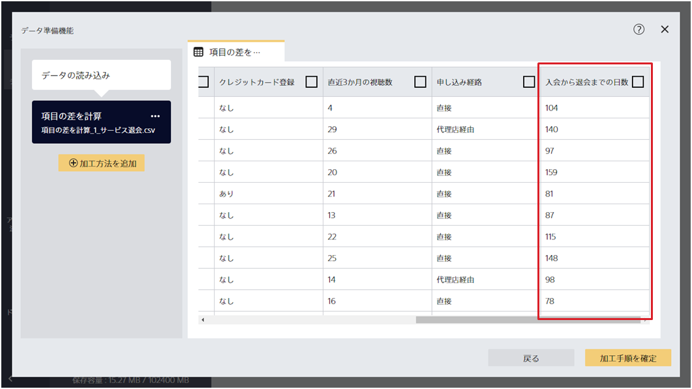
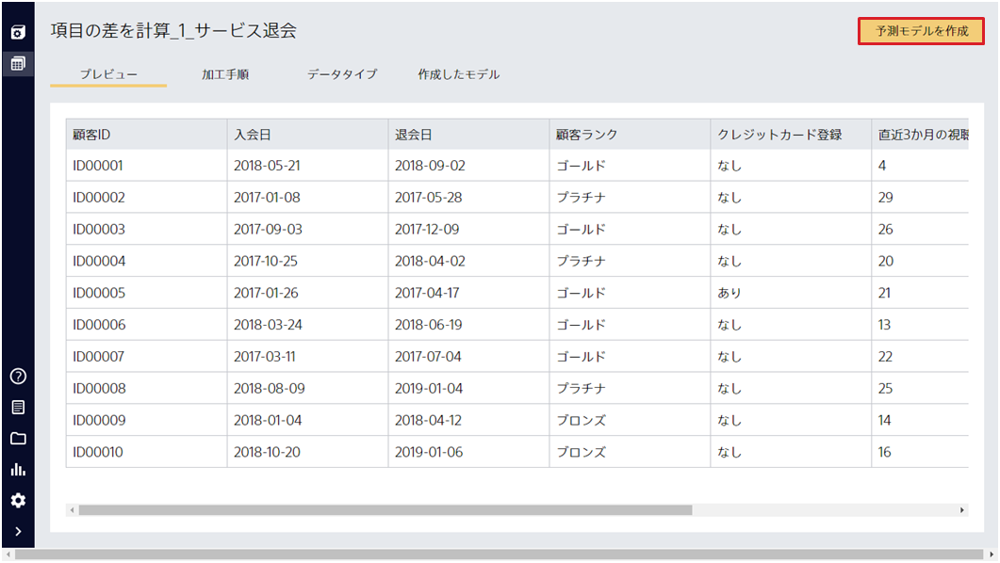
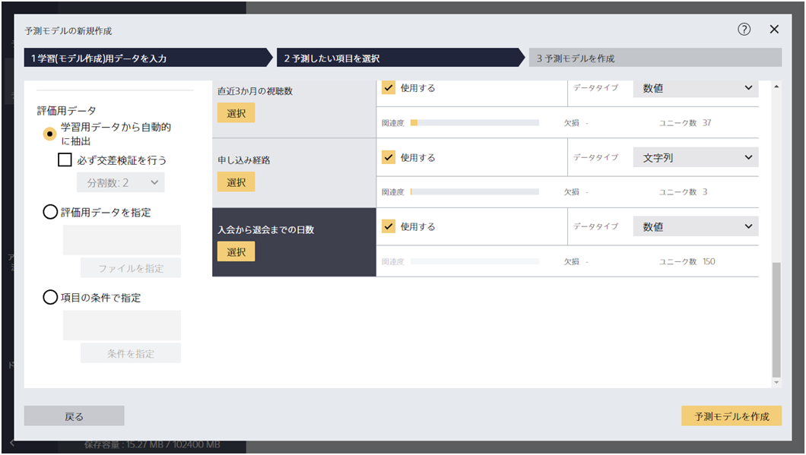

{}

『項目の差分を計算』は、ふたつの数値項目の差やふたつの時間項目の間の日数差を計算する加工ステップです。
この加工を使えば、たとえば以下のようなことができるようになります。

- ①あるサービスのユーザーの 「入会日」と「退会日」の差を予測することで、すぐにサービスを退会する可能性があるユーザーを見つける
- ②機器の最終点検日から何日後に故障が発生するかを予測するために、「最終点検日」と「故障発生日」の差を予測する

{}

ここでは、①を例にして『項目の差分を計算』の使いかたについて説明します。`1_サービス退会.csv`を読み込んでください。

{}

{}

ファイルを読み込んだら加工ステップを追加します。
画面左側の「加工方法を追加」をクリックして、『項目の差分を計算』を選択してください。

{}

{}

項目の差を求めることができるのはデータタイプが時間型と数値型の項目です。
今回は「退会日」と「入会日」を指定して、「加工手順に追加」をクリックしてください。

{}

{}

加工を追加すると、さきほど指定したふたつの項目の日数差を計算した項目が追加されます。
ここではこれ以上は加工ステップを追加しないので、「加工手順を確定」をクリックしてください。

{}

{}

この「入会日から退会日までの日数」を予測したい項目として指定することで、退会までの日数を予測する予測モデルを作成することができます。画面右上の「予測モデルを作成」をクリックすることで、このデータを使って予測モデルを作成することができます。

「入会日から退会日までの日数」を予測したい項目として選択し、予測モデルを作成してください。

※予測モデルを作成する際、 「入会日」と「退会日」は予測に使用する項目として指定しないでください。

{}
