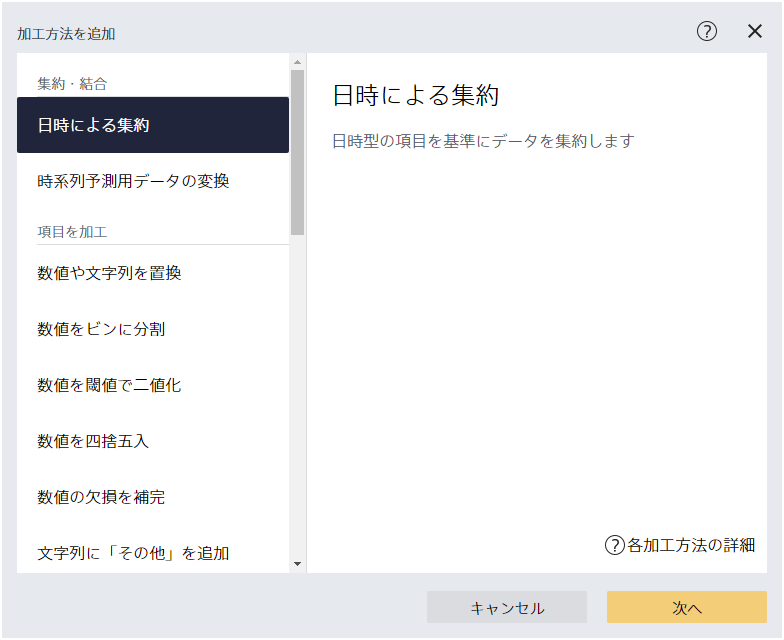
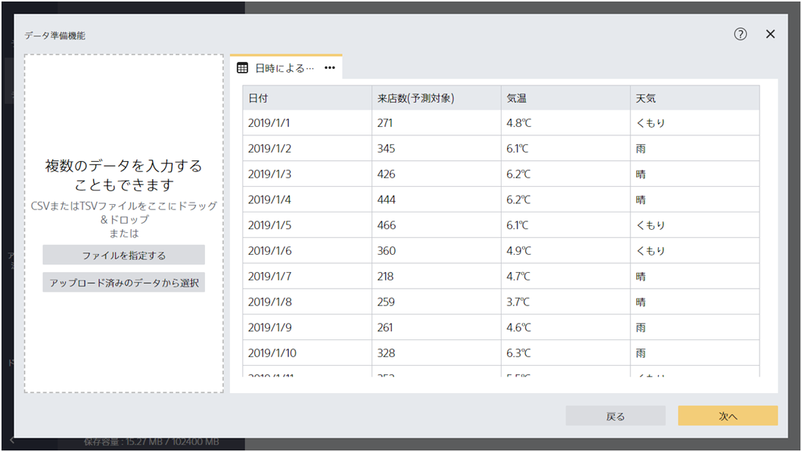
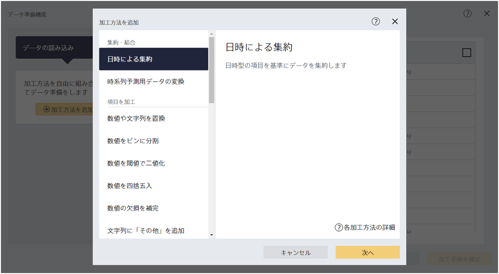
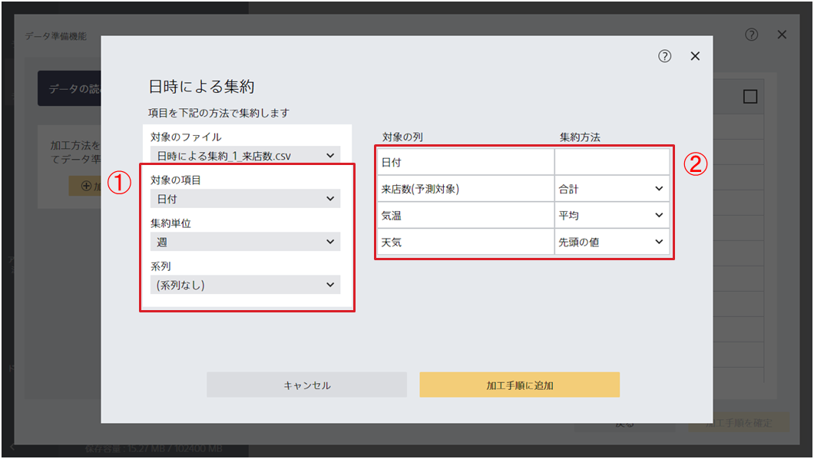
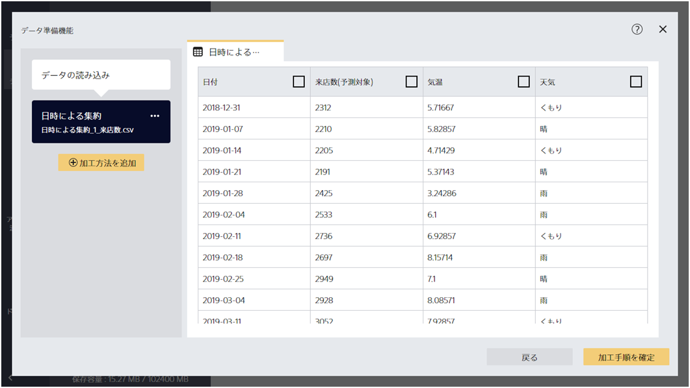
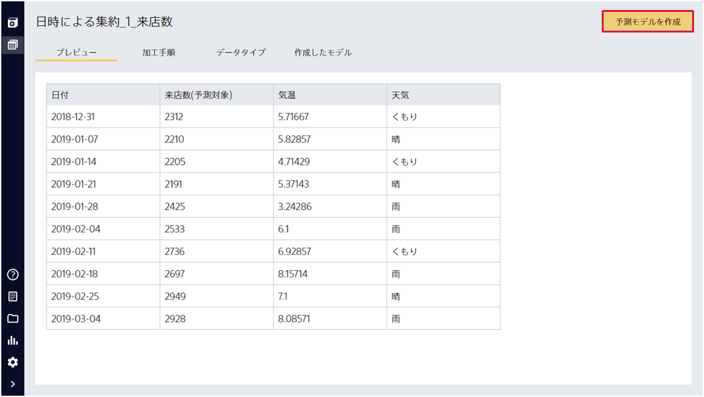
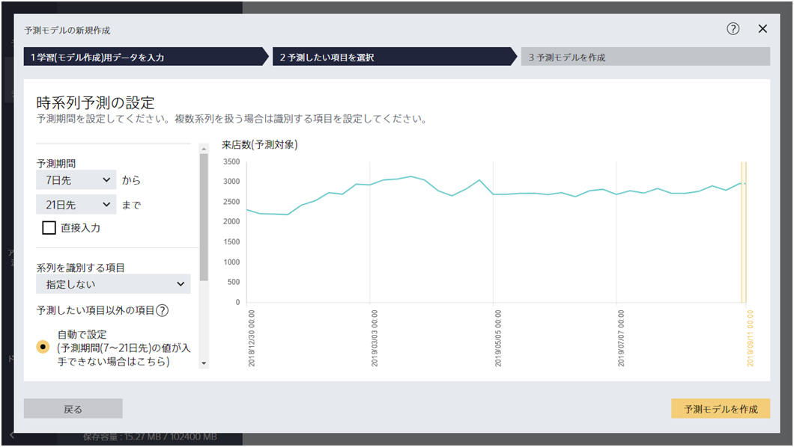

{}

『日時による集約』は、日時項目をもとにファイル全体を集約する加工です。この加工ステップを使えばたとえば

- 日ごとに記録した売上データを週ごとにまとめて、今後数週間の売り上げ推移を予測する
- 出荷数の記録を月次にまとめて、月ごとの出荷数予測をする

{}

ことができるようになります。ここでは、来店数のデータを例として説明します。`1_来店数.csv`を読み込んで「次へ」をクリックしてください。

{}

{}

「加工方法を追加」から『日時による集約』を選択してください。

「加工方法を追加」から『日時による集約』を選択してください。

①では、どの項目を基準にしてデータを集計するかを指定します。
今回は『日付』項目を『週』ごとにまとめるように指定しています。

②は、『日付』項目以外についてどのように集計するかを指定しています。
たとえば、毎週の来店数の合計を計算したい場合は集計方法として『合計』を指定します。

指定が完了したら「加工手順に追加」をクリックしてください。

{}

{}

週ごとに集計されたデータを作成します。プレビューを確認し、**週**ごとの**来店数**の**合計**が計算されていることを確認してください。このようにすることで、週ごとの来店数の合計を予測する予測モデルを作成できるようになります。このまま加工を終了する場合は「加工手順を確定」をクリックしてください。

{}

{}

「予測モデルを作成」をクリックすることで、この加工済みデータを使って予測モデルを作成できます。

時系列予測モードを選択することで、週ごとの来店数を予測することが可能になりました。

{}
