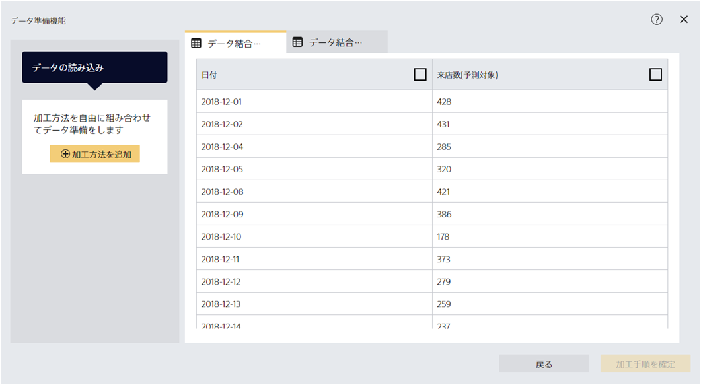

{}

『データ結合』は複数ファイルをひとつにまとめる加工ステップです。ここでは、ふたつのファイルを結合する場合について説明します。

{}

データ準備機能にて、`1_来店数.csv`と`2_天気予報.csv`を選択して読み込んでください。

{}

{}

ファイルを複数読み込んだ場合であっても、右側のプレビューでそれぞれのファイルの中身を確認できます。
これらのデータから予測モデルを作成するためには、ファイルをひとつにまとめる必要があります。
「加工方法を追加」から「データ結合」を選択してください。

{}

{}

データ結合を実行するためには、あらかじめ予測したい項目がどのファイルに含まれているかを指定する必要があります。
今回のデータでは『来店数（予測対象）』を予測したいとします。『来店数（予測対象）』が記録されている『1_来店数.csv』を選択してから「次へ」をクリックしてください。

{}

{}

ここでは、どの項目をつかってファイル間のデータを紐づけるかを指定します。
今回のデータは日付でファイルが紐づいているので、設定を変更する必要はありません。このまま「次へ」をクリックしてください。
{}

{}

さいごに、どのようにデータを集約するか指定します。
データを結合する際には複数行のデータを一行にまとめる必要がある場合があります。その際にどのようにデータを集約するかを指定することができます。

{}

{}

プレビューにて結合後データを確認できます。`1_来店数.csv`と`2_天気予報.csv`をひとつのファイルにまとめることができました。
{}