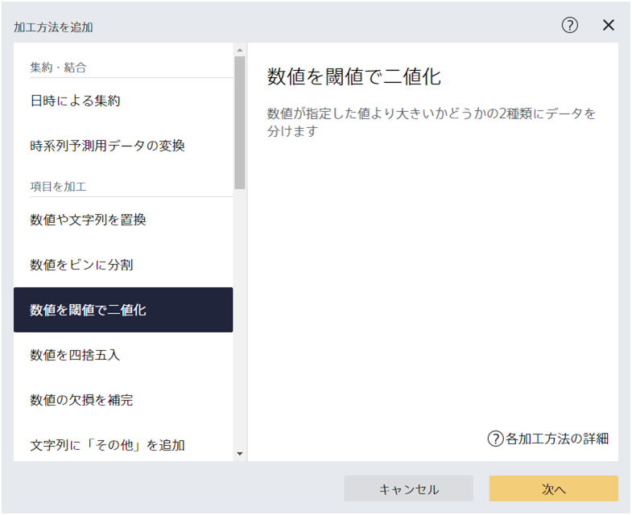
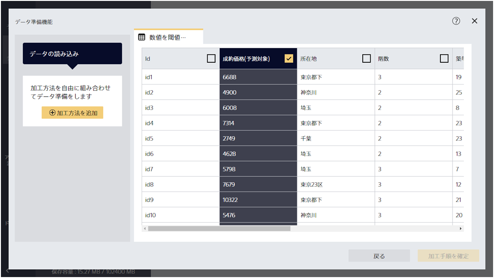
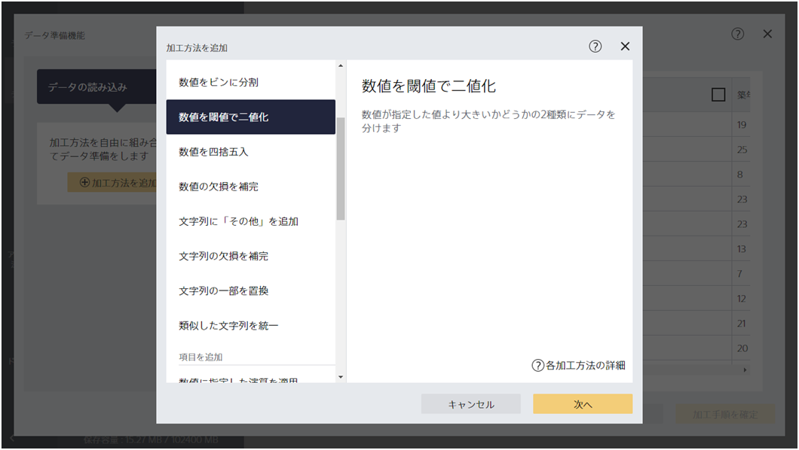
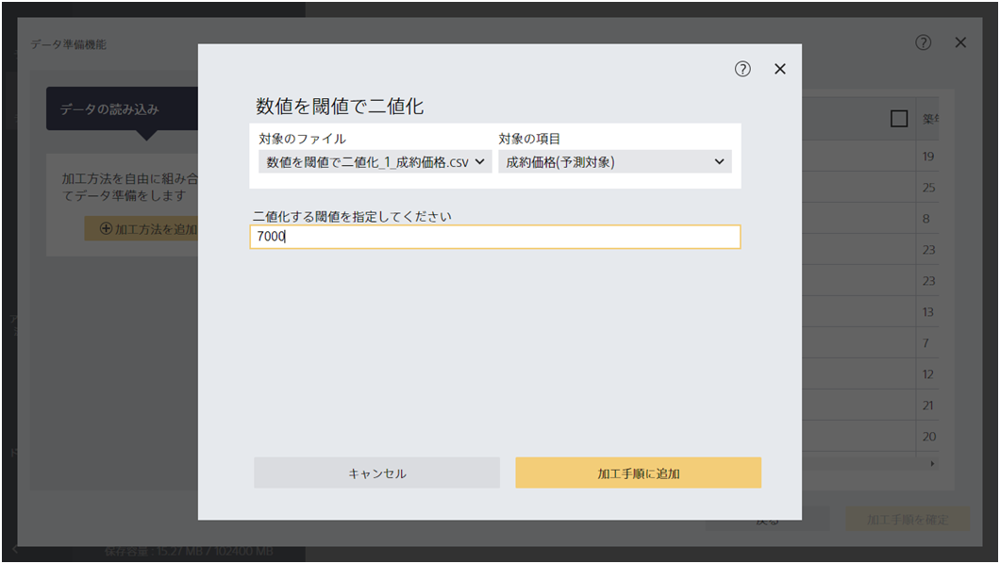
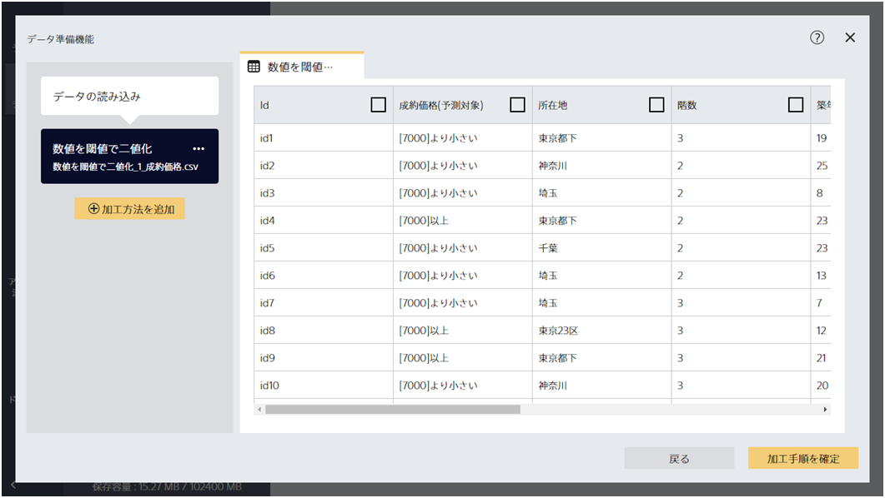

{}

『数値を閾値で二値化』の加工ステップは、数値項目を指定した数値以上か未満かのフラグを作成します。
数値にはずれ値が含まれていたり非常に広い範囲に広がっている場合、数値予測で正確に数値を予測するのが難しいケースがあります。この加工ステップを使って数値を二値化することで、数値項目を使って二値分類をすることができるようになります。

{}

ここでは、不動産の成約価格予測を、二値分類問題として実行してみます。`1_成約価格.csv`を読み込んでください。

{}

{}

『成約価格(予測対象)』がある価格以上であるかどうかを判定するために、『数値を閾値で二値化』を適用します。

ここでは『成約価格(予測対象)』が「7000」以上か未満かの二値分類をしたいとします。二値化する閾値として「7000」を指定して「加工手順に追加」をクリックしてください。

{}

{}

『成約価格(予測対象)』が「7000」以上か未満かが記録された項目が作成されました。
この項目を予測したい項目として設定することで、成約価格予測問題を二値分類問題として解くことができるようになります。
{}