
時系列予測を実行できる形式に変換する機能はデスクトップとクラウドそれぞれで操作が異なる箇所があります。


## デスクトップ版

{}

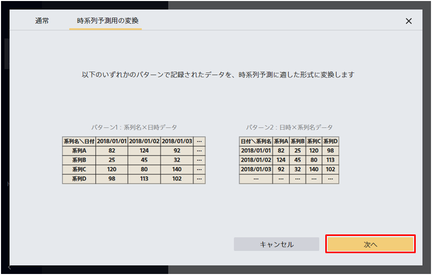

データ準備機能では時系列予測を行うための変換機能を用意しています。
この機能は、特定のフォーマットで記録されているデータを時系列予測ができるように変換する機能です。

{}

{}
『時系列予測用の変換』では、以下のようなフォーマットのファイルを時系列予測が可能なフォーマットに変換します。
これらのファイルは必ず「日時」「系列名」「予測したい数値」で構成されている必要があります。
また、系列の数は20個以下である必要があります。

  
  日時項目として読み取るためには、日付や時刻を特定のフォーマットにする必要があります。
  Prediction Oneで対応している日時フォーマットについては{}をご確認ください。
  

{}

{}
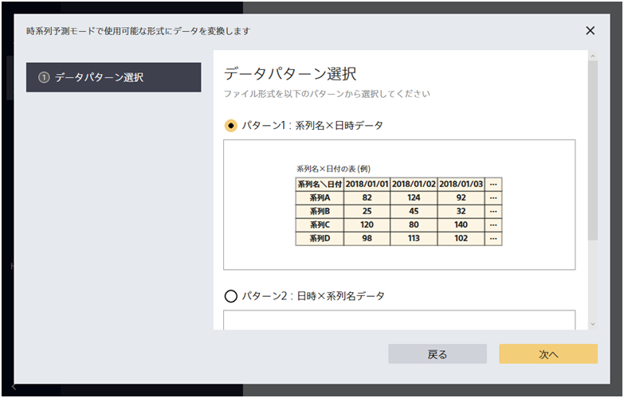

はじめに、手元にあるファイルがどのフォーマットに当てはまるかを確認し、該当するパターンを選択してください。

{}

系列名ｘ日時データのサンプルデータとして「`系列名x日時データ.csv`」を用意しました。
このファイルには複数の製品の月ごとの出荷数が記録されています。
このファイルを用いて、来月以降の出荷数を予測する時系列予測モデルを作成してみましょう。
{}

{}
ここでは**パターン１：系列名ｘ日時データを選択**したものとします。
ファイルをドラッグ＆ドロップで入力してください。

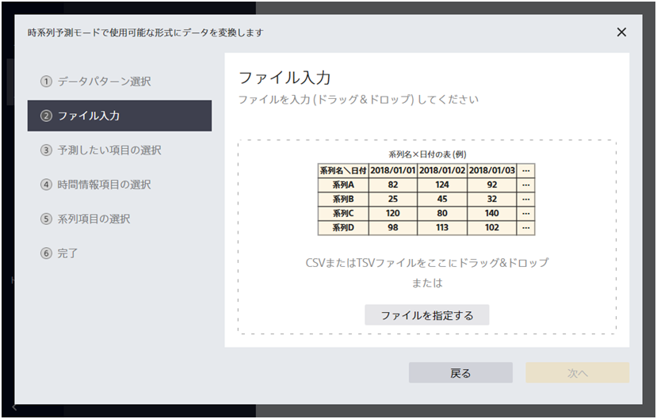

ファイルの読み込みに成功すると、「次へ」がクリックできるようになります。「次へ」をクリックしてください。

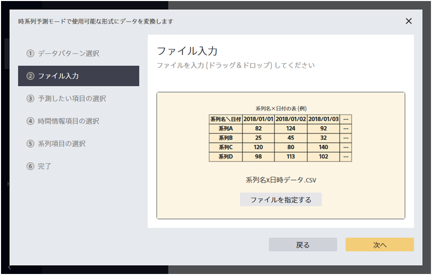

{}

{}
ファイル入力後、「予測したい項目」「日時が記録された項目」「系列項目」を選択してください。
サンプルデータのような出荷数予測をするデータの場合は

- 予測したい項目：予測対象（出荷数が記録された列）
- 時間情報項目：日付
- 系列項目：系列名

となります。

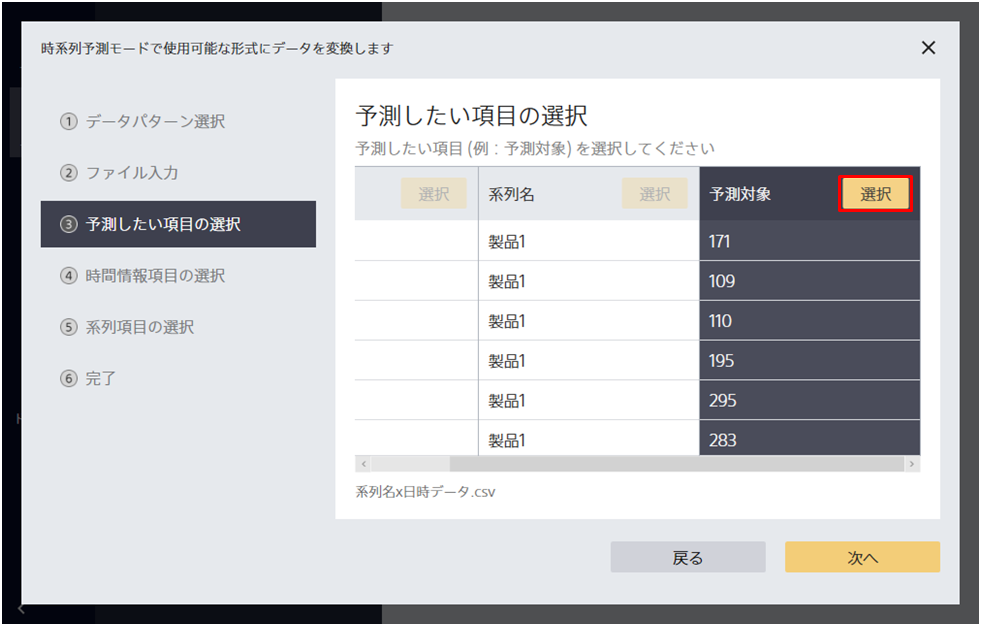

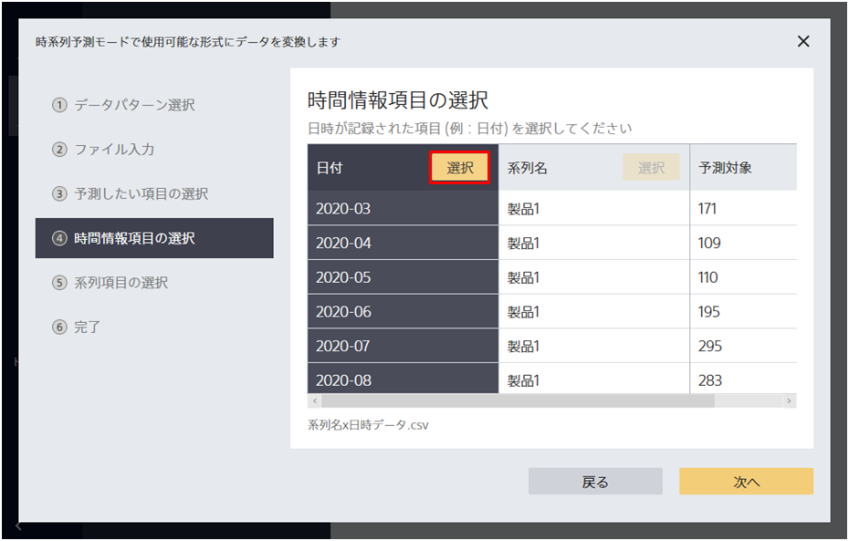

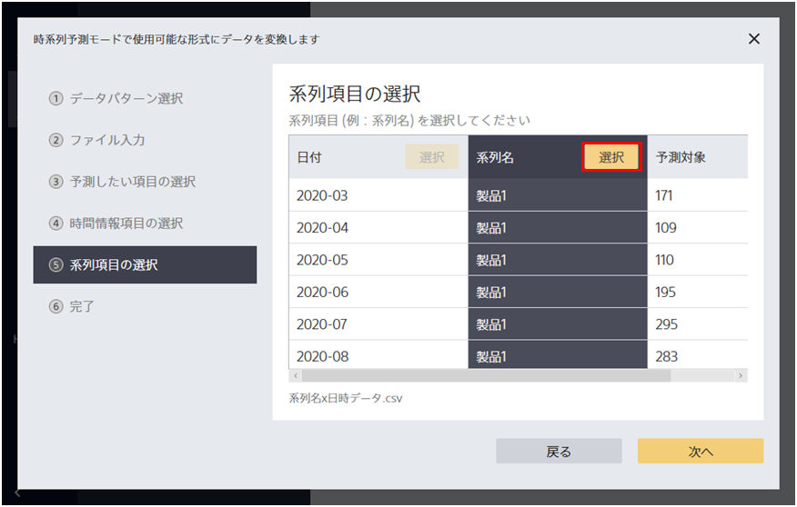

さいごに「次へ」をクリックすることでデータの変換が完了します。

{}

{}
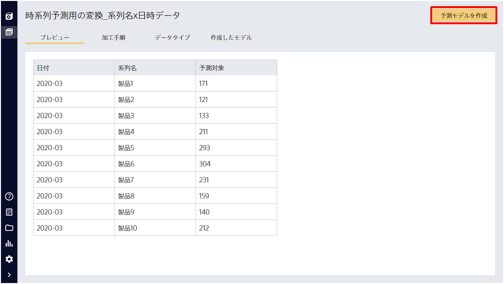

作成されたデータから時系列予測を実行するには「予測モデルを作成」をクリックしてください。
あとは、通常のデータと同じ手順で時系列予測モデルを作成できます。

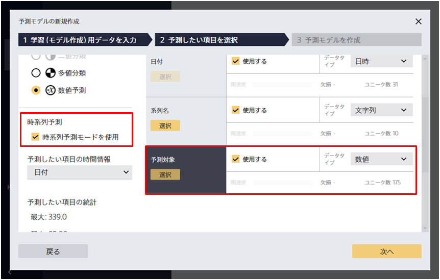

「時系列予測モードを使用」にチェックを入れて、

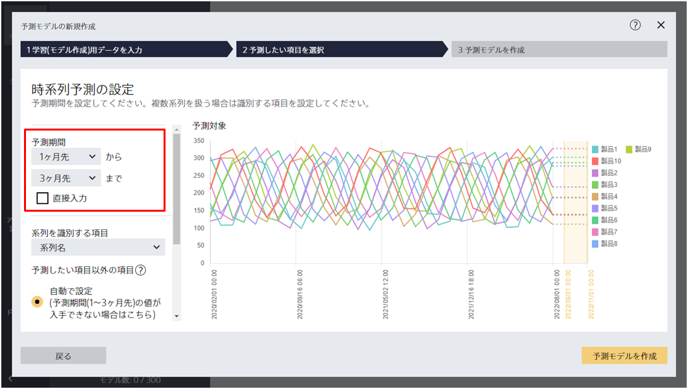

予測期間を指定した上で予測モデルを作成してください。
{}

## クラウド版

{}
『時系列予測用の変換』では、以下のようなフォーマットのファイルを時系列予測が可能なフォーマットに変換します。
これらのファイルは必ず「日時」「系列名」「予測したい数値」で構成されている必要があります。
また、系列の数は200個以下である必要があります。

  
  日時項目として読み取るためには、日付や時刻を特定のフォーマットにする必要があります。
  Prediction Oneで対応している日時フォーマットについては{}をご確認ください。
  

{}

{}
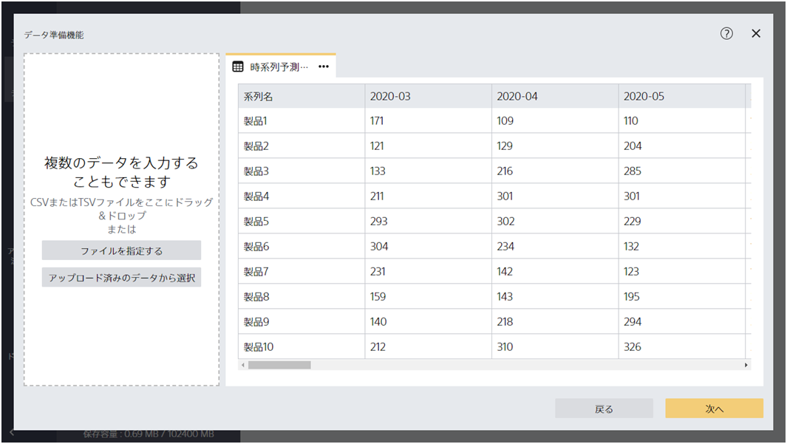

はじめに、使用するファイルをクラウドにアップロードしてください。
{}

{}
ファイルをアップロードしてデータ準備機能を開始してください。

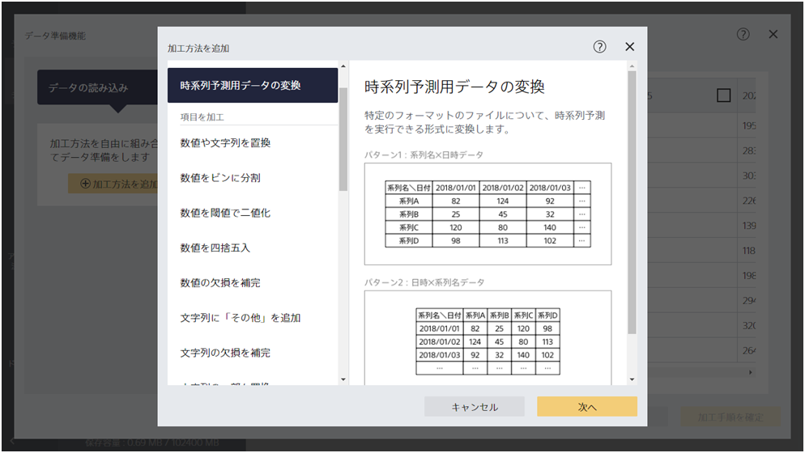

ファイルのフォーマットに問題がない場合は「加工手順に追加」をクリックできるようになります。

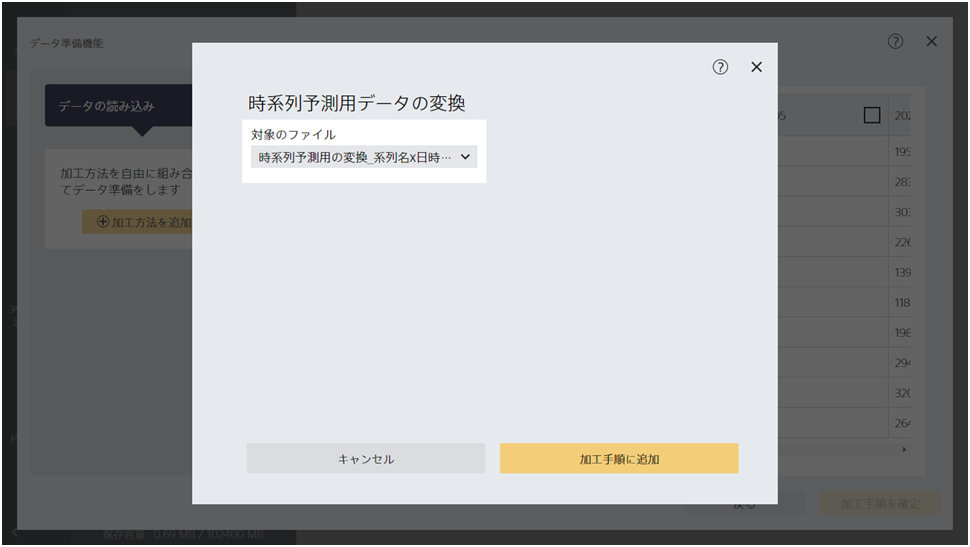

「加工手順に追加」をすると、時系列予測用に変換されたファイルが表示されます。
そのまま「加工手順を確定」をクリックしてください。
これで時系列予測用のファイル変換作業は完了しました。

{}

{}

作成されたデータから時系列予測を実行するには「予測モデルを作成」をクリックしてください。
あとは、通常のデータと同じ手順で時系列予測モデルを作成できます。

「時系列予測モードを使用」にチェックを入れて、

予測期間を指定した上で予測モデルを作成してください。
{}

