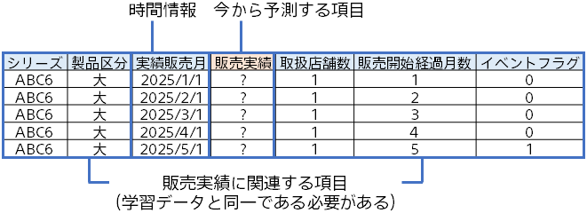
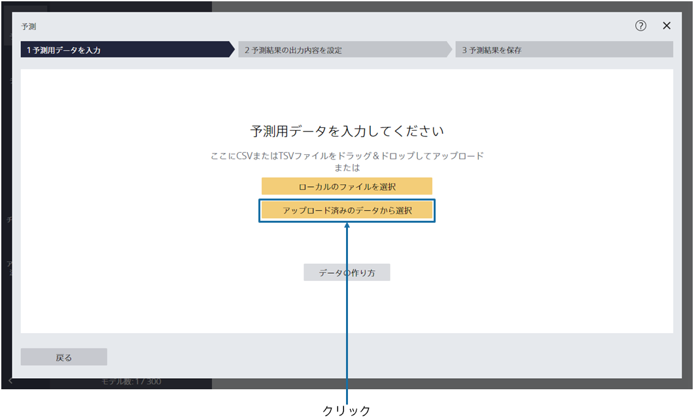
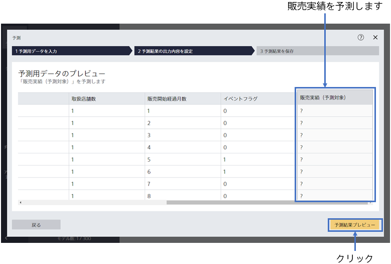
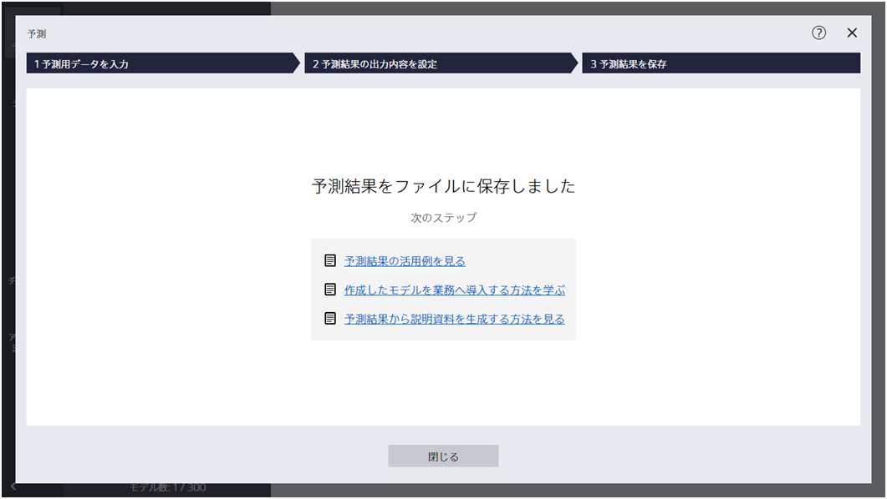
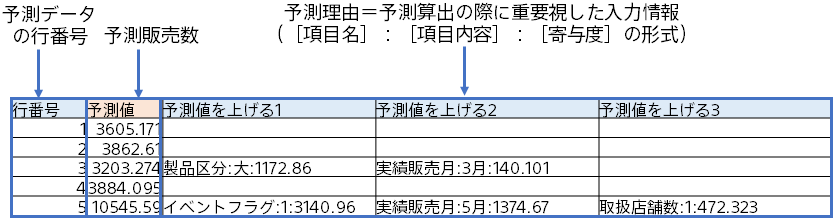

{}

この画面にて、予測用データを指定します。今回のチュートリアルで使用する予測用データの内容を確認しましょう。
{}

{}
作成した予測モデルを利用して、新商品の販売数を予測します。 本チュートリアルでは、事前に準備した、予測用のサンプルデータを利用します。 以下の通り、予測したい商品の情報が書かれています。

{}
{}

{}

予測用データである`2_新商品需要予測（予測用）.csv` を指定してください。 
{}
データはウィンドウへのドラッグ&ドロップか 「ファイルを指定する」で読み込むことができます。 
{}
{}
サンプルデータは、「アップロード済みのデータから選択」をクリックし、「サンプル」タブのデータ一覧から選択してください。
{}

{}
{}

{}

予測用データのプレビューが表示されます。 
今から「？」と表示されている「販売実績（予測対象）」を予測します。 
{}
「予測結果プレビュー」をクリックしてください。
{}
{}
「予測結果プレビュー」をクリックしてください。予測結果のプレビュー画面が表示されるまで、しばらくお待ちください。
{}
{}

{}

「以下の項目を左端に追加する」にて「行番号」を指定してください。 
{}
「予測して保存」をクリックしてください。 各行ごとに予測を行い、その結果を保存します。

「予測して保存」をクリックした後、名前を付けて保存するダイアログが表示されます。 ファイル名を指定して予測結果を保存してください。
{}
{}
「予測結果を保存」をクリックし、「ファイル名」を入力し、「保存」をクリックしてください。
{}
{}

{}
予測が完了すると以下の画面が表示され、指定したファイルに予測結果が保存されています。

予測結果は以下のような形式で出力されます（オプション設定によっては違う形式になります）。 
予測データの各行に入力した新商品の条件に対して、販売台数が予測されています。

{}
