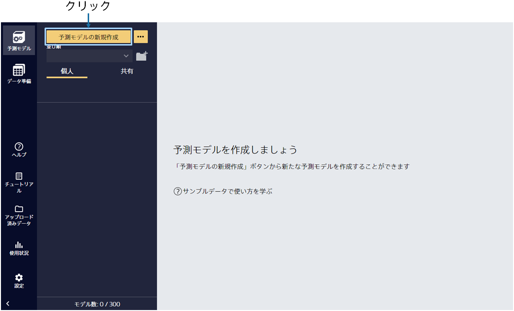
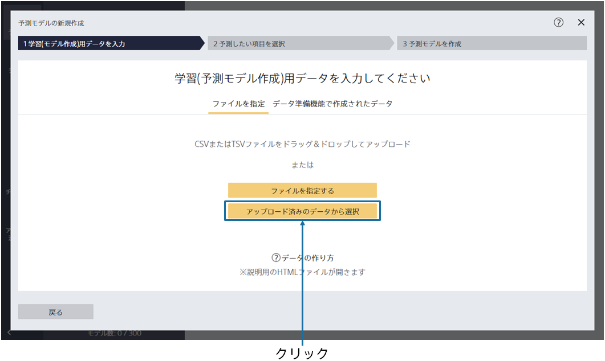
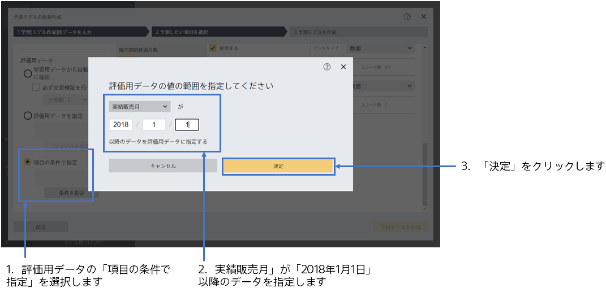
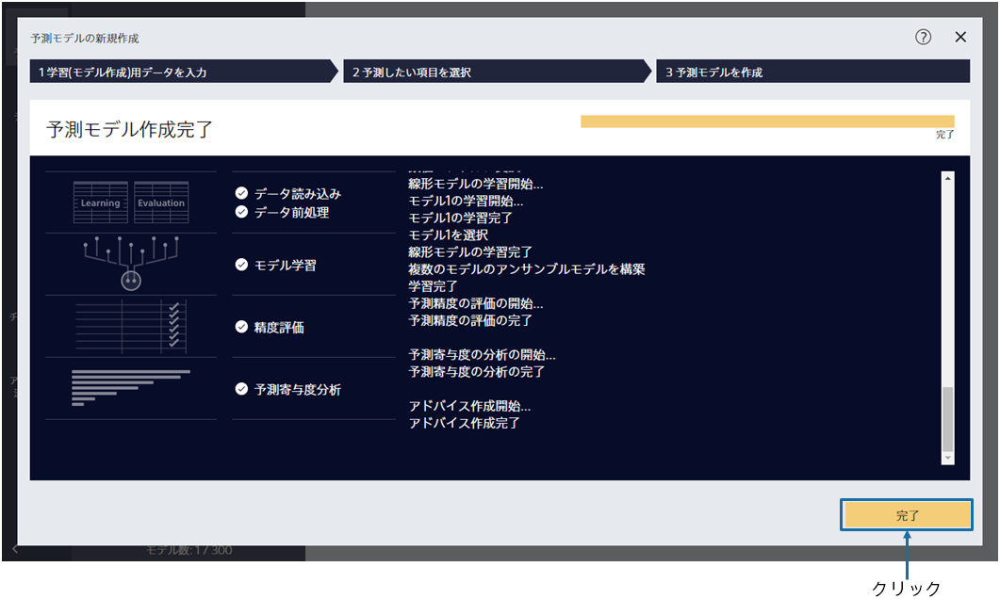

{}

メイン画面が表示されますが、まだ予測モデルは作成されていないので、空の状態です。「予測モデルの新規作成」をクリックしてください。
{}

{}

予測モデル作成(学習)用データである `1_新商品需要予測.csv` を指定してください。 
{}
データはウィンドウへのドラッグ&ドロップか 「ファイルを指定する」で読み込むことができます。
{}
{}
サンプルデータは、「アップロード済みのデータから選択」をクリックし、「サンプル」タブのデータ一覧から選択してください。
{}
{}
{}

{}

データ読み込みが完了すると、この画面が表示されます。 
予測したい項目を １つ選択してください。 このチュートリアルでは、「販売実績（予測対象）」という項目を選択してください。 
このまま「次へ」をクリックすると、評価用データを学習データ内から自動的に抽出してのモデル作成となります。その場合、今回のケースでは未来のデータで過去の数字を当てに行くような動きとなってしまうため、直近のデータを評価用データとして指定します。 
「詳細設定」をクリックしてください。

{}

{}

評価用データから「項目の条件で指定」を選択し、評価用データの値の範囲を指定します。 
このチュートリアルでは、「実績販売月」が「2018年1月1日」以降のデータを評価用データに指定してください。指定後、決定ボタンをクリックし、予測モデルを作成します。指定後、決定ボタンをクリックし、予測モデルを作成します。

{}

{}

学習が開始されますので、完了までお待ちください。前処理 → 予測モデル学習 → 精度評価→予測寄与度分析の処理が実行されます。 
待ち時間の見積もりが上部に表示されます。データ量が多いほど時間がかかります。 
学習完了後、完了ボタンをクリックしてください。 
{}
