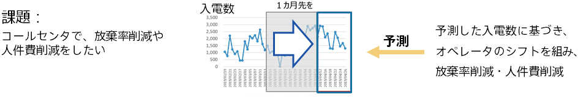

### Introduction: 

The operation of a call center requires the accurate planning of the number of operators deployed over a period of one month or more in advance.

- If the number of operators is too small compared to the number of incoming calls, incoming calls will be increasingly abandoned and the quality of customer service will decrease.
- If there are too many operators for the number of incoming calls, labor costs will be more than necessary. Therefore, it is important to accurately estimate the number of incoming calls for a future period.

Using predictive analytics, you can predict the number of incoming calls with high accuracy.

- The accuracy is often better than when the person in charge predicts with experience and intuition while looking at the data.
- If the person in charge of the prediction changes, the prediction accuracy may decrease until the newly appointed person in charge becomes accustomed to it, but predictive analytics is automatically calculated from the data, so there is no adjustment period

