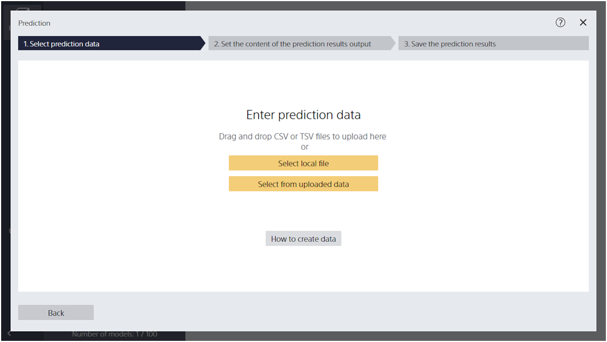
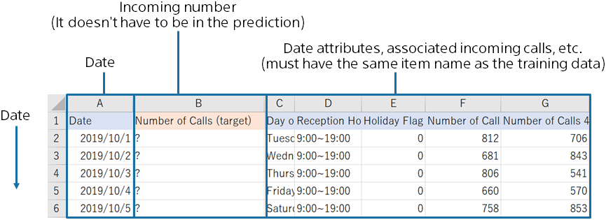
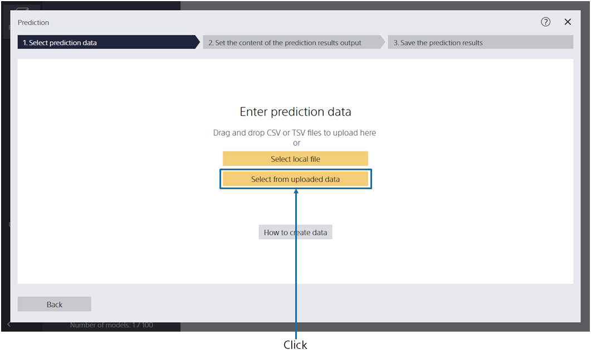
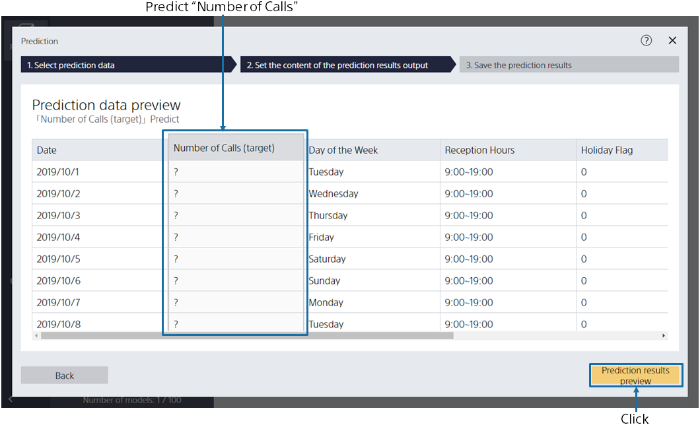
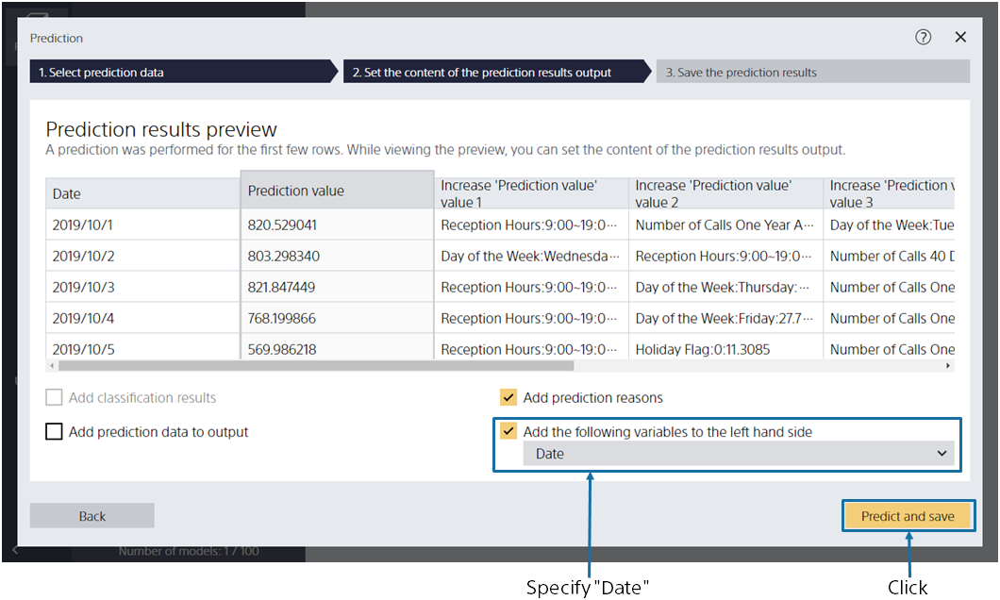
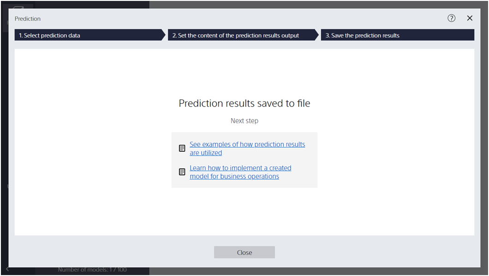
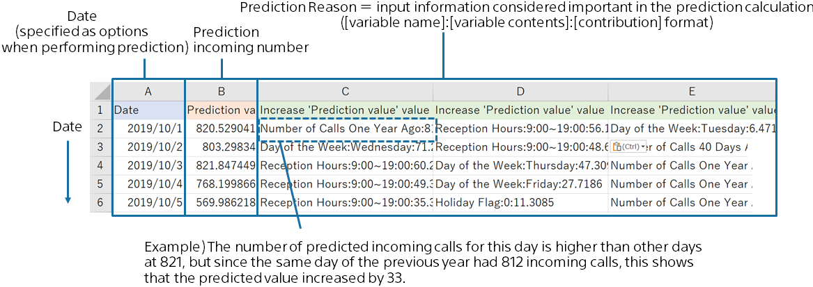

{}

Select the prediction dataset on this screen. Let's review the prediction data used in this tutorial.
{}

{}

Using the prediction model you created, you predict the number of incoming calls for all 31 days in October.
In this tutorial, you will use sample data that has been prepared for prediction.
Here's the period you want to predict (10/1 to 10/31):

{}
{}

{}

Specify the prediction data `2_入電数（予測用）.csv` here. 
{}
You can import data by dragging and dropping it into the window or by [Select a File]. 
{}
{}
Click [Select from Uploaded Data] and select the sample data from the data list on the [Samples] tab.
{}

{}
{}

{}

The prediction dataset preview is displayed.
Predict "Number of Calls (target)" displayed as "?"  from information such as "Day of the week" and "Reception time".
{}
Click [Result Preview].
{}
{}
Click [Run Prediction]. Wait a while until the preview screen of the prediction result is displayed.
{}
{}

{}

{}
Please specify "Date" in [Add the following variables to the first column].

Click [Predict and Save].
Make a prediction for each row and save the results.

After clicking [Predict and Save], the Save As dialog appears.
Specify a file name and save the prediction result.
{}
{}
Please specify "Date" in [Add the following variables to the first column].
Click [Save Prediction Results], enter "File name" and click [Save].
{}
{}

{}
When the prediction is complete, the following screen is displayed and the prediction results are saved in the specified file.

Predicted results are output in the following format (this format may vary depending on the option settings).
The predicted number of incoming calls is calculated for each date.

{}
