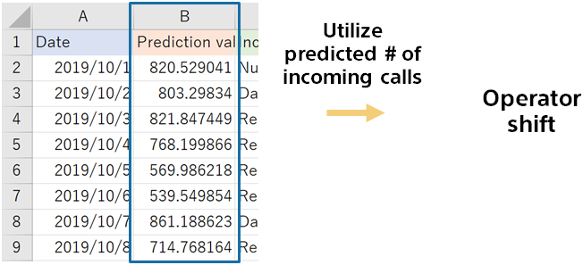

{}

Next month (in this example, 2019/10/1 to 2019/10/31), you can predict the number of incoming calls for each day.
You decide the number of operators on this basis.

Compare the calculated prediction with the previous method to see if it is accurate.
{}
