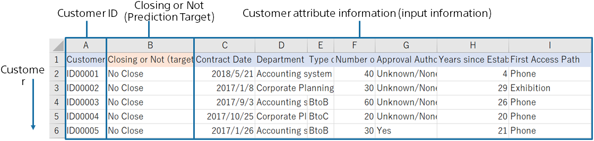

With predictive analytics, a prediction model for predicting contract closing is created using the following data for creating a prediction model (training), which combines customer data and sales performance.
The prediction model trains with the data for creating a prediction model (training) that these customers will or will not conclude a contract.
This tutorial uses sample datasets that were prepared.

{}

The following pages describe how Prediction One operates.
