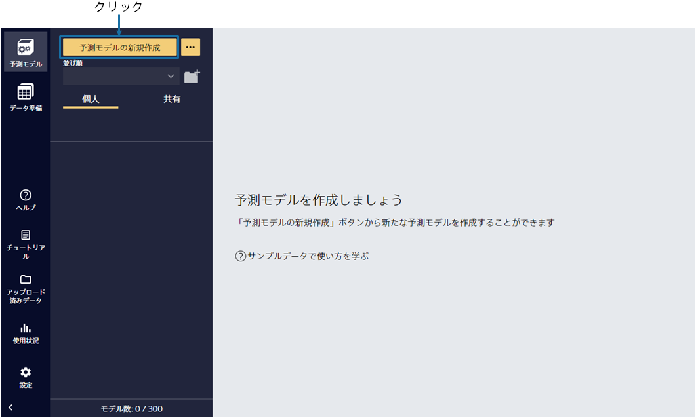
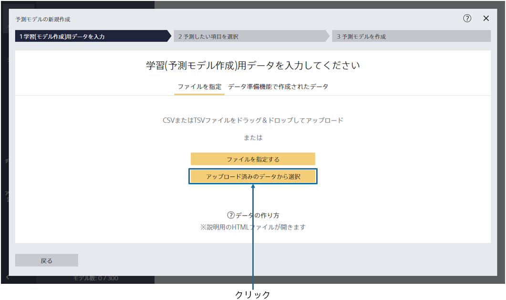
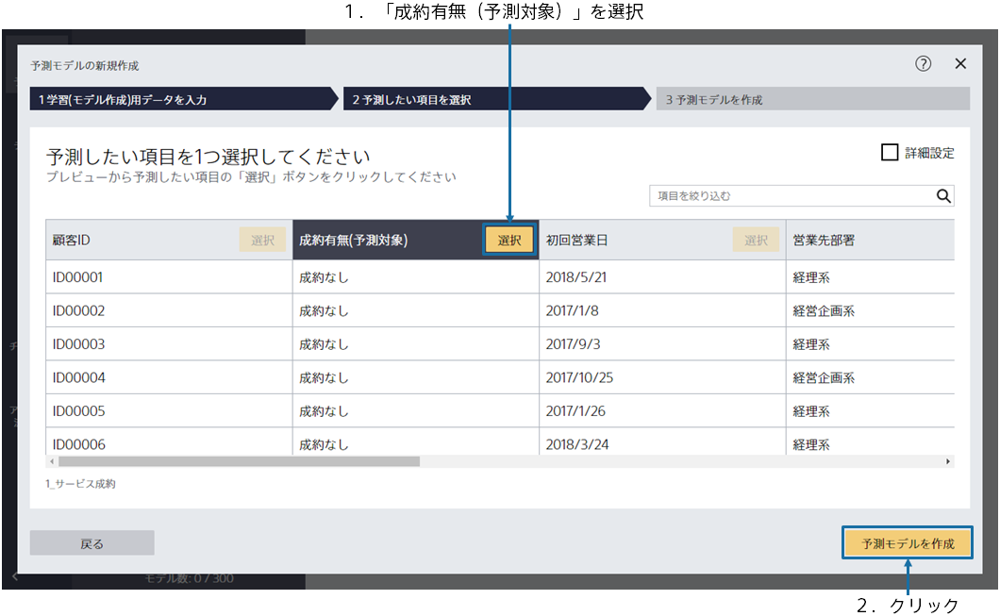
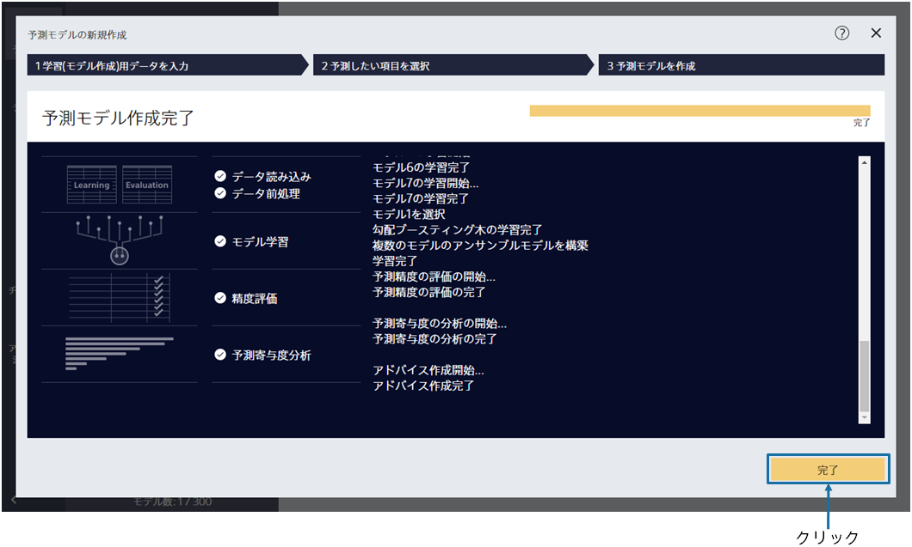

{}

メイン画面が表示されますが、まだ予測モデルは作成されていないので、空の状態です。「予測モデルの新規作成」をクリックしてください。
{}

{}

予測モデル作成(学習)用データである`1_サービス成約.csv`を指定してください。 
{}
データはウィンドウへのドラッグ&ドロップか 「ファイルを指定する」で読み込むことができます。 
{}
{}
サンプルデータは、「アップロード済みのデータから選択」をクリックし、「サンプル」タブのデータ一覧から選択してください。
{}

{}
{}

{}

データ読み込みが完了すると、この画面が表示されます。 
予測したい項目を 1 つ選択してください。(このチュートリアルでは、「成約有無(予測対象)」という項目を選択してください)選択後、「予測モデルを作成」ボタンをクリックしてください。 
{}

{}

学習が開始されますので、完了までお待ちください。前処理 → 予測モデル学習 → 精度評価 → 予測寄与度分析の４つの処理が実行されます。 
待ち時間の見積もりが上部に表示されます。データ量が多いほど時間がかかります。 
学習完了後、完了ボタンをクリックしてください。 
{}
