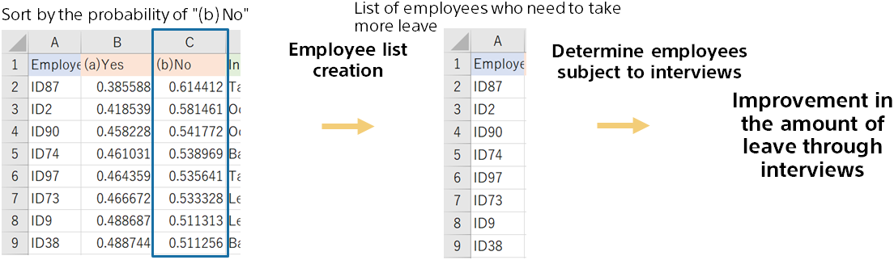

{}

Sorts the file of predicted results in order of the probability of the target not being achieved.
After sorting, the top 20 employees are selected to make a list of employees with a low percentage of taking a vacation.
(After that, provide a list to the person in charge of the interview.)

There may be a difference in the type of employee in the reason for the prediction. It may be reflected in the interview content.
{}
