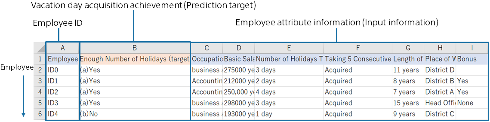

In predictive analytics, using data for creating a prediction model (training) that combines employee data and vacation acquisition achievement data as follows
enables you to create a prediction model for vacation day acquisition achievement. The prediction model trains with the data for creating a prediction model (training) whether these employees are likely to take a vacation or not.
This tutorial uses sample datasets that were prepared.

{}

The following pages describe how Prediction One operates.
