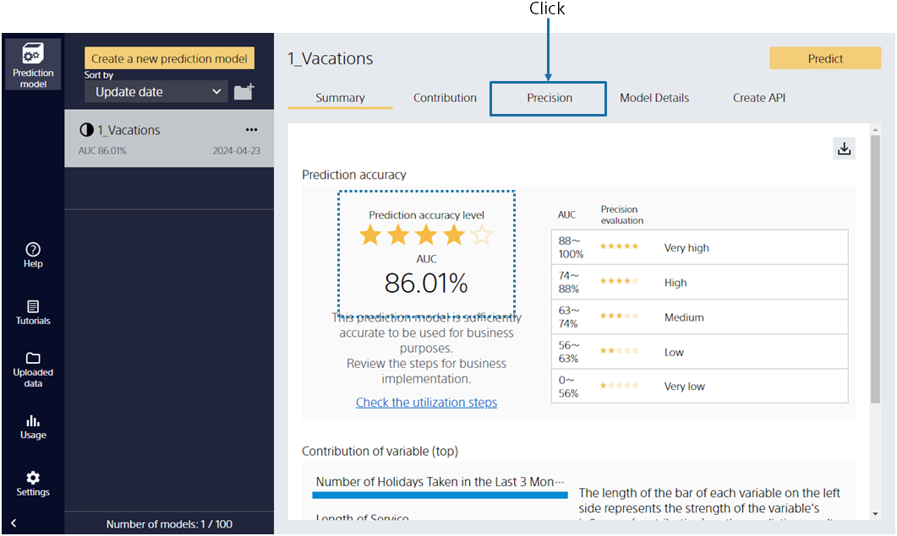
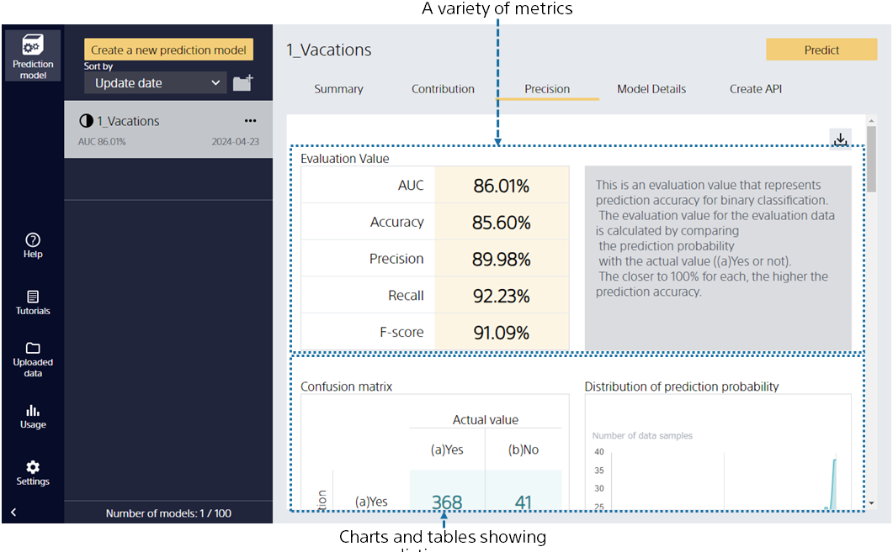
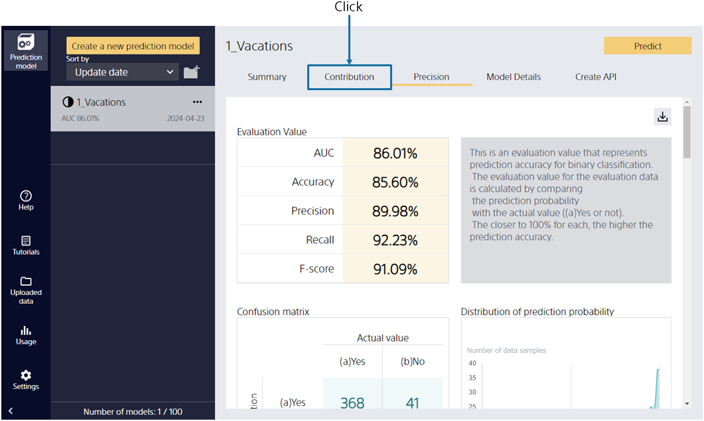
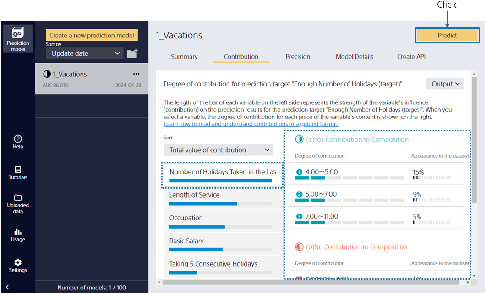

{}

After training with the prediction model, it automatically evaluates the prediction accuracy. This screen provides a summary of the model evaluation.

The prediction accuracy is calculated by comparing the actual results with the predicted results of the prediction model that is created.
We found that we can predict the vacation acquisition achievement with good accuracy from the number of stars at the prediction accuracy level!
{}

{}

Select "Evaluation" to see a more detailed evaluation.
Evaluated values of prediction accuracy from various perspectives and tables and graphs of prediction accuracy are generated. You can scroll down to browse.
{}

{}

We found that the prediction accuracy is high. So why is the prediction accuracy high?
Click [Understanding].
{}

{}

In the vacation acquisition prediction,
"Number of vacations taken in the last 3 months" is valid, and from the information on the right side,
it is easy to achieve if the acquisition number is large.

You can check if it matches your intuition.
They may also discover unexpected relationships (length of service was more related to the achievement of vacation than expected, etc.).

Then click [Predict].
{}
