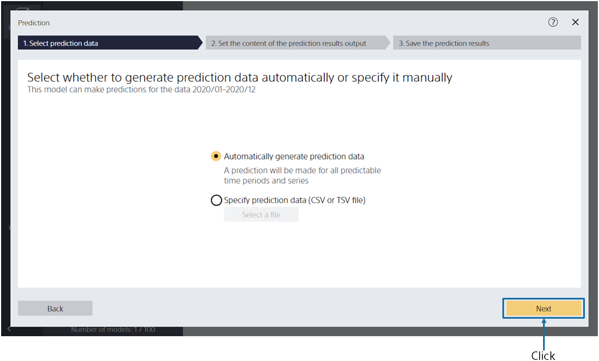
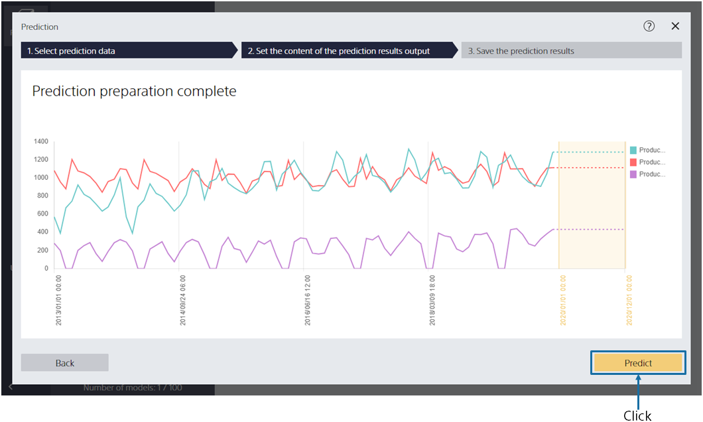
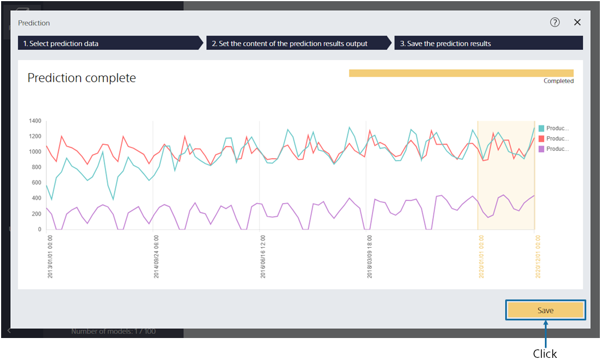
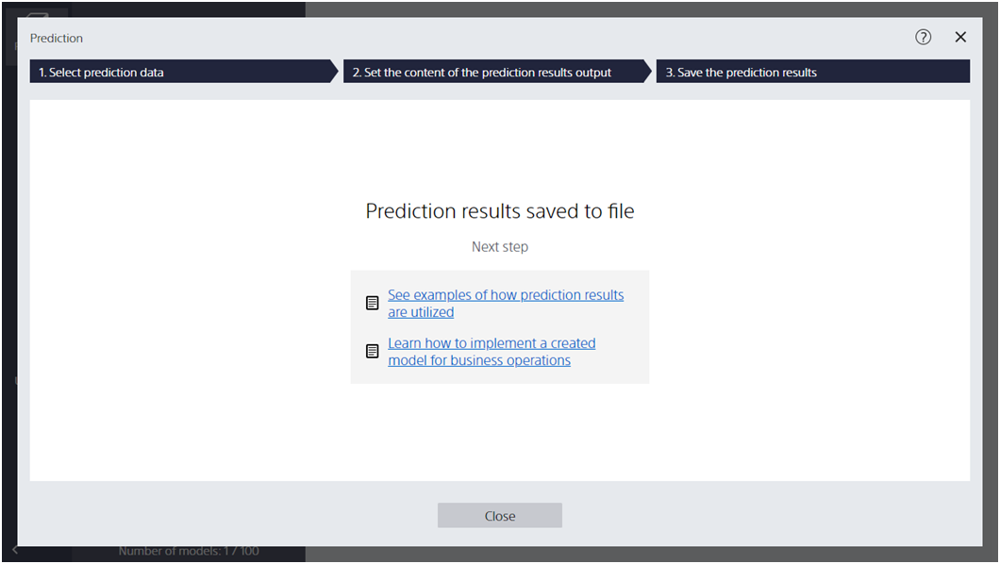
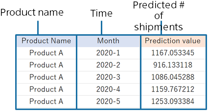

{}

By clicking [Next], you can output the predicted shipments for 2020/01 to 2020/12.

If you create a prediction model from "Year and month (time information)", "Product name (series)", "Number of shipments (target)", alone, as in this case, you do not need to specify the prediction data.
{}

{}

The prediction is ready. Click [Predict].
{}

{}

{}
Click [Save] to save the prediction results.
{}
{}
Click [Save], enter "File name", and click [Save].
{}

---

When the prediction is complete, the following screen is displayed and the prediction results are saved in the specified file.

{}

{}

Predicted results are output in the following format:
The predicted number of shipments is written for each year and month.

{}
