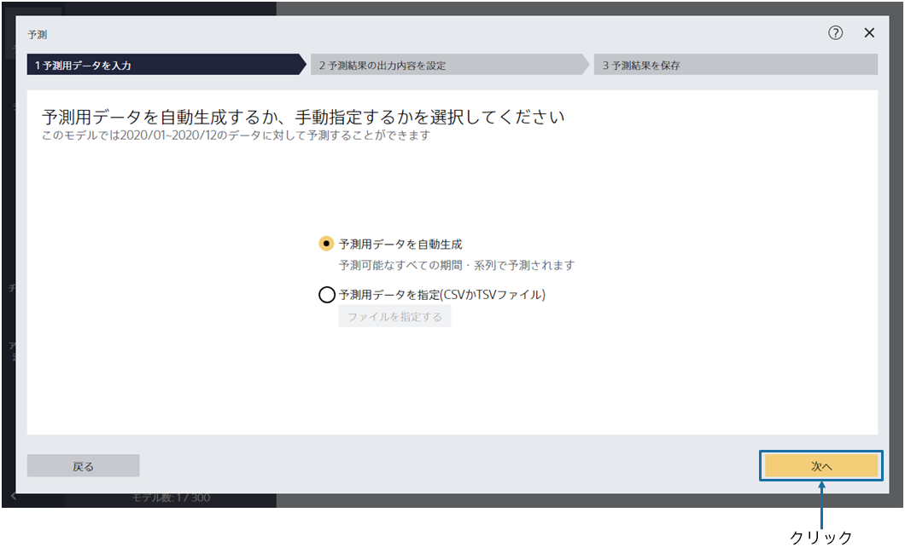
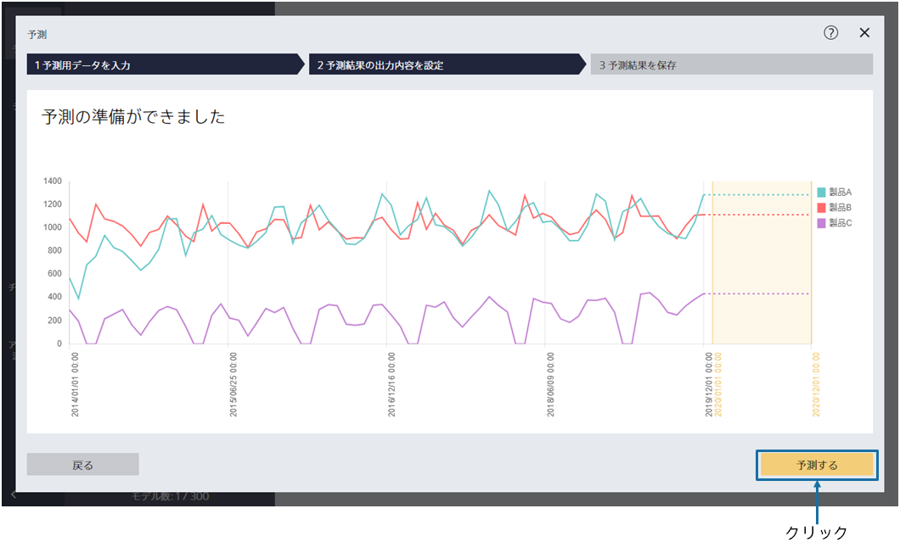
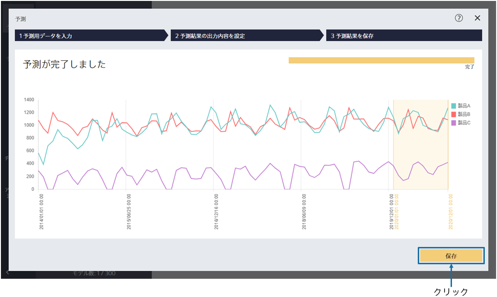
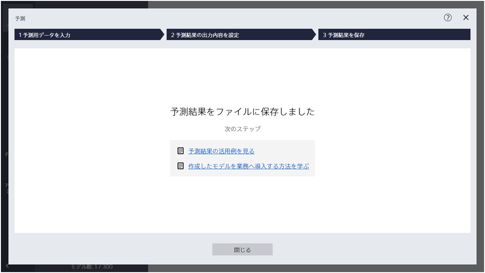
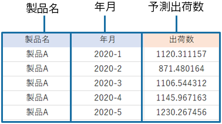

{}

「次へ」をクリックすることで、2020/01 ～ 12 の予測出荷数を出力できます。

今回のように「年月（時間情報）」「製品名（系列）」「出荷数（予測対象）」のみから予測モデルを作成した場合、予測用データを指定する必要はありません。
{}

{}

予測の準備ができました。「予測する」をクリックしてください。
{}

{}

{}
「保存」をクリックして予測結果を保存してください。
{}
{}
「保存」をクリックし、「ファイル名」を入力し、「保存」をクリックしてください。
{}

---

予測が完了すると以下の画面が表示され、指定したファイルに予測結果が保存されています。

{}

{}

予測結果は以下のような形式で出力されます。
各年月に対して、予測出荷数が書かれています。

{}
