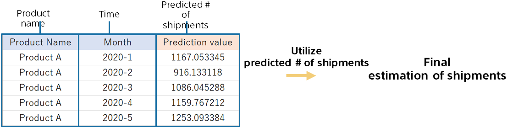

{}

We were able to predict the number of shipments from 2020/01 to 2020/12.
Based on this, adjustments can be made as necessary to estimate final shipments.

Compare the calculated prediction with the previous method to see if it is accurate. Before using it in earnest, compare the prediction accuracy with the estimation based on experience and intuition to confirm the accuracy.
{}
