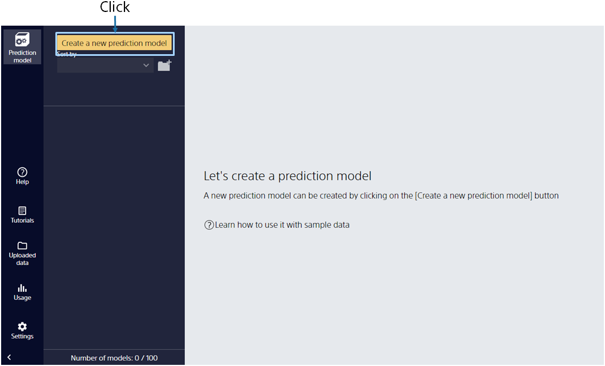
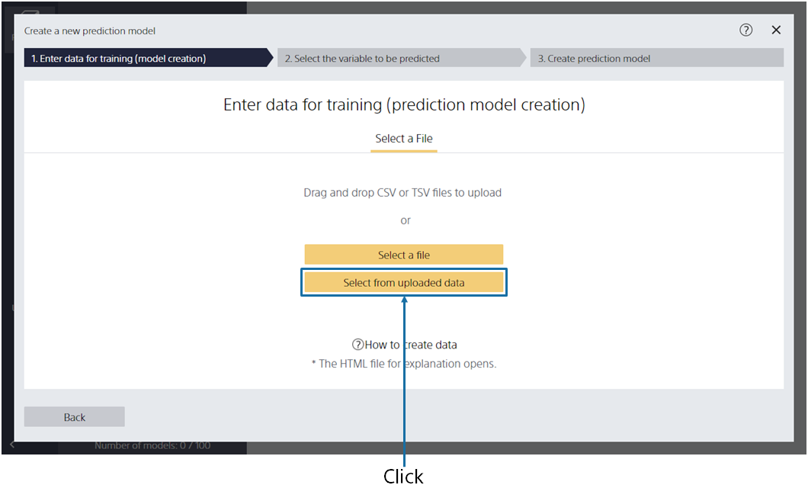
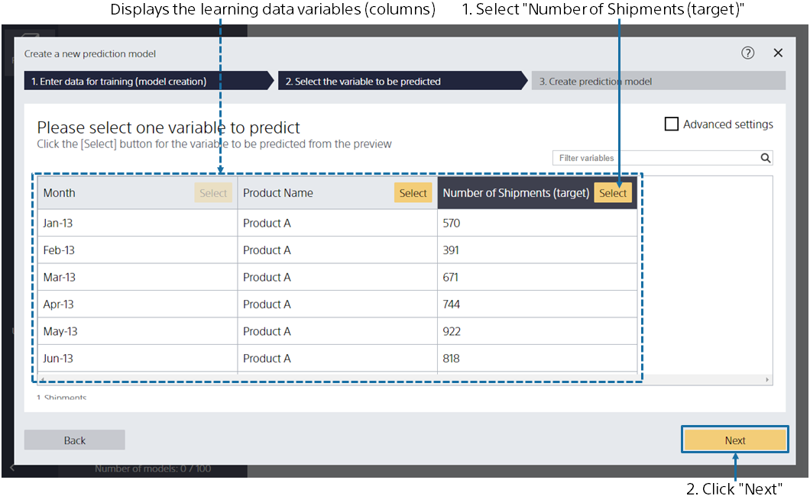
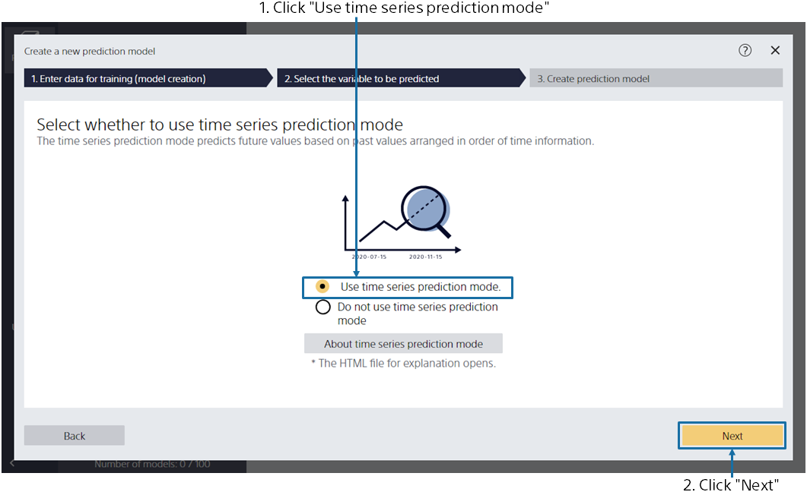

{}

The main screen appears, no prediction model has been created, so it is empty. Click [Create New Prediction Model].
{}

{}

Specify `1_出荷数.csv`, the data for creating a prediction model (training). 
{}
You can import data by dragging and dropping it into the window or by [Select a File]. 
{}
{}
Click [Select from Uploaded Data] and select the sample data from the data list on the "Samples" tab.
{}
{}
{}

{}

This screen is displayed when data loading is completed. 
Please select one variable to predict.
For this tutorial, select the variable "Number of shipments (Prediction target)".
After selecting, click the [Next] button. 
{}

{}

In this tutorial, we will look at monthly shipments through the end of 2019 and predict how much we expect to ship in the future.
Click [Use the time series prediction mode] and then click [Next].
{}

{}

Set whether you want to predict "number of store shipments" for "when".

Suppose you have data up to 2019/12, and you want to predict the number of shipments from 2020/1 to 2020/12. Specify that you want to predict from "a month from now" to "12 months from now" in the prediction period.

The figure shows the period that you will be creating a model to predict for. Once you have made sure that the period is set to "2020/01/01" to "2020/12/01," click [Create Prediction Model].
{}

{}

Please wait until the training begins. The processes for Preprocessing → Prediction Model Training → Accuracy Evaluation are executed. 
The estimated wait time is displayed at the top. The more data you have, the longer it takes. 
When you have completed your training, click the [Completed] button. 
{}
