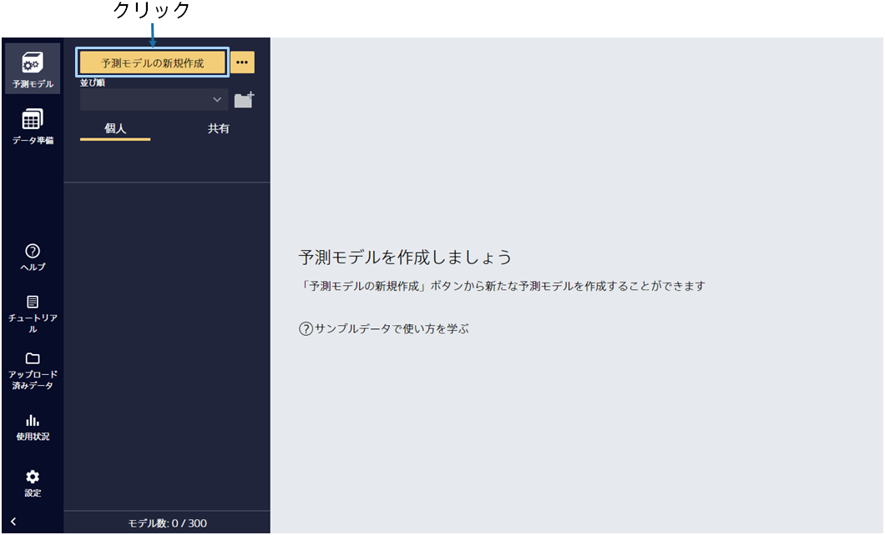
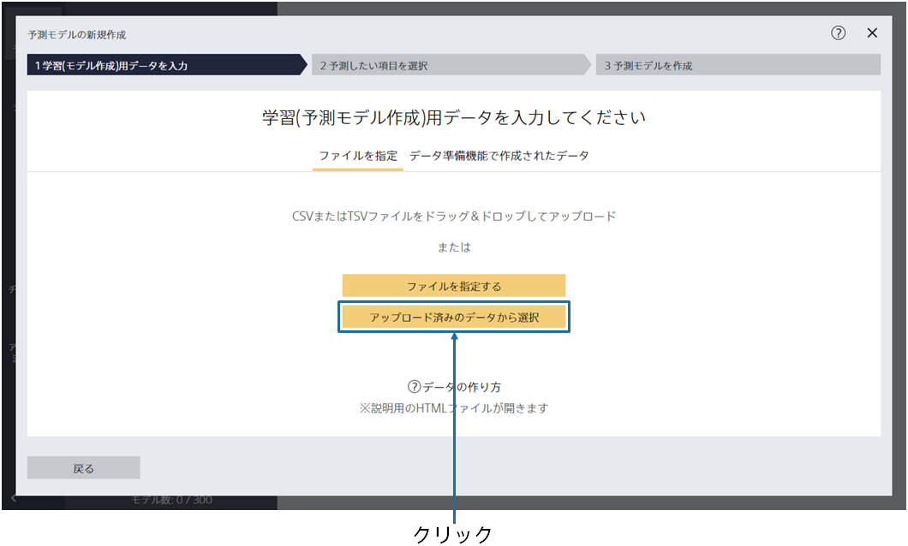
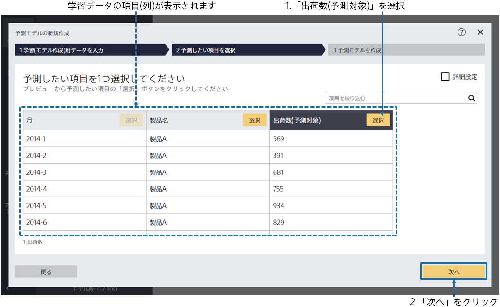
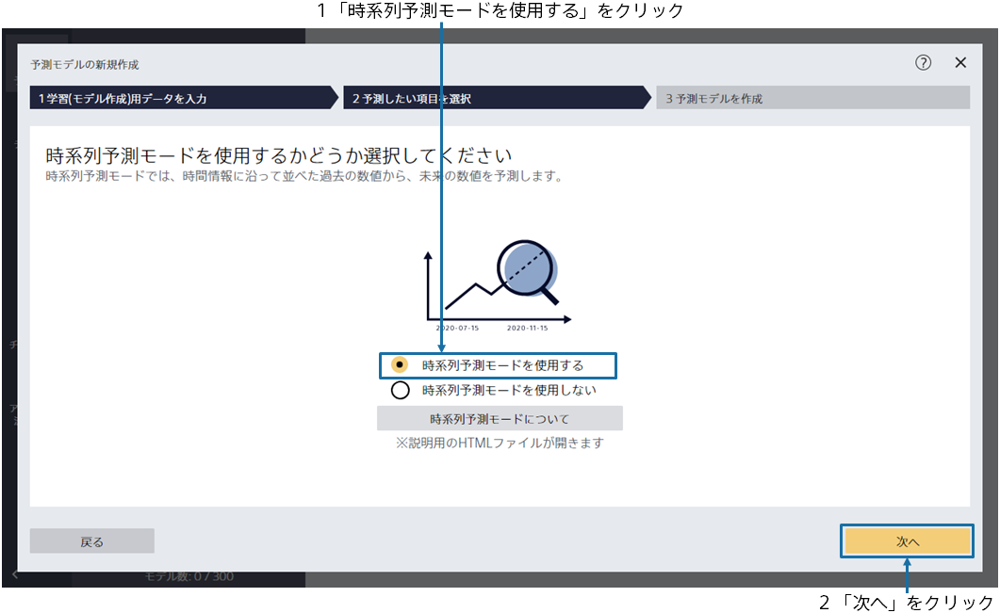
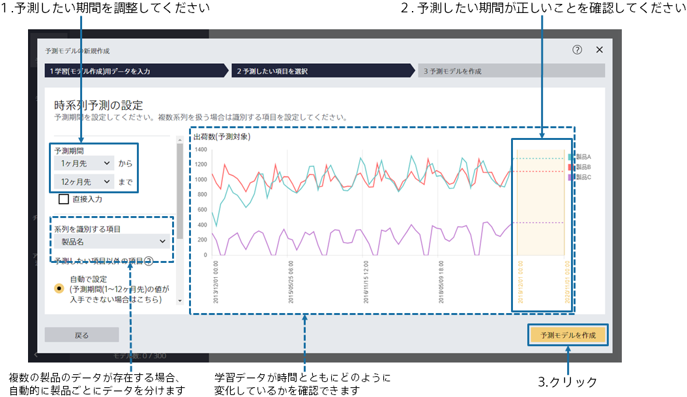
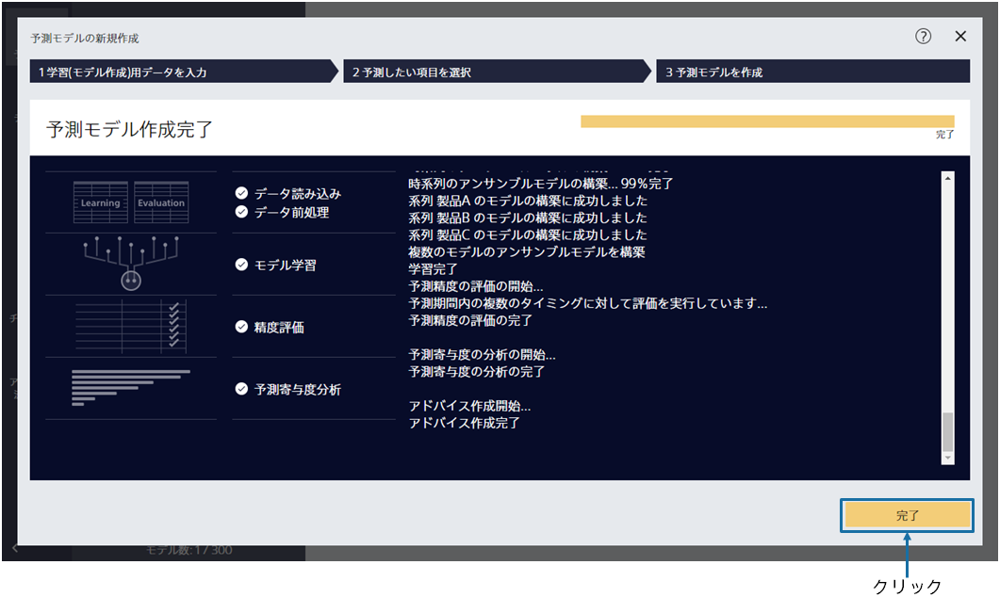

{}

メイン画面が表示されますが、まだ予測モデルは作成されていないので、空の状態です。「予測モデルの新規作成」をクリックしてください。
{}

{}

予測モデル作成(学習)用データである `1_出荷数.csv` を指定してください。 
{}
データはウィンドウへのドラッグ&ドロップか 「ファイルを指定する」で読み込むことができます。 
{}
{}
サンプルデータは、「アップロード済みのデータから選択」をクリックし、「サンプル」タブのデータ一覧から選択してください。
{}
{}
{}

{}

データ読み込みが完了すると、この画面が表示されます。 
予測したい項目を 1 つ選択してください。
このチュートリアルでは、「出荷数（予測対象）」という項目を選択してください。
選択後、「次へ」ボタンをクリックしてください。 
{}

{}

今回のチュートリアルでは、2019 年末までの月ごとの出荷数から、その先にどれくらいの出荷が見込まれるかを予測します。
「時系列予測モードを使用する」をクリックし、「次へ」をクリックしてください。
{}

{}

この画面ではいつの「出荷数」を予測したいかを設定します。

データは 2019 年 12 月まで存在しており、今は 2020 年 1 月から 2020 年 12 月までの出荷数を予測したいとします。予測期間に「1 か月先」から「12 カ月先」まで予測するように指定します。

図から、どの期間の予測を行うモデルを作成するかを確認できます。「2020/01/01」～「2020/12/01」になっていることを確認できたら「予測モデルを作成」をクリックしてください。
{}

{}

学習が開始されますので、完了までお待ちください。前処理 → 予測モデル学習 → 精度評価の処理が実行されます。 
待ち時間の見積もりが上部に表示されます。データ量が多いほど時間がかかります。 
学習完了後、完了ボタンをクリックしてください。 
{}
