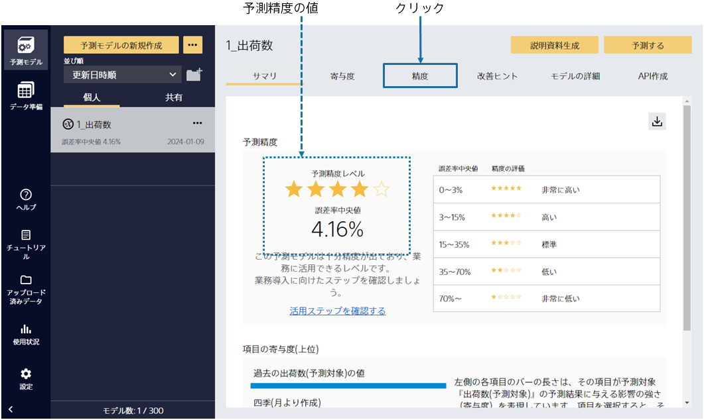
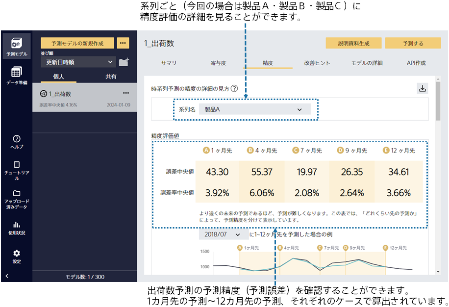
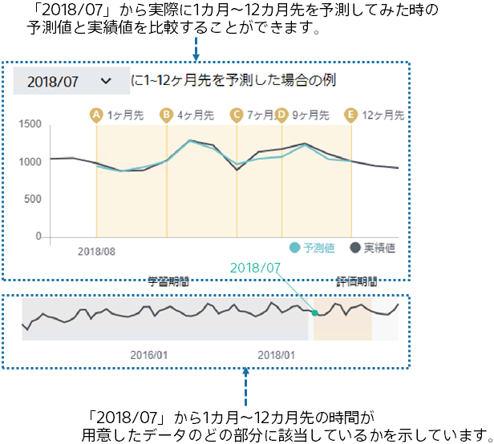
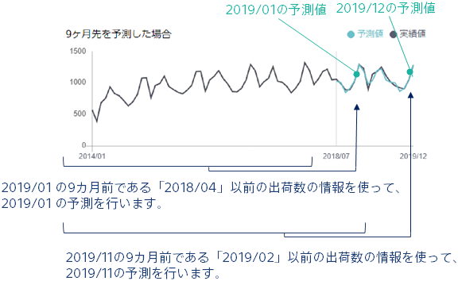
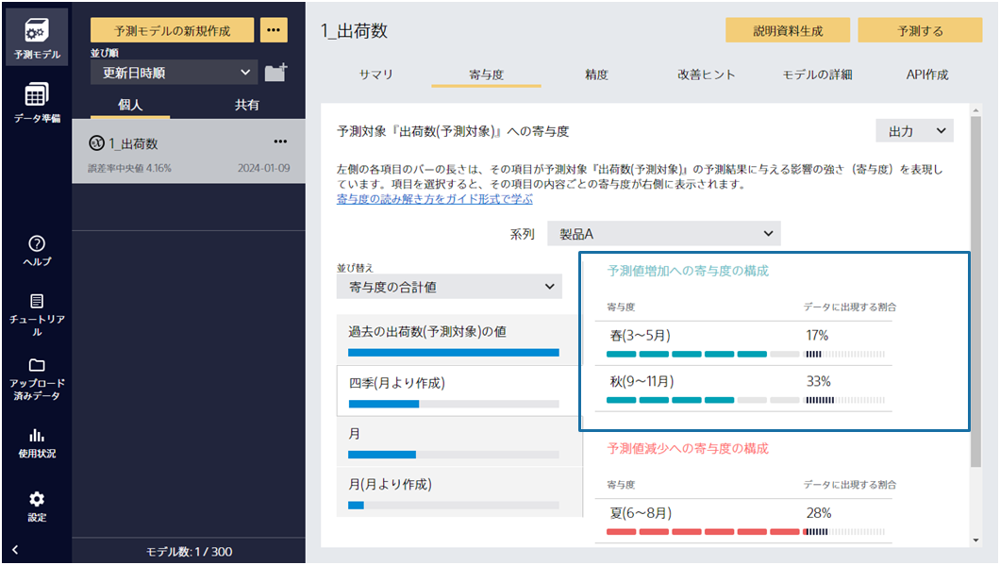
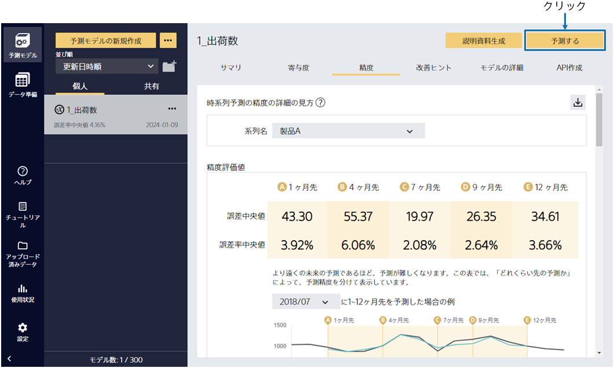

{}

予測モデルの学習後、予測精度の評価までを自動で行います。この画面ではモデルのサマリを確認できます。

予測精度は作成した予測モデルの予測結果と実際の結果を比較することで算出されます。
予測精度レベルの星の数から、高い精度で出荷数を予測できる事がわかりました！
{}

{}

「精度」を選択するとさらに詳細な評価を見ることができます。
さまざまな観点での予測精度の評価値や、予測精度に関する表やグラフが生成されます。

今回のような複数の製品が含まれたデータの場合には、
製品ごとに精度の詳細を見ることができます。

製品Ａについて、下にスクロールしてグラフを見てみましょう。
{}

{}

精度評価値のすぐ下にあるグラフについて説明します。

このグラフは、ある時間から実際に 1 カ月～ 12 カ月先を予測した場合にどのような予測になるかを見ることができます。

たとえば、左の図の場合は「2018/07」の時点から実際に 1 カ月～ 12 カ月先予測を行った場合に実績値と予測値がどのように変化するかを見ることができます。

さらに下にスクロールしてみましょう。
{}

{}

下にあるグラフについて、「9 カ月先の予測と実績」を例に説明をします。

今月から「9 カ月先」の出荷数を予測するとき、どんな情報を使うでしょうか。今月までの出荷数を参考にして予測すると思います。つまり、予測したい月の「9 カ月前」である今月以前の出荷数を使います。
同じように、予測モデルが「9 カ月前」に分かる情報だけを用いて予測した結果が、このグラフの「予測値」となります。
作成した予測モデルがどのように「9 カ月先」の予測を行えるかを確認できます。
{}

{}
{}
「寄与度」をクリックしてください。
この画面では、予測に対してどの入力項目がどう有効かを知ることができます。

四季の寄与度を確認すると、1 月周辺の時期が製品 A の出荷数増加に寄与していることがわかります。

分析した結果が自分の直感と合っているか確認できます。思いもよらない寄与が見つかれば、新しい発見にもなります。
{}
{}
「寄与度」をクリックしてください。
この画面では、予測に対してどの入力項目がどう有効かを知ることができます。

四季の寄与度を確認すると、4 月周辺の時期が製品 A の出荷数増加に寄与していることがわかります。

分析した結果が自分の直感と合っているか確認できます。思いもよらない寄与が見つかれば、新しい発見にもなります。
{}
{}

{}

では、このモデルで予測してみましょう。
次に「予測する」をクリックしてください。
{}
