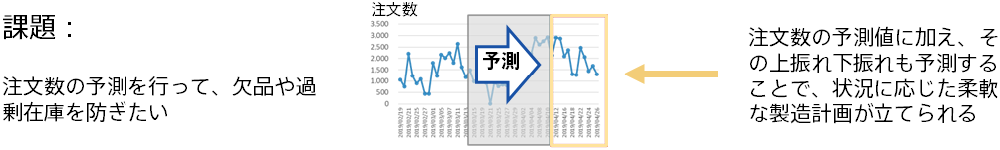

---
title: "Preventing overstocking and shortages by predicting the number of orders"
date: 2018-12-29T11:02:05+06:00
lastmod: 2020-01-05T10:42:26+06:00
weight: 13
draft: false
# metaタグのパラメータ
meta:
  description: "This is a tutorial on Prediction One, a piece of software that can be easily operated by non-experts, which calculates predictions from data. This section explains how to use Prediction One, using the example of prevent overstocking and shortages by predicting the number of orders."
# クラウド・デスクトップ限定ページの場合は片方のみtrueにする
visible:
  is_cloud_only: true
  is_desktop_only: false
# 検索でヒットする文字列の指定
keywords:
  [
    "time series",
    "Number of orders",
    "tutorials",
    "Inventory",
    "Upturn/downturn",
    "How to use",
  ]
tutorial_page:
  is_next_exists: true
---

### Introduction: Preventing Overstocking and Shortages through Order Prediction

Companies that manufacture and sell products sometimes need to use information on order intake and inventory levels to develop optimal manufacturing plans. If a company makes a mistake in creating a manufacturing plan, it can run into the following problems.

- Excess inventory creates higher management costs
- Shortages lead to opportunity loss

Preventing these types of problems hinges on good manufacturing planning. One effective way to ensure solid planning is to make accurate predictions of order quantities ahead of time. However, prediction results for a certain point in the future rarely match the corresponding order volume exactly. If you want to develop a manufacturing plan with a nice, safe cushion, you might want to factor in information on things like how much the order volume could potentially vary. Prediction One's upturn/downturn prediction offers the following benefits.

- Knowing the upturn of a given prediction value lets you safeguard against shortages when the number of orders exceeds the prediction
- Knowing the downturn of a given prediction value lets you safeguard against overstocking when the number of orders falls short of the prediction

