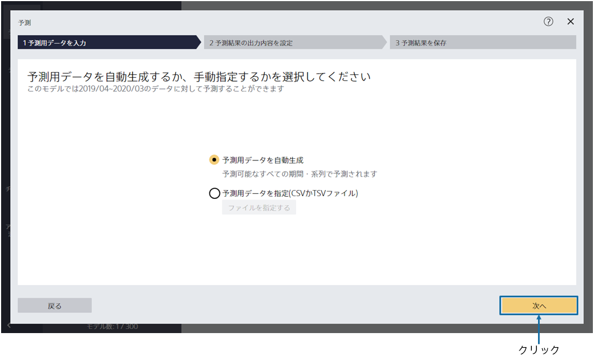
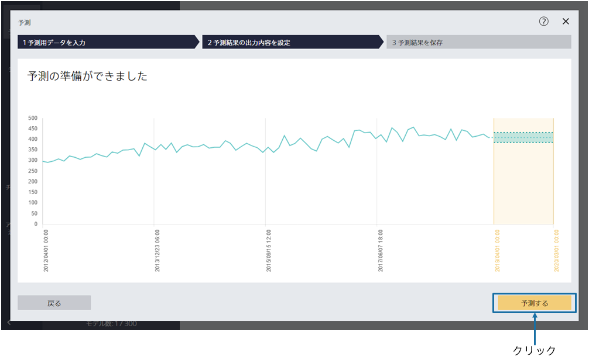
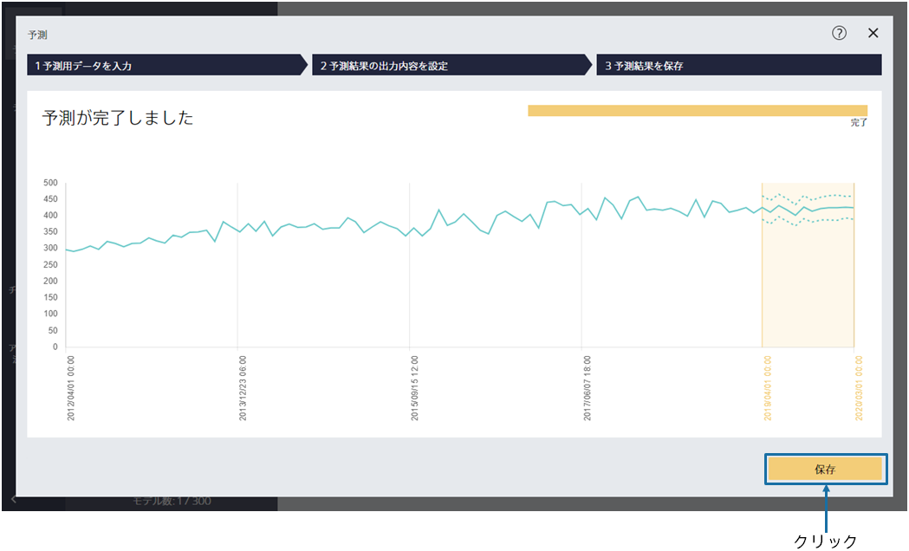
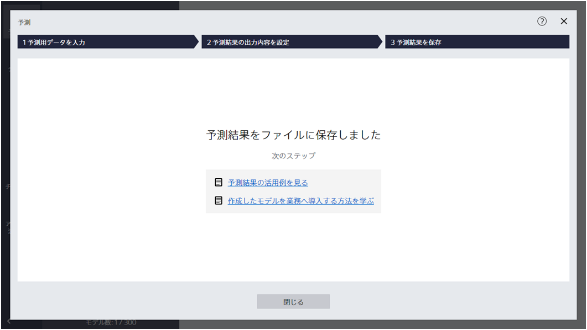
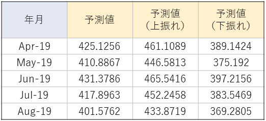

---
title: "予測"
date: 2023-06-15T11:02:05+06:00
lastmod: 2023-06-15T10:42:26+06:00
weight: 11
draft: false
# metaタグのパラメータ
meta:
  description: ""
# クラウド・デスクトップ限定ページの場合は片方のみtrueにする
visible:
  is_cloud_only: false
  is_desktop_only: false
# 検索でヒットする文字列の指定
keywords: [""]
tutorial_page:
  is_next_exists: true
---

{}

「次へ」をクリックすることで、2019/04 ～ 2020/03 の予測注文数を出力できます。

今回のように{}で個別に設定を使用せずに
予測モデルを作成した場合、予測用データを指定する必要はありません。
{}

{}

予測の準備ができました。「予測する」をクリックしてください。
{}

{}

{}
「保存」をクリックして予測結果を保存してください。
{}
{}
「保存」をクリックし、「ファイル名」を入力し、「保存」をクリックしてください。
{}

---

予測が完了すると以下の画面が表示され、指定したファイルに予測結果が保存されています。

{}

{}

予測結果は以下のような形式で出力されます。
各年月に対して、予測注文数、予測の上振れ、下振れが書かれています。

{}
