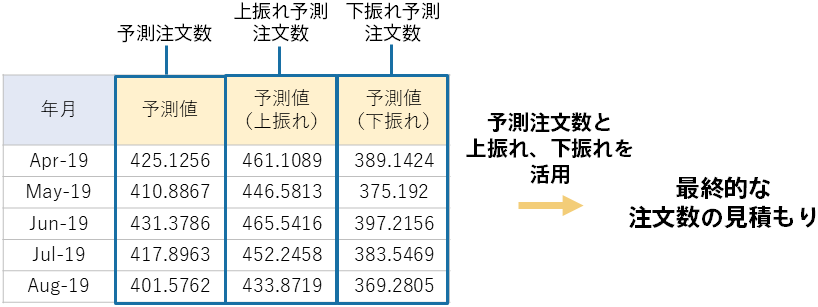

{}

We were able to predict the number of orders from 2019/04 to 2020/03.
Based on this, adjustments can be made as necessary to estimate final orders.

With the prediction values for the number of orders along with the upturn/downturn figures, calculated by month, there are many things you can do with the information available. For example, as is the case in normal time series prediction mode, you could use the prediction values—which represent the most likely future values at that point—as estimates for future order counts. If you want to make sure that overstocking never occurs, your approach might involve the downturn prediction for the number of orders. The same goes for the opposite case: preventing shortages. The upturn prediction value, which indicates how much the number of orders could possibly increase relative to the prediction value, might provide a good reference in safeguarding against shortages.

Before you get deep into using the values, check to see that the prediction results seem reasonable in light of past experience. If you already use normal time series prediction mode and are thinking of transitioning to predictions with upturn/downturn elements, we recommend checking whether the values you are working with line up relatively well with past time series prediction results and, based on what you find, opting for the prediction approach that best meets your needs.
{}
