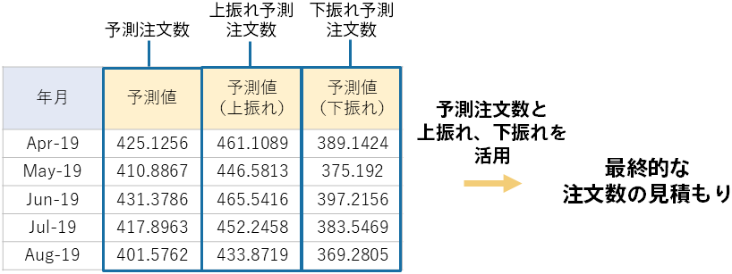

{}

2019/04 ～ 2020/03 の注文数が予測できました。
これに基づき、必要に応じて調整を行い、最終的な注文数の見積もりを立てることができます。

注文数の予測値と、その上振れ下振れ予測値が月ごとに算出されており、様々な活用方法が考えられます。例えば、通常の時系列予測モードと同様に、出力された予測値が将来のその時点で最も取りうる可能性の高い値なので、その予測値を将来の注文数の見積もりとすることができるでしょう。また、過剰在庫を必ず防止したいのであれば、注文数の下振れ予測の値を採用するという方法も考えられます。逆に欠品を必ず防止したい場合は、注文数が予測値に対してどれだけ増加し得るのかを示す上振れ予測値を参照するのが良いかもしれません。

本格的な利用をする前に、予測結果がこれまでの経験に照らして妥当そうか確認を行ってください。また、既に通常の時系列予測モードを使用していて、上振れ下振れありの予測に移行することを考えている場合は、以前の時系列予測の結果と大きな差異が無いかを確認するようにして、どちらがご自身の用途に合っているか検討してみることをお勧めいたします。
{}
