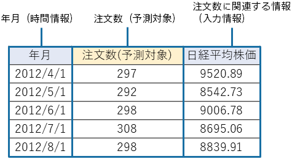

---
title: "Preparing Data for Creating a Prediction Model (Training)"
date: 2023-06-15T11:02:05+06:00
lastmod: 2023-06-15T10:42:26+06:00
weight: 4
draft: false
# metaタグのパラメータ
meta:
  description: ""
# クラウド・デスクトップ限定ページの場合は片方のみtrueにする
visible:
  is_cloud_only: true
  is_desktop_only: false
# 検索でヒットする文字列の指定
keywords: [""]
tutorial_page:
  is_next_exists: true
---

Predictive analytics uses data for creating a prediction model (training) based on actual order-intake data, such as the following, to create a model that predicts future numbers of orders.
This tutorial uses sample datasets that were prepared.

{}

The following pages describe how Prediction One operates.
