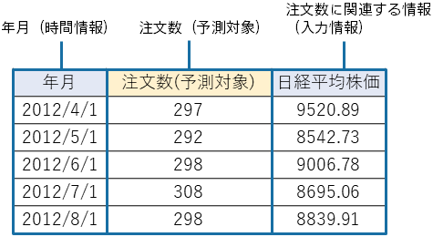

---
title: "予測モデル作成(学習)用データの準備"
date: 2023-06-15T11:02:05+06:00
lastmod: 2023-06-15T10:42:26+06:00
weight: 4
draft: false
# metaタグのパラメータ
meta:
  description: ""
# クラウド・デスクトップ限定ページの場合は片方のみtrueにする
visible:
  is_cloud_only: false
  is_desktop_only: false
# 検索でヒットする文字列の指定
keywords: [""]
tutorial_page:
  is_next_exists: true
---

予測分析では、下記のような、受注実績データを基にした予測モデル作成(学習)用データを用いて、将来の注文数を予測するモデルを作成します。
本チュートリアルでは、すでに準備してあるサンプルデータを利用します。

{}

以降のページでは、Prediction One の操作について説明します。
