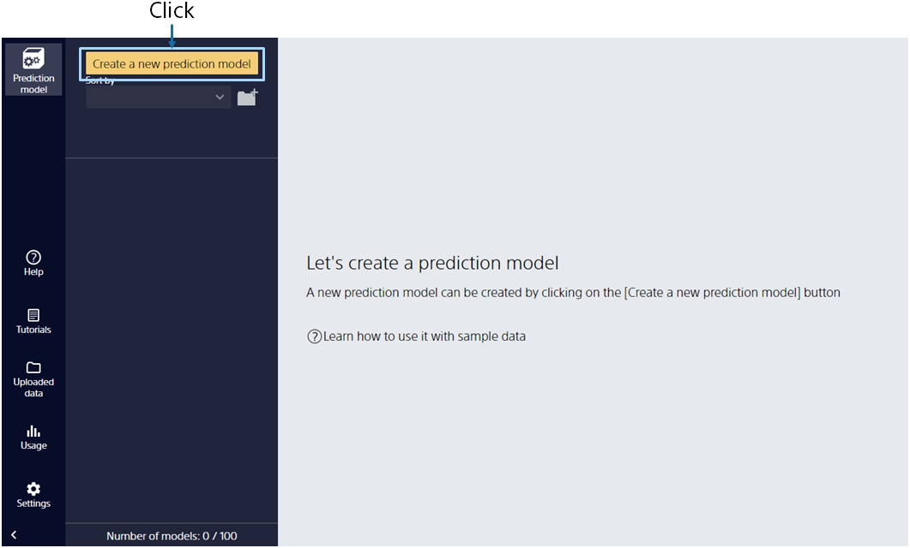
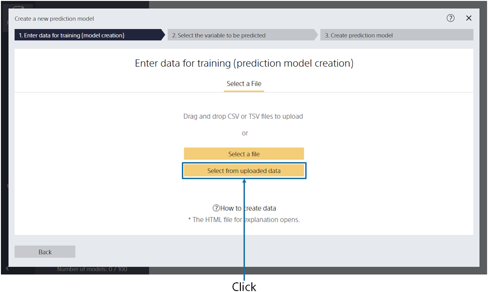
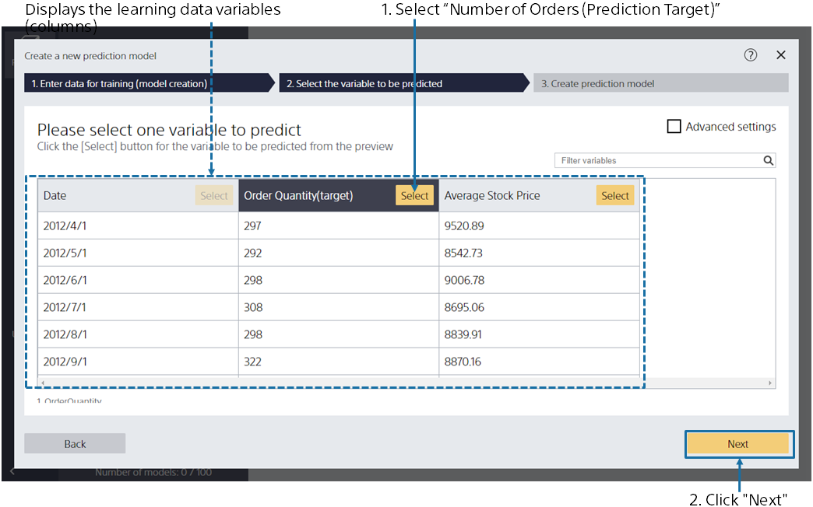
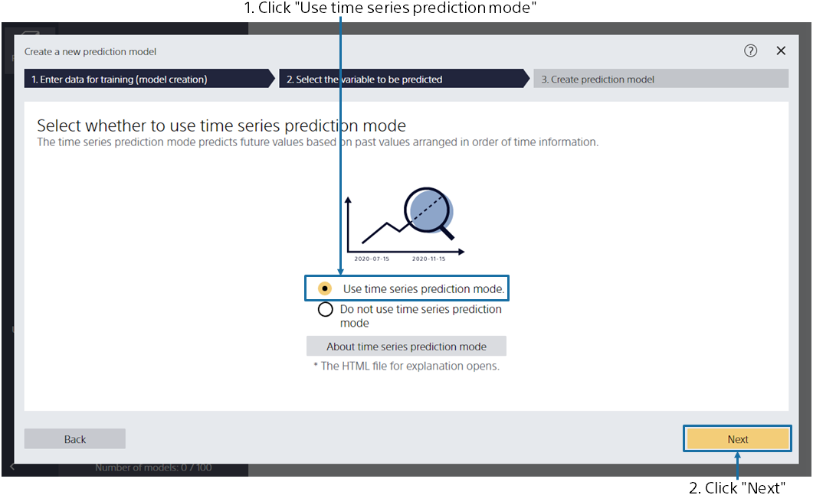
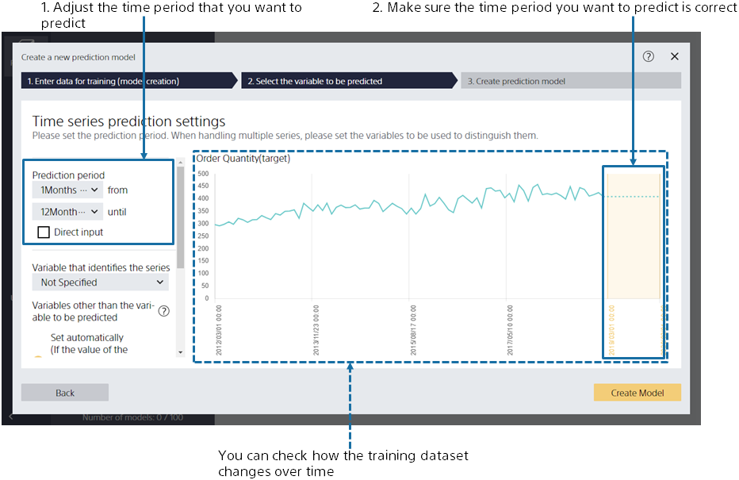
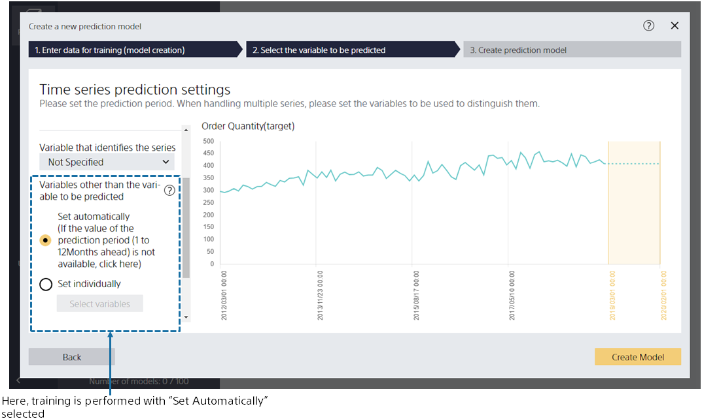
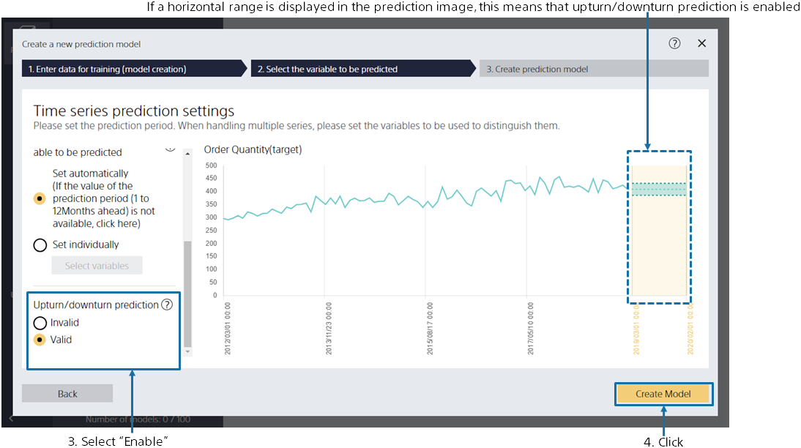
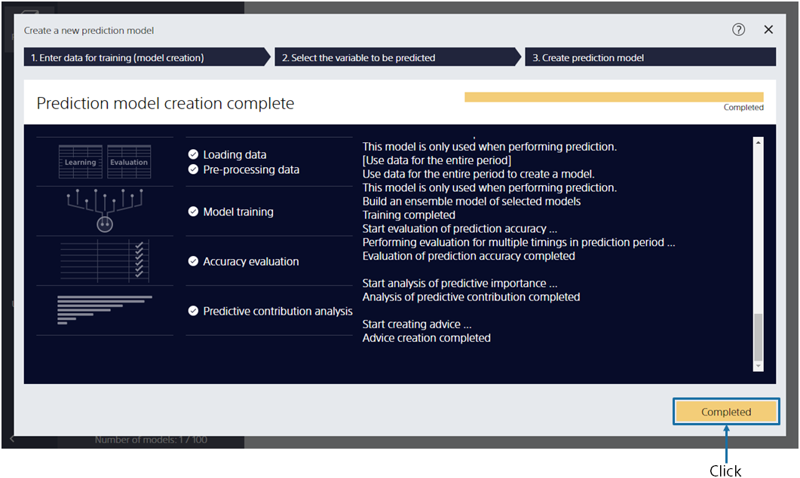

---
title: "Creating a Prediction Model"
date: 2023-06-15T11:02:05+06:00
lastmod: 2023-06-15T10:42:26+06:00
weight: 7
draft: false
# metaタグのパラメータ
meta:
  description: ""
# クラウド・デスクトップ限定ページの場合は片方のみtrueにする
visible:
  is_cloud_only: true
  is_desktop_only: false
# 検索でヒットする文字列の指定
keywords: [""]
tutorial_page:
  is_next_exists: true
---

{}

The main screen appears, no prediction model has been created, so it is empty. Click [Create New Prediction Model].
{}

{}

Specify `1_注文数.csv`, the data for creating a prediction model (training). 
{}
You can import data by dragging and dropping it into the window or by [Select a File]. 
{}
{}
Click [Select from Uploaded Data] and select the sample data from the data list on the "Samples" tab.
{}
{}
{}

{}

This screen is displayed when data loading is completed. 
Please select one variable to predict.
For this tutorial, select the variable "Number of orders (Prediction target)".
After selecting, click the [Next] button. 
{}

{}

In this tutorial, we'll use the number of orders per month through March 2019 and Nikkei Stock Average values to predict future order volume and also the corresponding upturn and downturn.
Click [Use the time series prediction mode] and then click [Next].
{}

{}

On this screen, set the period for which you want to predict the "number of orders".

Suppose you have data up to 2019/3, and you want to predict the number of orders from 2019/4 to 2020/3. Specify that you want to predict from "1 month from now" to "12 months from now" in the prediction period.

The figure shows the period that you will be creating a model to predict for: April 1, 2019, to March 1, 2020.

You could also configure variables other than the variable to be predicted, but we'll go with "Set Automatically" here.


For details on the settings, see {}. 
The tutorial for setting variables individually can be found {}.


You can also enable or disable the feature for "Upturn/downturn prediction". If you disable it, the prediction will follow the process for normal time series prediction mode, which does not generate upturn/downturn prediction results. Since we want to predict upturn and downturn in this case, though, select "Enable". If a horizontal range is visible in the prediction period graph, upturn/downturn prediction is enabled.

Once you completed these setup steps, click [Create Prediction Model].

{}

{}

Please wait until the training begins. The processes for Preprocessing → Prediction Model Training → Accuracy Evaluation are executed. 
The estimated wait time is displayed at the top. The more data you have, the longer it takes. 
When you have completed your training, click the [Completed] button. 
{}
