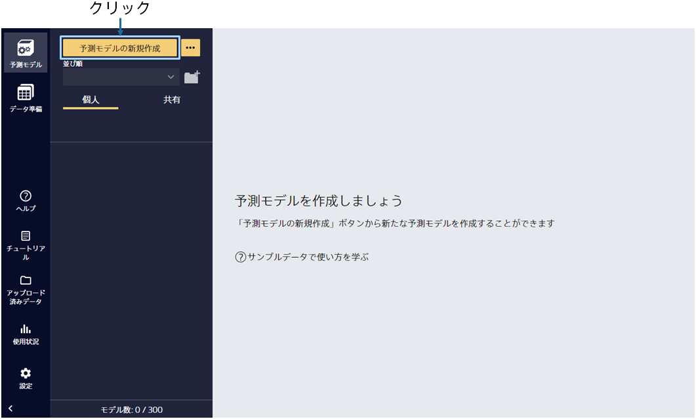
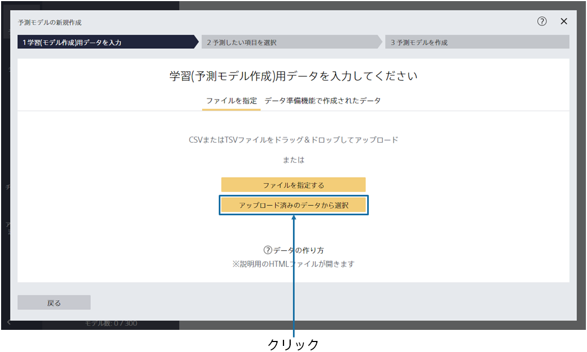
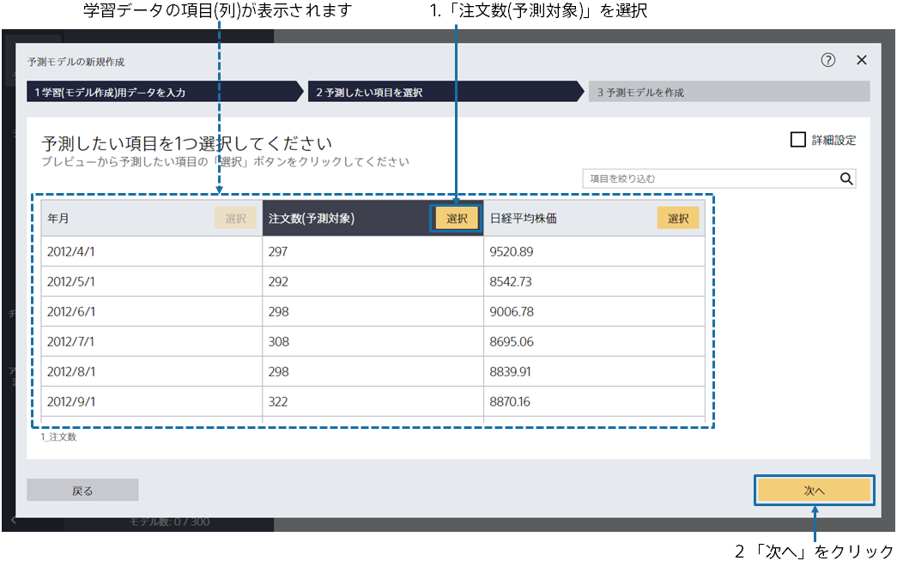
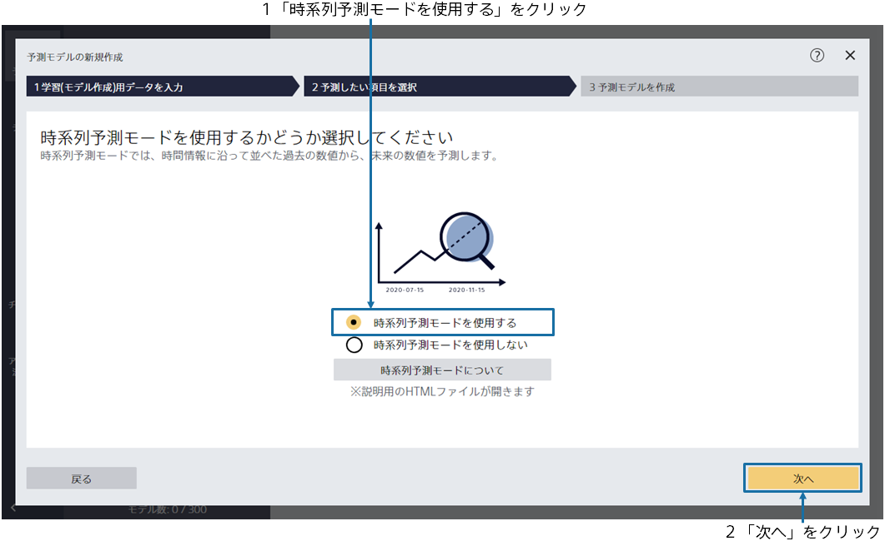
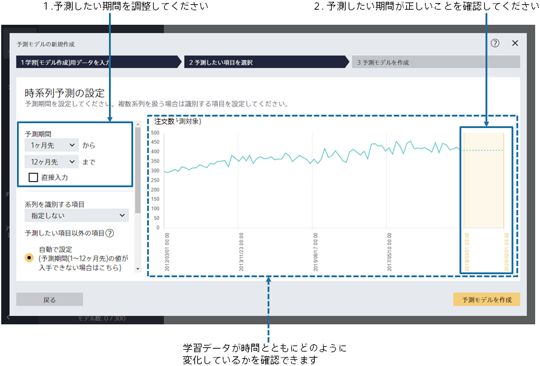
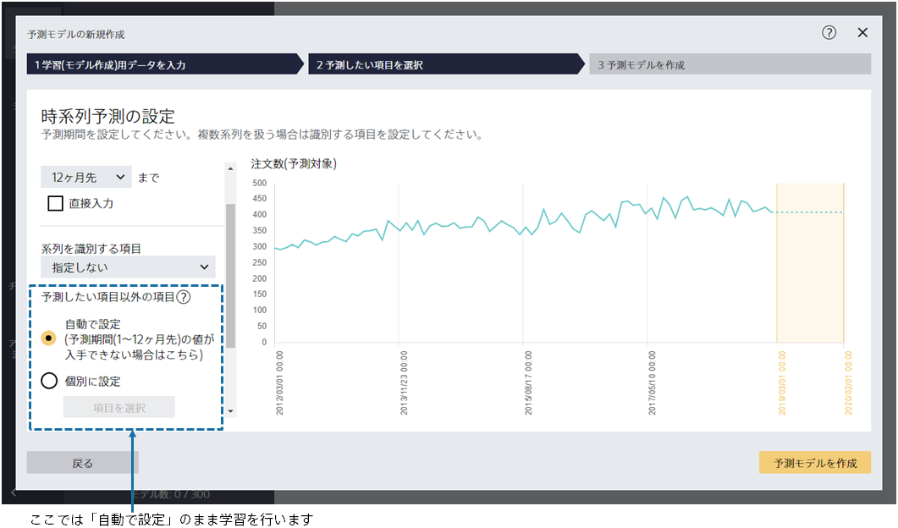
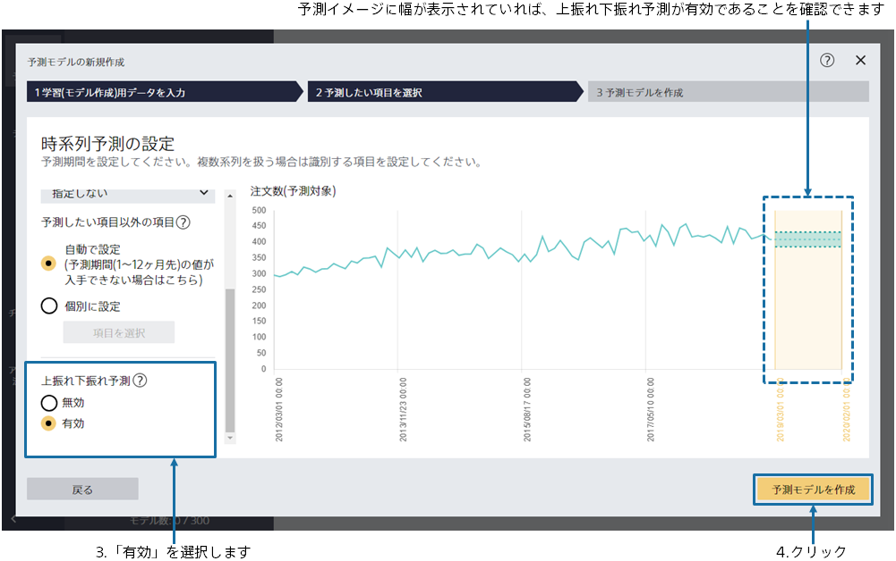
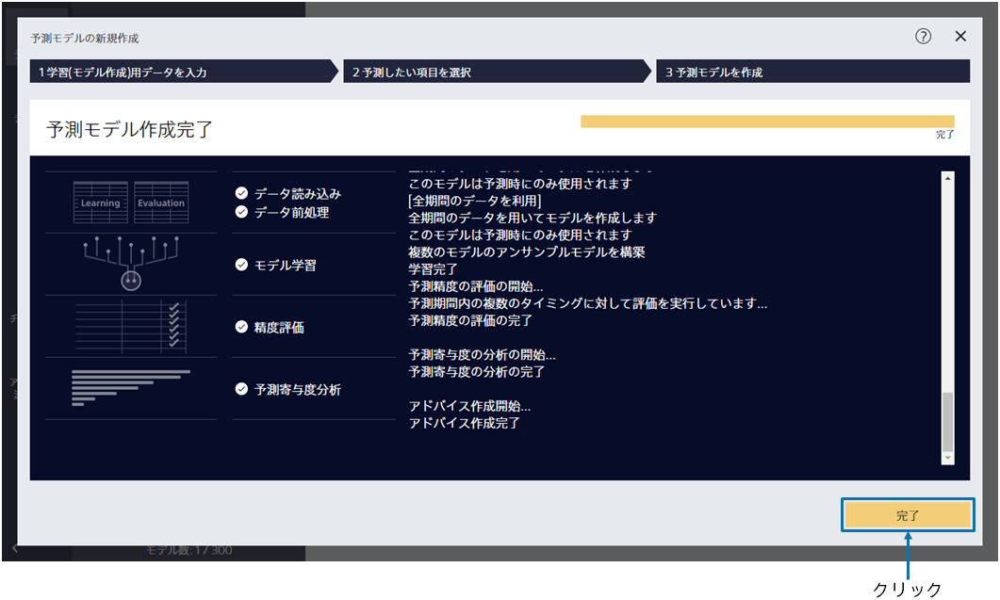

{}

メイン画面が表示されますが、まだ予測モデルは作成されていないので、空の状態です。「予測モデルの新規作成」をクリックしてください。
{}

{}

予測モデル作成(学習)用データである `1_注文数.csv` を指定してください。 
{}
データはウィンドウへのドラッグ&ドロップか 「ファイルを指定する」で読み込むことができます。 
{}
{}
サンプルデータは、「アップロード済みのデータから選択」をクリックし、「サンプル」タブのデータ一覧から選択してください。
{}
{}
{}

{}

データ読み込みが完了すると、この画面が表示されます。 
予測したい項目を 1 つ選択してください。
このチュートリアルでは、「注文数（予測対象）」という項目を選択してください。
選択後、「次へ」ボタンをクリックしてください。 
{}

{}

今回のチュートリアルでは、2019 年 3 月までの月ごとの注文数と日経平均株価から、その先にどれくらいの注文が見込まれるかを予測し、さらにその上振れ下振れ予測を行います。
「時系列予測モードを使用する」をクリックし、「次へ」をクリックしてください。
{}

{}

この画面ではいつの「注文数」を予測したいかを設定します。

データは 2019 年 3 月まで存在しており、今は 2019 年 4 月から 2020 年 3 月までの注文数を予測したいとします。予測期間に「1 ヶ月先」から「12 ヶ月先」まで予測するように指定します。

図から、どの期間の予測を行うモデルを作成するかを確認できます。「2019/04/01」～「2020/03/01」になっていることを確認してください。

予測したい項目以外の項目という設定もありますが、ここでは「自動で設定」のまま進みます。


こちらの設定の詳細については、{}をご確認ください。 
「個別に設定」を使用するチュートリアルは、{}です。


「上振れ下振れ予測」という項目があり、そちらで機能の有効、無効を切り替えることができます。無効にした場合は上振れ下振れ予測が出ない、通常の時系列予測モードが選択されます。今回は上振れ下振れ予測を出したいので、「有効」を選択します。予測期間のグラフに幅が表示されていれば上振れ下振れ予測は有効になっています。

ここまでの設定が完了したら「予測モデルを作成」をクリックしてください。

{}

{}

学習が開始されますので、完了までお待ちください。前処理 → 予測モデル学習 → 精度評価の処理が実行されます。 
待ち時間の見積もりが上部に表示されます。データ量が多いほど時間がかかります。 
学習完了後、完了ボタンをクリックしてください。 
{}
