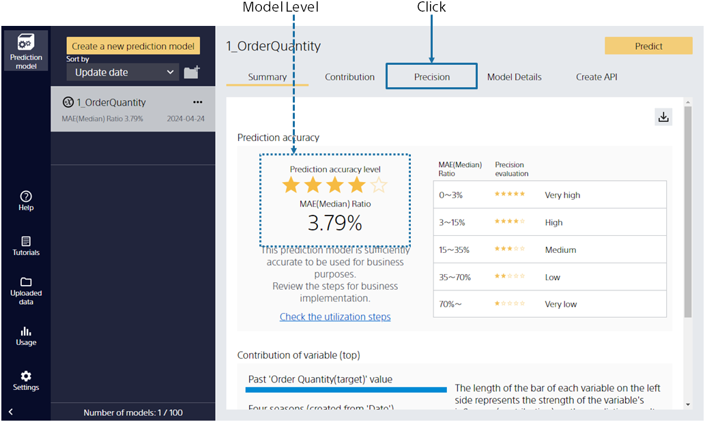
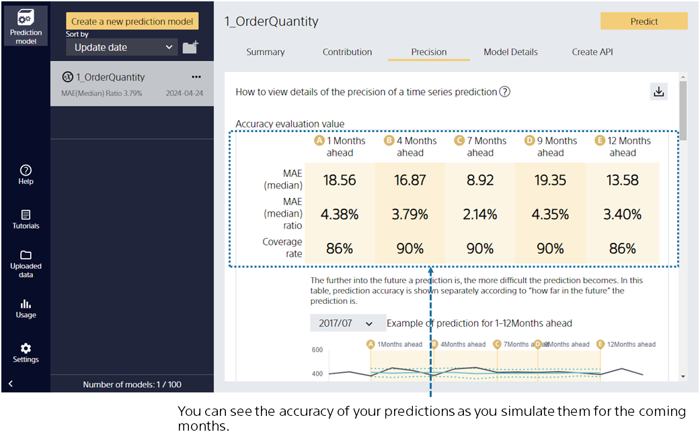
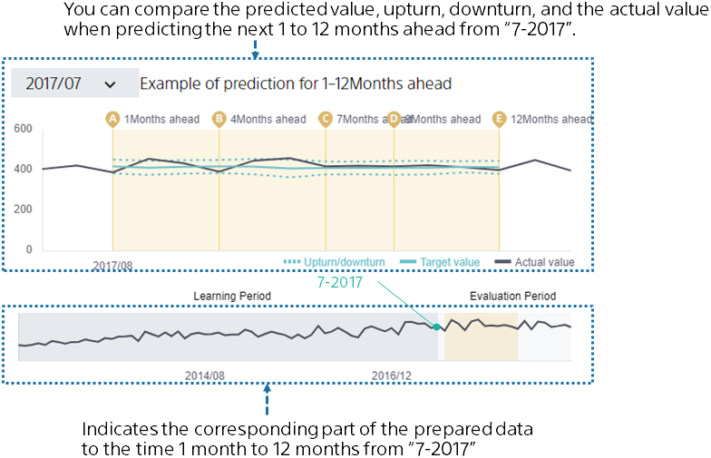
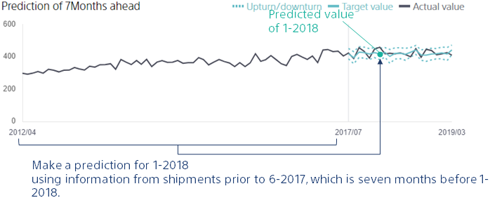
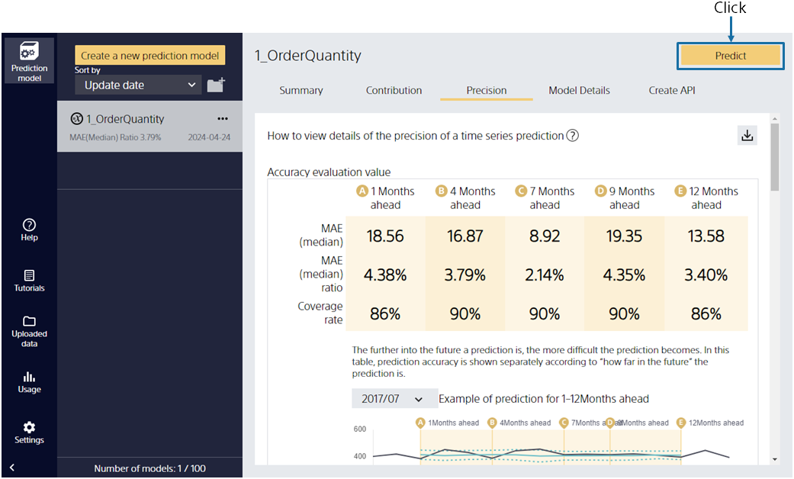

---
title: "Viewing Evaluation Results"
date: 2023-06-15T11:02:05+06:00
lastmod: 2020-06-15T10:42:26+06:00
weight: 9
draft: false
# metaタグのパラメータ
meta:
  description: ""
# クラウド・デスクトップ限定ページの場合は片方のみtrueにする
visible:
  is_cloud_only: true
  is_desktop_only: false
# 検索でヒットする文字列の指定
keywords: [""]
tutorial_page:
  is_next_exists: true
---

{}

After training with the prediction model, it automatically evaluates the prediction accuracy. This screen provides a summary of the model evaluation.

The prediction accuracy is calculated by comparing the actual results with the predicted results of the prediction model that is created.
We found that we can predict the number of orders with good accuracy from the number of stars at the prediction accuracy level!
{}

{}

Select Accuracy Details to see a more detailed evaluation.
Evaluated values of prediction accuracy from various perspectives and tables and graphs of prediction accuracy are generated. When you perform an upturn/downturn prediction, the "Coverage" metric is displayed. The coverage rate is close to 90% for all the models across the entire period (1-12 months into the feature), which means that you have a good upturn/downturn prediction model.

{}

{}

This section describes the graph directly below the evaluation values.

The graph shows what it would look like if you actually predicted 1 to 12 months from a given time.

For example, in the illustration above, you can see how actual values and predicted values, upturn, and downturn change when you actually predict 1 to 12 months ahead from the time "2017/07".

Let's scroll further down.
{}

{}

This section describes the graph below using "Prediction and Results for the Next Seven Months" as an example.

What kind of information should you use when you predict the number of orders "Seven months in the future" from this month? It would make sense to predict by referring to the number of orders up to this month. In other words, use the number of orders prior to this month, which is the "Seven months ago", for the month you want to predict. The graph of the prediction results shows prediction values in a solid line along with dotted lines for upturn and downturn. As you can see, most of the actual values fall between the upturn and downturn, with occasional outliers. The outlying data might be values that diverged significantly (increased or decreased) from the norm for some reason.
{}

{}

Let's make a prediction with this model. Click [Predict].
{}
