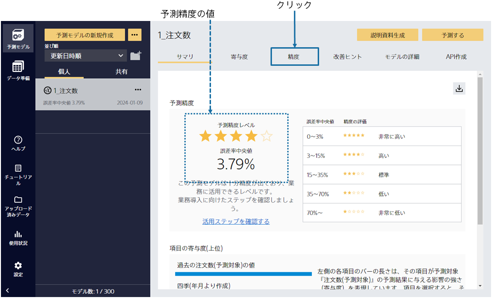
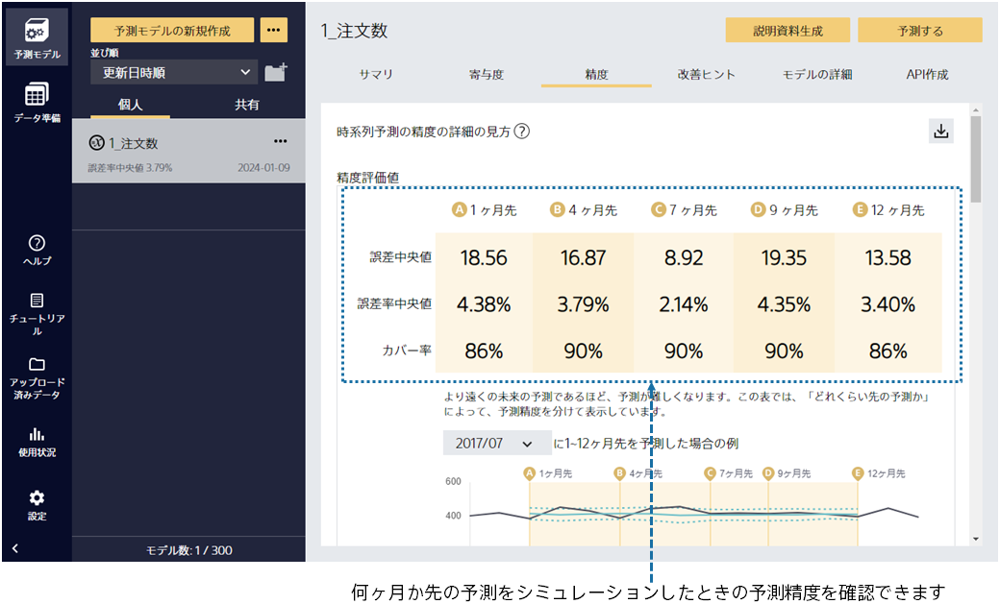
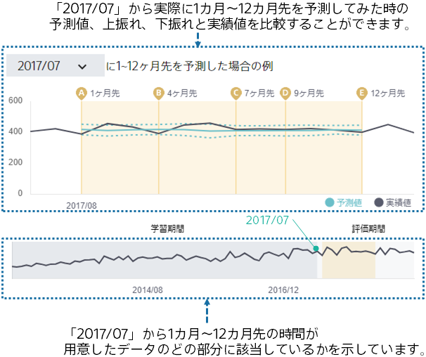
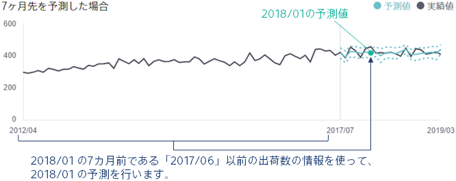
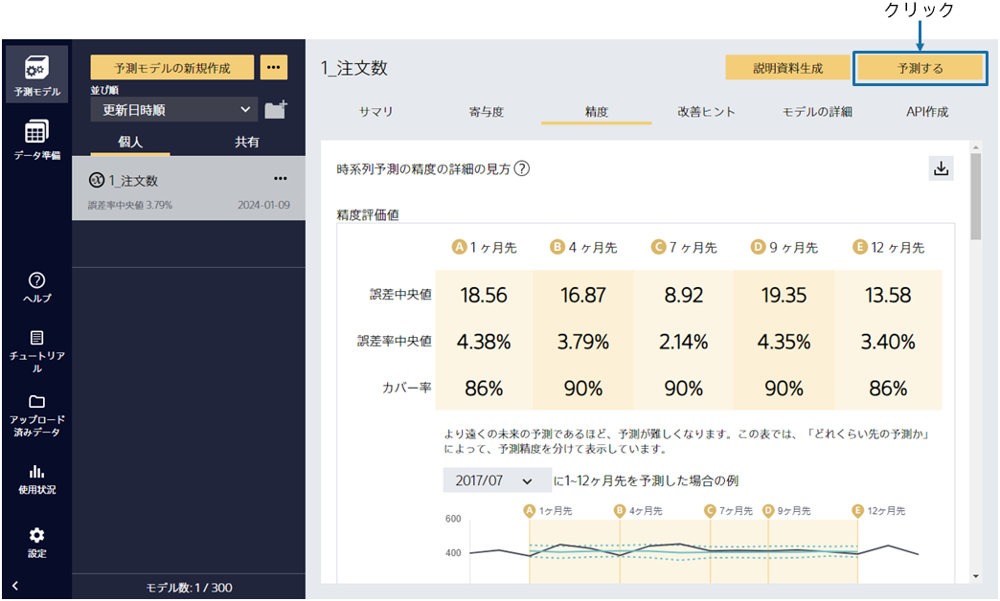

---
title: "評価結果の閲覧"
date: 2023-06-15T11:02:05+06:00
lastmod: 2020-06-15T10:42:26+06:00
weight: 9
draft: false
# metaタグのパラメータ
meta:
  description: ""
# クラウド・デスクトップ限定ページの場合は片方のみtrueにする
visible:
  is_cloud_only: false
  is_desktop_only: false
# 検索でヒットする文字列の指定
keywords: [""]
tutorial_page:
  is_next_exists: true
---

{}

予測モデルの学習後、予測精度の評価までを自動で行います。この画面ではモデルのサマリを確認できます。

予測精度は作成した予測モデルの予測結果と実際の結果を比較することで算出されます。
予測精度レベルの星の数から、高い精度で注文数を予測できる事がわかりました！
{}

{}

「精度」を選択するとさらに詳細な評価を見ることができます。
さまざまな観点での予測精度の評価値や、予測精度に関する表やグラフが生成されます。上振れ下振れ予測を行うときには「カバー率」という指標が表示されます。「１ ヶ月先」～「12 ヶ月先」のいずれのモデルでもカバー率が90%に近い値になっているため、良い上振れ下振れ予測モデルが作成できたことが分かります。

{}

{}

精度評価値のすぐ下にあるグラフについて説明します。

このグラフは、ある時間から実際に1 ヶ月先～12 ヶ月先を予測した場合にどのような予測になるかを見ることができます。

たとえば、上の図の場合は「2017/07」の時点から実際に1 ヶ月先～12 ヶ月先予測を行った場合に実績値と予測値、上振れ、下振れがどのように変化するかを見ることができます。

さらに下にスクロールしてみましょう。
{}

{}

下にあるグラフについて、「7 ヶ月先の予測と実績」を例に説明をします。

今月から「7 ヶ月先」の注文数を予測するとき、どんな情報を使うでしょうか。今月までの注文数を参考にして予測すると思います。つまり、予測したい月の「7 ヶ月前」である今月以前の注文数を使います。予測結果のグラフを見ると実線で描画された「予測値」に加えて「上振れ」、「下振れ」も描画されています。上振れと下振れの間に大体の実績値が収まっていて、たまにその範囲から外れているデータがあることが分かります。そのデータは何らかの原因によっていつもより大幅に増加もしくは減少した値かもしれません。
{}

{}

では、このモデルで予測してみましょう。「予測する」をクリックしてください。
{}
