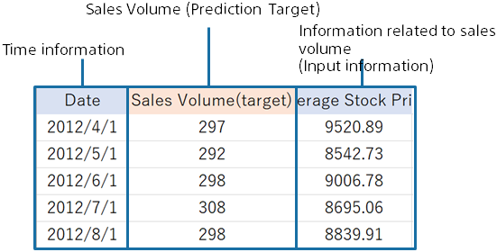

In predictive analytics, a prediction model for predicting the future number of shipments is created using data for creating a prediction model (training) based on the data for the actual sales volume as shown below.
This tutorial uses sample datasets that were prepared.

{}

The following pages describe how Prediction One operates.
