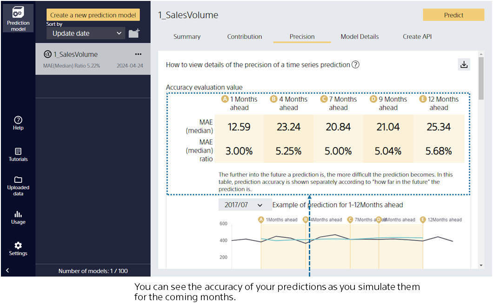

{}

After learning the prediction model, it automatically evaluates the prediction accuracy. This screen provides a summary of the model evaluation.

The prediction accuracy is calculated by comparing the actual results with the predicted results of the prediction model that is created.
We found that we can predict the sales volume with good accuracy from the number of stars at the prediction accuracy level!
{}

{}

Select Accuracy Details to see a more detailed evaluation.
Evaluated values of prediction accuracy from various perspectives and tables and graphs of prediction accuracy are generated.
You can scroll down to browse.

{}

{}

Describes the graph directly below the evaluation value.

This graph shows what it would look like if you actually predicted 1 to 12 months from a given time.

For example, in the illustration on the left, you can see how actual values and predicted values change when you actually predict 1 to 12 months ahead from the time "2017/07".

Let's scroll further down.
{}

{}

The graph below is described using "Prediction and Results for the Next Seven Months" as an example.

What kind of information do you use when you predict "Seven months in the future" sales volume from this month? I think we will make a prediction by referring to the sales volume up to this month. In other words, use the sales volume prior to this month, which is the "Nine months ago", of the month you want to predict.
Similarly, the result of the prediction using only the information that the prediction model knows about "Nine months ago" is the "predicted value" in this graph.
You can see how the prediction models you create can predict "Nine months in the future".
{}

{}
Click "Understanding".
This screen allows you to see which variables are effective for prediction and how they are effective.

If you check the contribution of four seasons, you can see that the fall period contributes to a decrease in the sales volume.

You can check if the result of the analysis matches your intuition. Finding unexpected contributions can lead to new discoveries.
{}

{}

Let's make a prediction with this model.
Then click "Predict".
{}
