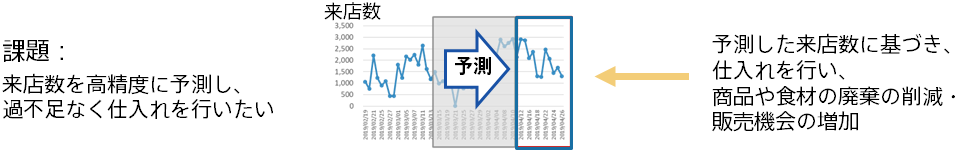

### はじめに ～来店数予測に基づく仕入れ量の決定～

飲食店などの店舗の運営では、商品や食材などの仕入れを過不足なく行う必要があります。

- 来店数に対して商品や食材が多すぎると、廃棄の数が増えてしまいます
- 来店数に対して商品や食材が少なすぎると、販売の機会を逃すことになってしまいます

そこで、将来の来店数を正確に見積もる必要があるのですが、現場の経験と勘に頼って予測し、なかなか来店数の予測が当たらない、良くなっていかない、というケースがあります。
予測分析を利用すると、過去の来店数の実績データに基づき、来店数を高精度に予測できます。

- 予測分析を利用すると、担当者がデータを見ながら経験と勘で予測する場合に比べて、精度が良くなることが多いです
- 予測の担当者が交代した場合に、担当者が慣れるまで予測精度が低くなってしまうこともありますが、予測分析はデータ から自動的に算出されるので、その心配はありません

