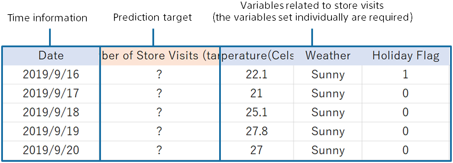
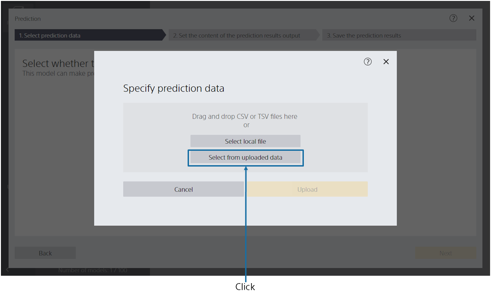
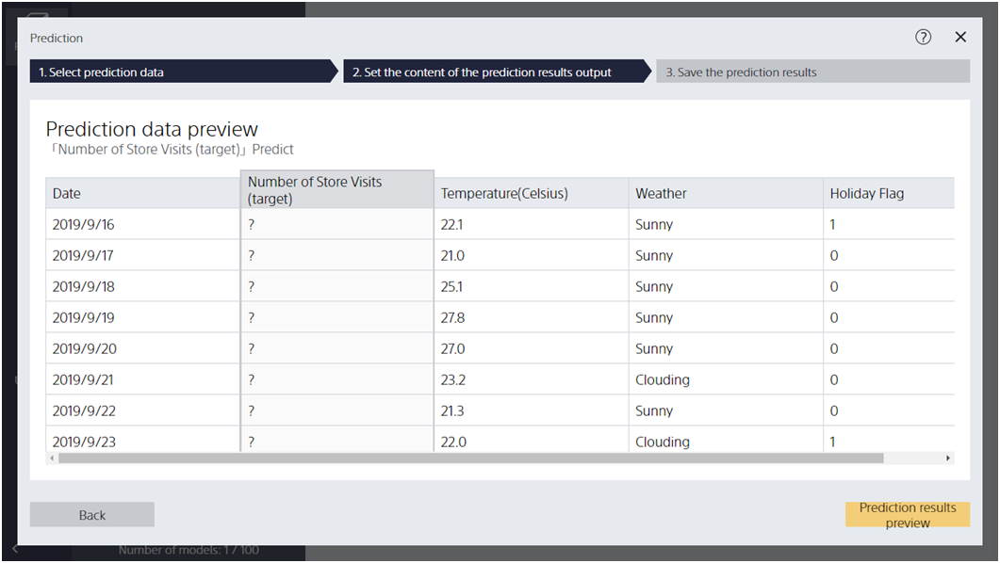
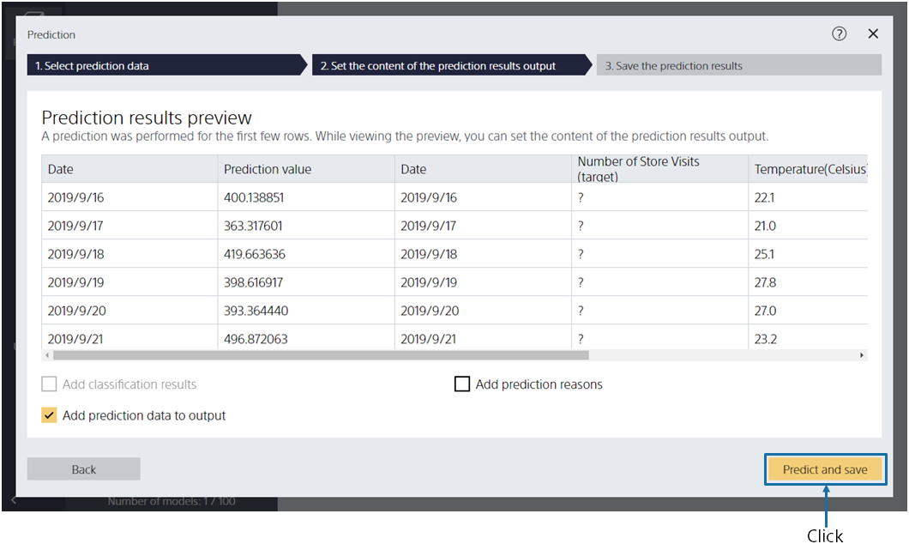
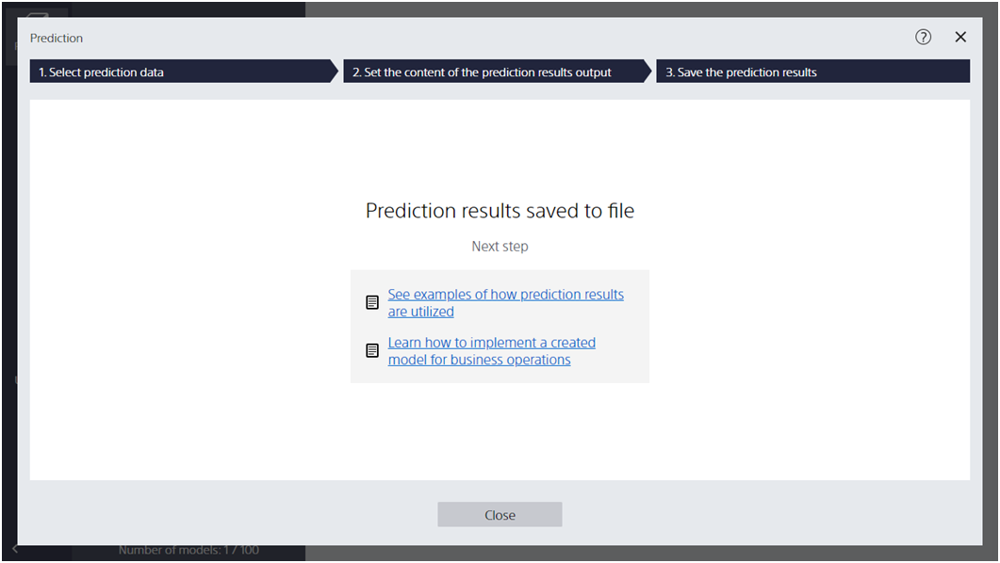
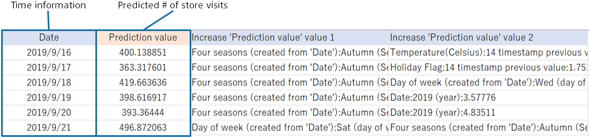

{}

Using the prediction model created, we predict store visits over the next two weeks (2019/09/16 to 09/29).
In this tutorial, you will use sample data that has been prepared for prediction.

{}
{}

{}

Let's make a prediction with this prediction model.

{}
Specify the prediction data `2_来店数（予測用）.csv` here. 
You can import data by dragging and dropping it into the window or by [Select a File]. 
{}
{}
Specify the prediction data `v1.8/2_来店数（予測用）.csv` here. 
Click "Select from Uploaded Data" and select the sample data from the data list on the "Samples" tab.
{}
{}

{}

{}
Previewing imported prediction data  `2_来店数（予測用）.csv`.
{}
{}
Previewing imported prediction data  `v1.8/2_来店数（予測用）.csv`.
{}
From now,  we predict the number of store visits (prediction target) displayed as "?".

{}
Click [Result Preview].
{}
{}
Click "Run Prediction". Wait a while until the preview screen of the prediction result is displayed.
{}
{}

{}

{}
It is ready to predict. Click [Predict and Save] to run the prediction.
Specify a file name to save the predicted results, and then run the prediction.
{}
{}
Click "Save Prediction Results", enter "File name" and click "Save".
{}
{}

{}
When the prediction is complete, the following screen is displayed and the prediction results are saved in the specified file.

{}

{}

Predicted results are output in the following format (this format may vary depending on the option settings).
The predicted number of visitors is written for each date.

{}
