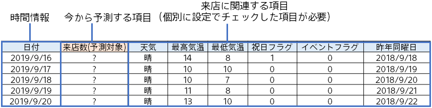
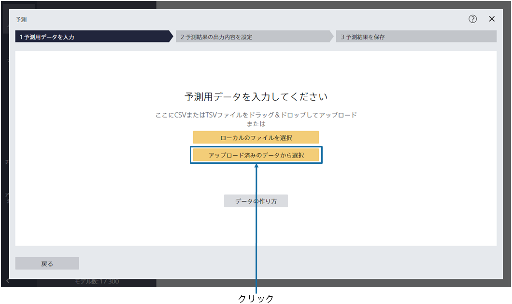
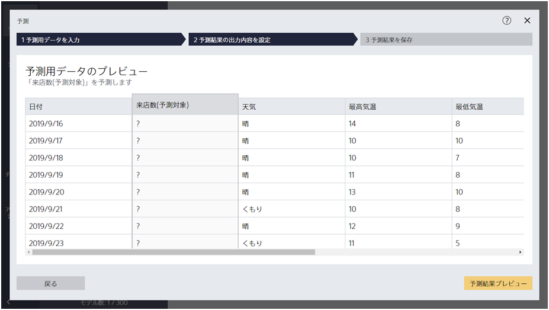
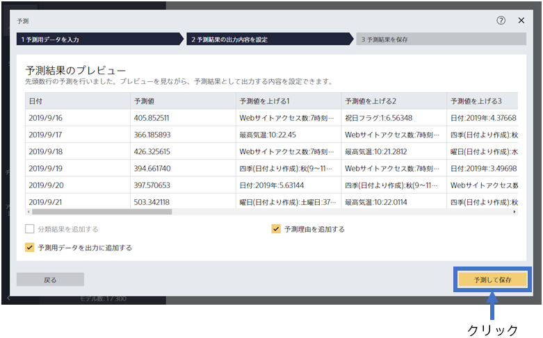
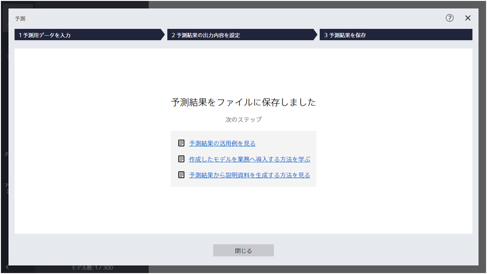
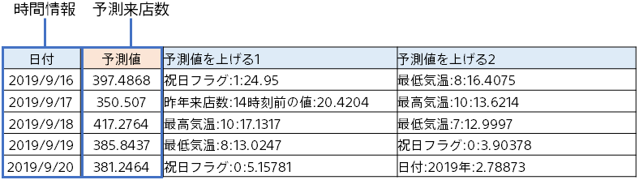

{}

作成した予測モデルを利用して、将来１週間（2019/09/16 ～ 09/22）の来店数を予測します。
本チュートリアルでは、事前に準備した、予測用のサンプルデータを利用します。

{}
{}

{}

では、この予測モデルで予測してみましょう。

{}
予測用データである `2_来店数（予測用）.csv`を指定してください。 
データはウィンドウへのドラッグ&ドロップか 「ファイルを指定する」で読み込むことができます。 
{}
{}
予測用データである `2_来店数（予測用）.csv`を指定してください。 
サンプルデータは、「アップロード済みのデータから選択」をクリックし、「サンプル」タブのデータ一覧から選択してください。
{}
{}

{}

{}
読み込んだ予測用データ `2_来店数（予測用）.csv` をプレビューしています。
{}
{}
読み込んだ予測用データ `2_来店数（予測用）.csv` をプレビューしています。
{}
今から「？」となっている来店数(予測対象)を予測します。

{}
「予測結果プレビュー」をクリックしてください。
{}
{}
「予測結果プレビュー」をクリックしてください。予測結果のプレビュー画面が表示されるまで、しばらくお待ちください。
{}
{}

{}

{}
予測する準備ができました。「予測して保存」をクリックし、予測を実行します。
予測結果を保存するファイル名を指定した後、予測を行います。
{}
{}
「予測結果を保存」をクリックし、「ファイル名」を入力し、「保存」をクリックしてください。
{}
{}

{}
予測が完了すると以下の画面が表示され、指定したファイルに予測結果が保存されています。

{}

{}

予測結果は以下のような形式で出力されます（オプション設定によっては違う形式になります）。
各日付に対して、予測来店数が書かれています。

{}
