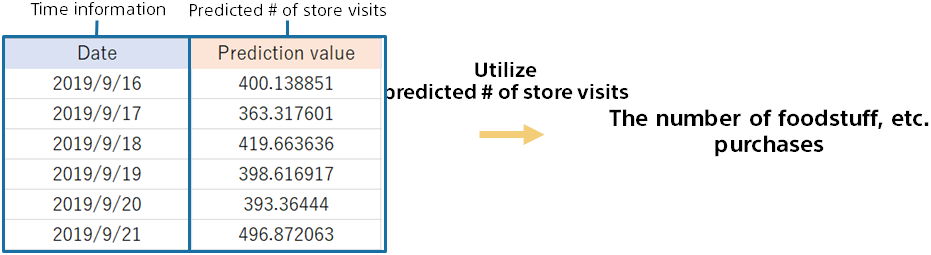

{}

The number of visitors from tomorrow to 2 weeks ahead has been predicted. Based on that, we will decide the number of purchases.

Compare the calculated prediction with the previous method to see if it is accurate.
The final quantity to be purchased is determined by taking into account the situation (some kind of intention) that does not appear in the data as compared to the predicted value.
{}
