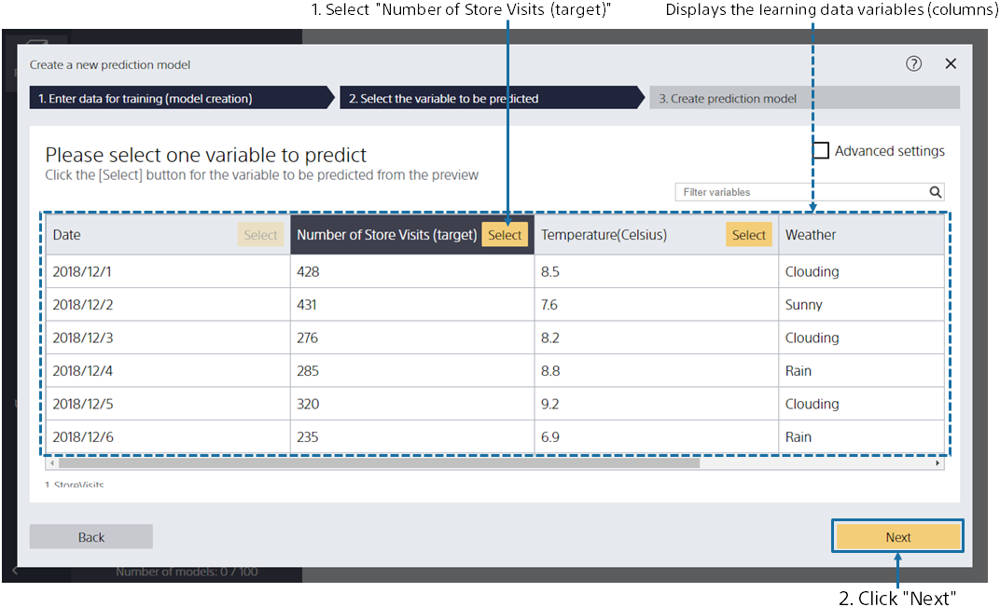
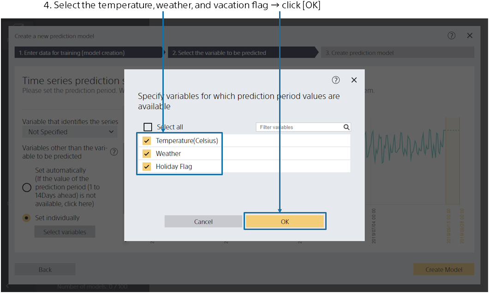

{}

The main screen appears, no prediction model has been created, so it is empty. Click [Create New Prediction Model].
{}

{}

{}
Specify `1_来店数.csv`, the data for creating a prediction model (training). 
You can import data by dragging and dropping it into the window or by [Select a File]. 
{}
{}
Specify `v1.8/1_来店数.csv`, the data for creating a prediction model (training). 
Click "Select from Uploaded Data" and select the sample data from the data list on the "Samples" tab.
{}

{}
{}

{}

This screen is displayed when data loading is completed. 
Please select one variable to predict.
For this tutorial, select the variable "Number of store visits (Prediction target)".
After selecting, click the "Next" button. 
{}

{}

For this tutorial, we'll use our store traffic records up to 2019/09/15 to predict how many store visits we expect.

Click "Use the time series prediction mode" and then click "Next".{}

{}

Set whether you want to predict "number of store visits" or "when".

Suppose you have data up to 2019/09/15, and you want to predict store visits between the following day (9/16) and two weeks in the future (9/29).**Specify the prediction interval as "One day ahead" through "14 days from now".**

You can check the period that you will be creating a model to predict for.**Confirm that the period is September 16, 2019, to September 29, 2019**.

Also configure the variables other than the variable to be predicted.

This time, let's assume that the temperature, weather, and vacation flag information for the period September 16, 2019, to September 29, 2019 is obtained from weather reports and calendar information.
Let's also assume that website access count data for September 16, 2019, to September 29, 2019 will not be obtained until that time. 
In cases like this where related information for a prediction time in the future can be obtained, **select the check boxes of the individual settings for the temperature, weather, and vacation flags**.
**Do not select the check box for the website access count**, as it will not be obtained.

For details on the settings, see {}.

When you have finished selecting the check boxes, click [Create prediction model].

{}

{}

Please wait until the learning begins. The processes for Preprocessing → Prediction Model Training → Accuracy Evaluation are executed. 
The estimated wait time is displayed at the top. The more data you have, the longer it takes. 
When you have completed your learning, click the [Completed] button. 
{}
