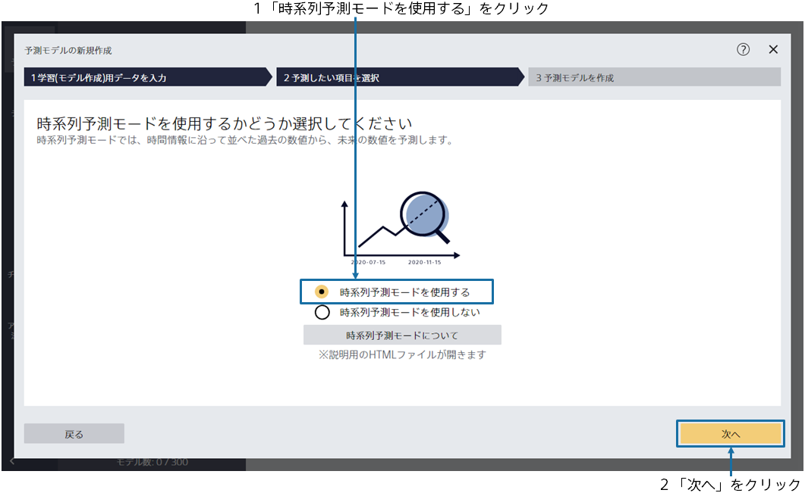

{}

メイン画面が表示されますが、まだ予測モデルは作成されていないので、空の状態です。「予測モデルの新規作成」をクリックしてください。
{}

{}

{}
予測モデル作成(学習)用データである `1_来店数.csv` を指定してください。 
データはウィンドウへのドラッグ&ドロップか 「ファイルを指定する」で読み込むことができます。 
{}
{}
予測モデル作成(学習)用データである `1_来店数.csv` を指定してください。 
サンプルデータは、「アップロード済みのデータから選択」をクリックし、「サンプル」タブのデータ一覧から選択してください。
{}

{}
{}

{}

データ読み込みが完了すると、この画面が表示されます。 
予測したい項目を 1 つ選択してください。
このチュートリアルでは、「来店数(予測対象)」という項目を選択してください。
選択後、「次へ」ボタンをクリックしてください。 
{}

{}

今回のチュートリアルでは、2019/09/15 までの来店数の記録から、これからどれくらいの来店が見込まれるかを予測します。

「時系列予測モードを使用する」をクリックし、「次へ」をクリックしてください。
{}

{}

いつの「来店数」を予測したいかを設定します。

データは 2019/09/15 まで存在しており、次の日(9/16)から 1 週間先(9/22)の間の来店数を予測したいとします。予測期間に「1 日先」から「7 日先」までと指定します。

どの期間の予測を行うモデルを作成するかを確認できます。2019/09/16」～「2019/9/22」になっていることを確認します。

また、予測したい項目以外の項目についても設定を行います。

今回、予測時点である「2019/09/16」～「2019/9/22」の気温、天気、祝日フラグの情報が天気予報やカレンダー情報から手に入り、店舗のイベント予定日が事前に決まっているものとします。 
このように未来である予測時点の関連情報が手に入る場合は、個別に設定で曜日、天気、最高気温、最低気温、祝日フラグ、イベントフラグの項目にチェックを入れます。この時、予測時点で手に入らない項目(Webサイトアクセス数)にはチェックを入れません。

こちらの設定の詳細については、{}をご確認ください。

チェックを入れ終わったら「予測モデルを作成」をクリックします。

{}

{}

学習が開始されますので、完了までお待ちください。前処理 → 予測モデル学習 → 精度評価 → 予測寄与度分析の処理が実行されます。 
待ち時間の見積もりが上部に表示されます。データ量が多いほど時間がかかります。 
学習完了後、完了ボタンをクリックしてください。 
{}
