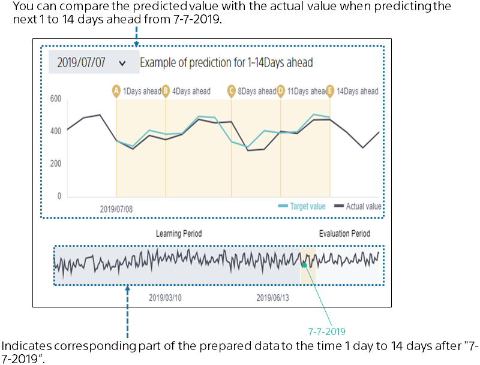
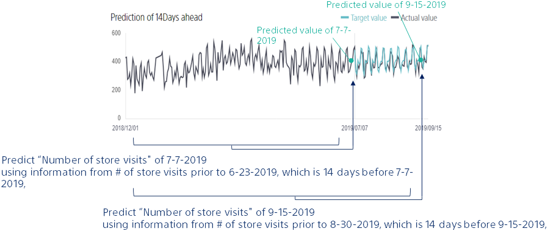

{}

After learning the prediction model, it automatically evaluates the prediction accuracy. This screen provides a summary of the model evaluation.

The prediction accuracy is calculated by comparing the actual results with the predicted results of the prediction model that is created.
We found that we can predict the number of store visits with good accuracy from the number of stars at the prediction accuracy level!
{}

{}

Select "Evaluation" to see a more detailed evaluation.
Evaluated values of prediction accuracy from various perspectives and tables and graphs of prediction accuracy are generated. You can scroll down to browse.
{}

{}

Describes the graph directly below the evaluation value.
This graph shows what the prediction will look like if you actually predict 1 to 14 days from a given time.
For example, in the figure on the left, we can see how the actual number of store visits and the predicted number of store visits would change if we actually made a prediction for 1 to 14 days from the time of "2019/07/07".
Let's scroll further down.
{}

{}

When predicting 14 days ahead is used as an example.

What kind of information do you use to predict the number of "14 days ahead" store visits from today? I think we will make a prediction based on the number of store visits to date. In other words, it is based on information about the number of store visits before today, which is more than "14 days" before the day you want to predict.

Similarly, the "predicted value" in this graph is the result of the prediction made using only information that the prediction model knows before 14 days.
You can see how the prediction models you create can predict the future in "14 days".
{}

{}
Click "Understanding".
This screen allows you to see which variables are effective for prediction and how they are effective.

The number of store visits is expected to increase when the day of the week is "Saturday", or "Sunday".
You can check if the result of the analysis matches your intuition. Finding unexpected contributions can lead to new discoveries.

Discuss the relatively high contribution "Past store visits (target)".
In the time series mode, past actual values are used from the time of the prediction.
For example, we make a prediction based on the number of store visits 7 days, 14 days, and 365 days before the prediction.
The variable created using these past actual values is "Past store visits (target)".

{}

{}

Let's make a prediction with this model.
Then click "Predict".
{}
