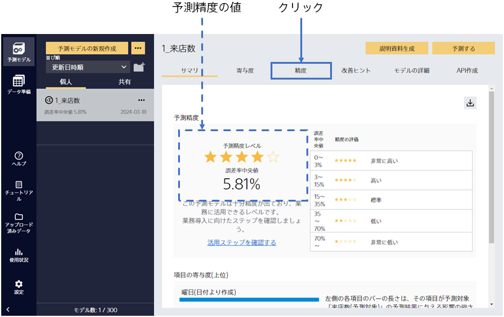
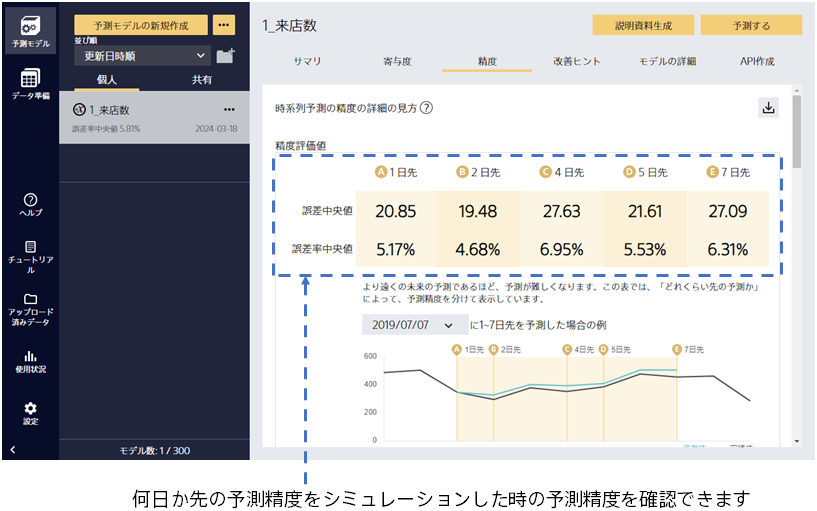
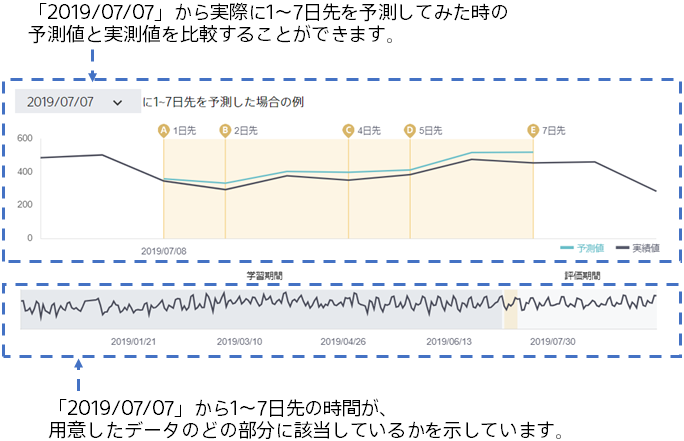
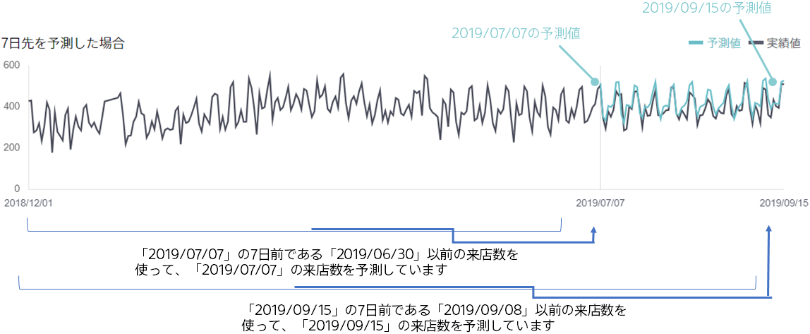
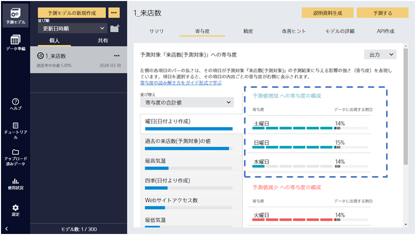
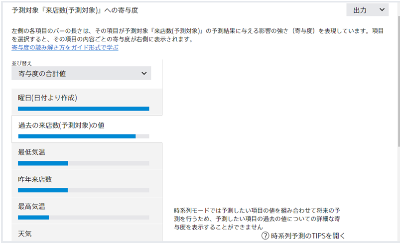
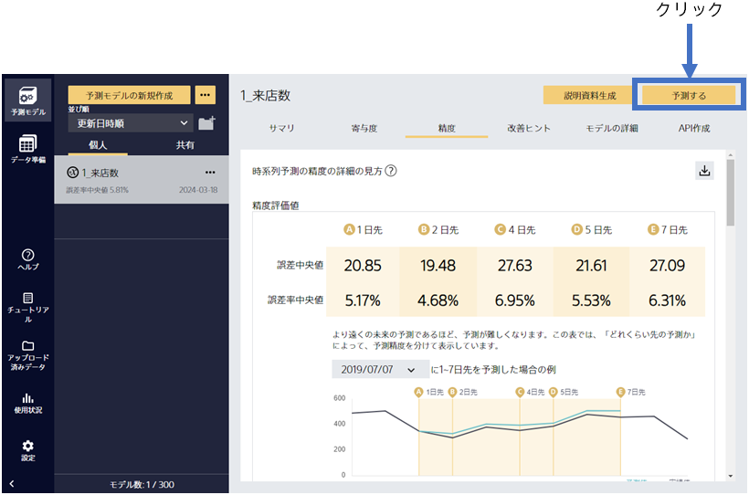

{}

予測モデルの学習後、予測精度の評価までを自動で行います。この画面ではモデルのサマリを確認できます。

予測精度は作成した予測モデルの予測結果と実際の結果を比較することで算出されます。
予測精度レベルの星の数から、高い精度で来店数を予測できる事がわかりました！
{}

{}

「精度」を選択すると、さらに詳細な評価を見ることができます。
さまざまな観点での予測精度の評価値や、予測精度に関する表やグラフが生成されます。下にスクロールすることで、閲覧できます。
{}

{}

精度評価値のすぐ下にあるグラフについて説明します。
このグラフは、ある時間から実際に 1 ～ 7 日先を予測した場合にどのような予測になるかを見ることができます。
たとえば、左の図の場合は「2019/07/07」の時点から実際に 1 日～ 7 日先予測を行った場合に実際の来店数と予測した来店数がどのように変化するかを見ることができます。
さらに下にスクロールしてみましょう。
{}

{}

評価結果の見方を「7 日先を予測した場合」を例に説明をします。

今日から「7 日先」の来店数を予測するとき、どんな情報を使うでしょうか。今日までの来店数を参考にして予測を行うと思います。つまり、予測したい日の「7 日」以上前である今日以前の来店数の情報を参考にしています。

同じように、予測モデルが「7 日」以上前に分かる情報だけを用いて予測した結果が、このグラフの「予測値」となります。
作成した予測モデルが、どの程度「7 日」先の未来を予測できるかどうか確認できます。
{}

{}
「寄与度」をクリックしてください。
この画面では、予測に対してどの入力項目がどう有効かを知ることができます。

来店数予測では、曜日が「日曜日」「土曜日」「水曜日」である場合に来店数が増加することが分かります。
分析した結果が自分の直感と合っているか確認できます。思いもよらない寄与が見つかれば、新しい発見にもなります。

寄与度が比較的高い「過去の来店数(予測対象)の値」について説明します。
時系列モードでは予測を行う時点より過去の実績値を用いて予測を行います。
今回のサンプルデータでは365日前の来店数はデータとして存在しませんが、アルゴリズムとしては予測を行うタイミングの 7 日前・14 日前・365 日前の時点での来店数など特徴的な過去の値を元にして予測を行います。 このような過去の実績値を使って作成された項目が「過去の来店数(予測対象)の値」です。

{}

{}

では、このモデルで予測してみましょう。
次に「予測する」をクリックしてください。
{}
