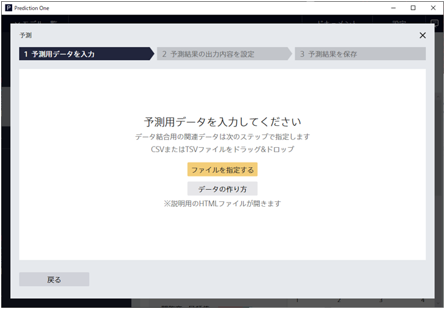
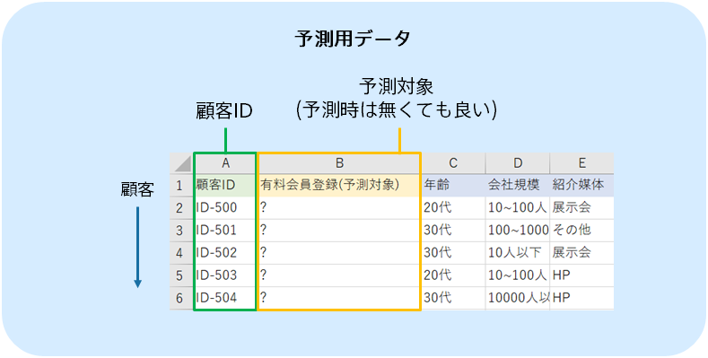
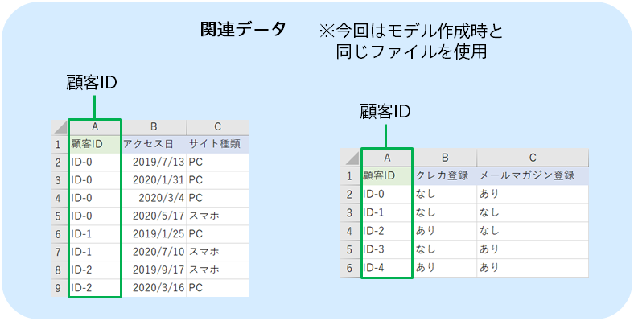
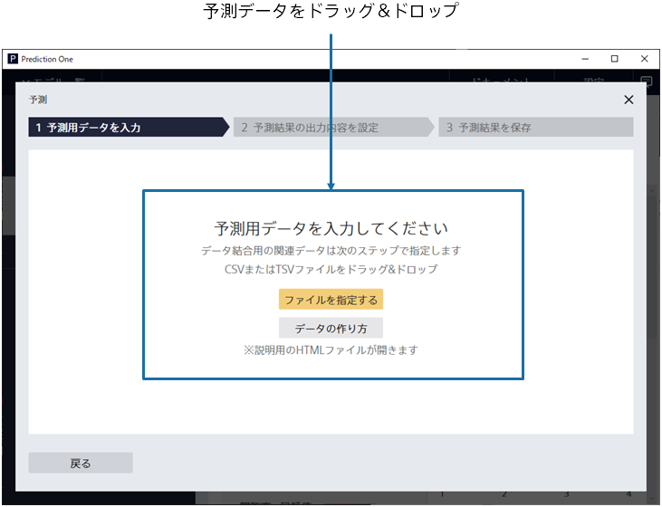
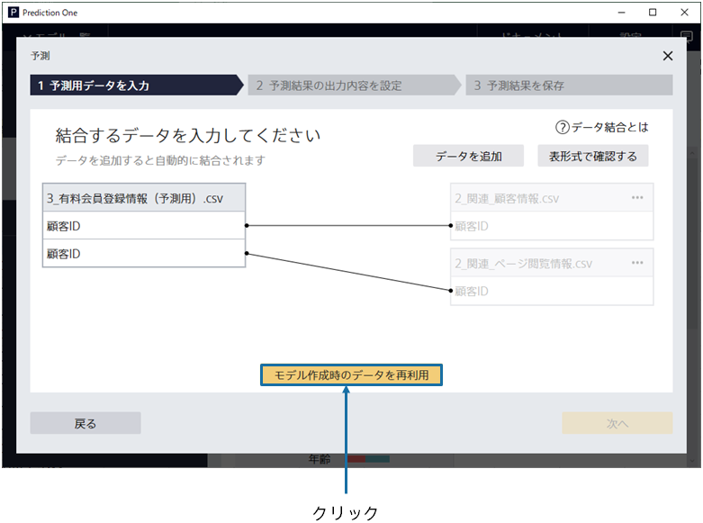
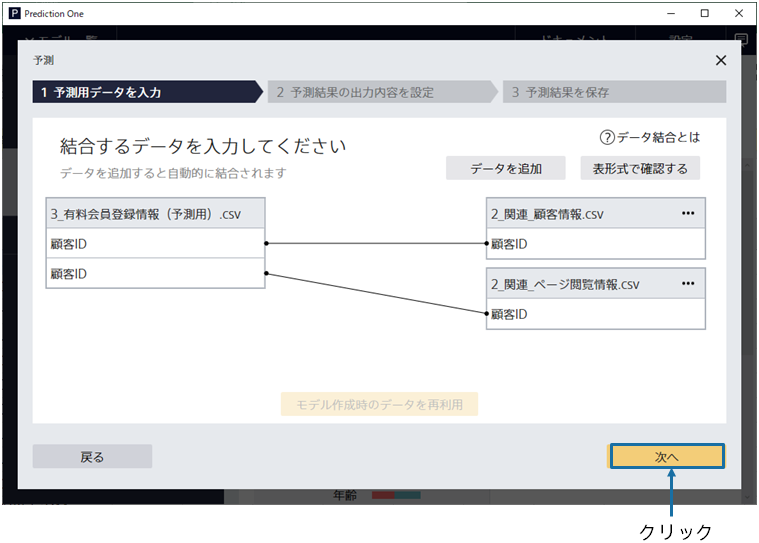
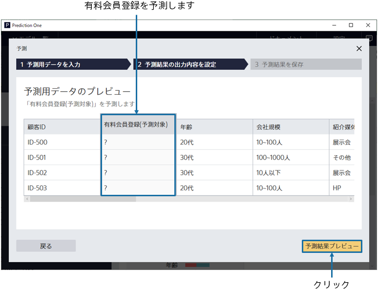
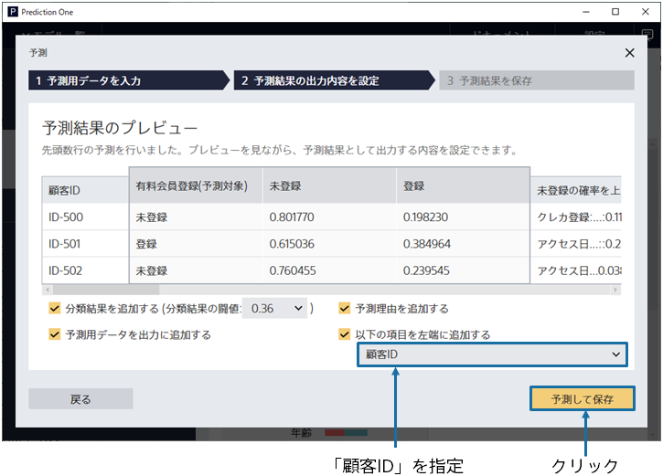
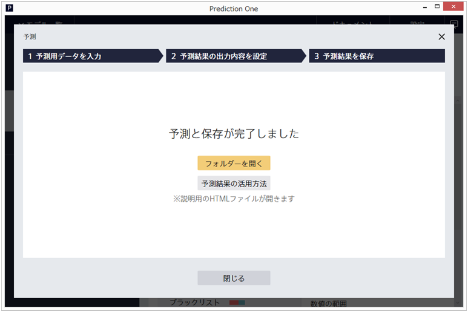
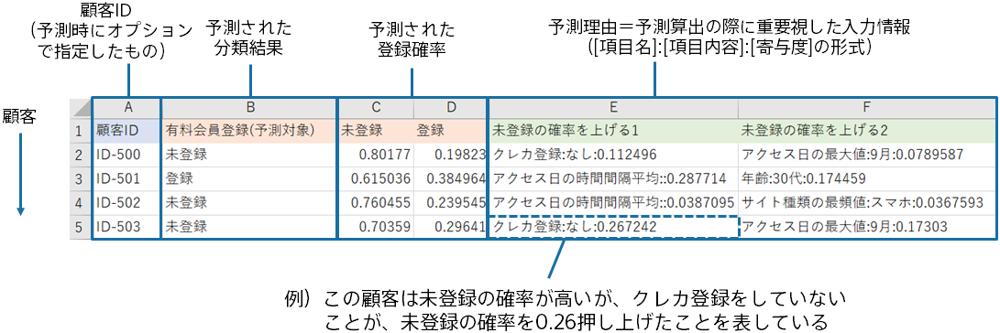

{}

Select the prediction dataset on this screen. Let's review the prediction data used in this tutorial.
{}

{}

Using the prediction model created, we predict the registration probability for customers who have not yet completed paid membership registration (approximately 100 people). 
In this tutorial, you will use sample data that has been prepared for prediction.
Unlike the prediction model creation (training) data, the paid membership registration variable is not used.

{}
{}

{}

Specify the prediction data `3_有料会員登録情報（予測用）.csv` here. 
{}
You can import data by dragging and dropping it into the window or by [Select a File]. 
{}
{}
Click "Select from Uploaded Data" and select the sample data from the data list on the "Samples" tab.
{}

{}
{}

{}

Then specify the related data.
The related data for this tutorial also includes related information about the customers you are predicting, so
Select [Reuse Data Used to Create Models] 
Related data has been added and associated with the prediction data.

Click "Next".

{}

{}

Displays a preview of the combined prediction data.
Predict "Paid Membership Registration (target)" displayed as "?"  from information such as "Age", and "Company Size".

{}
Click [Result Preview].
{}
{}
Click "Run Prediction". Wait a while until the preview screen of the prediction result is displayed.
{}
{}

{}

{}
Please specify "Customer ID" in [Add the following variables to the first column].

Click [Predict and Save].
Make a prediction for each row and save the results.

After clicking [Predict and Save], the Save As dialog appears.
Specify a file name and save the prediction result.
{}
{}
Please specify "Customer ID" in [Add the following variables to the first column].
Click "Save Prediction Results", enter "File name" and click "Save".
{}
{}

{}
When the prediction is complete, the following screen is displayed and the prediction results are saved in the specified file.

Predicted results are output in the following format (this format may vary depending on the option settings).
For each customer, the predicted probability of paid membership registration is calculated.

{}
