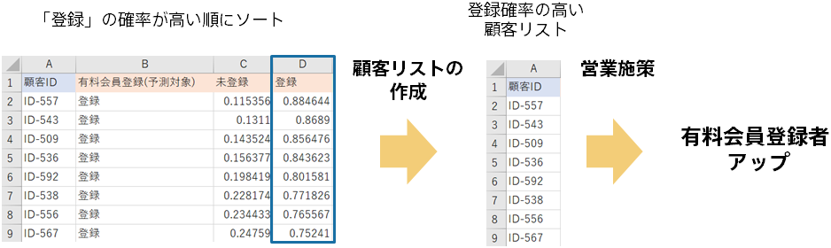

{}

Sorts the file of predicted results in order of the predictive probability of registration.
After sorting, select the highest rank, and make it the target of sales measures as a customer list with high registration probability.
(Share a list of customer IDs with the sales department)

The different types of customers may be reflected in the prediction reasons. It may be reflected in the contents at the time of business.
{}
