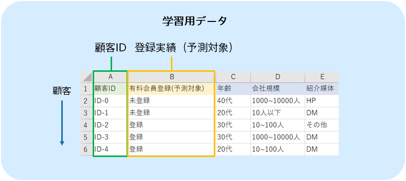
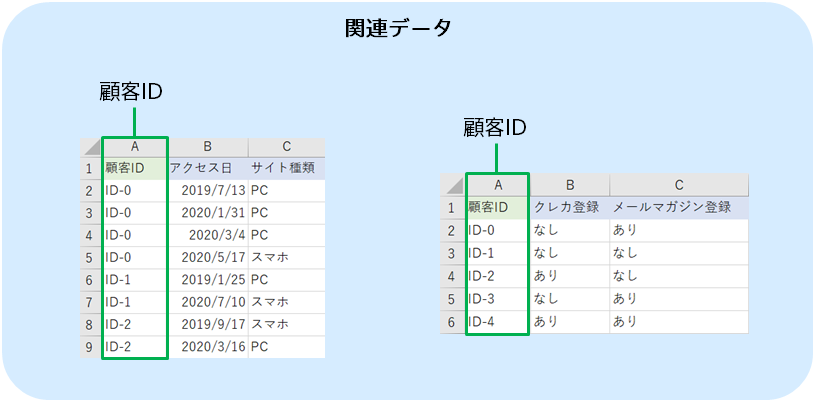

In predictive analytics, a prediction model for predicting paid membership registration is created by using paid membership registration information data as prediction model creation (training) data and customer data and page browsing history data as related data, as follows: The prediction model learns whether the customer signs up for paid membership or not from the prediction model creation (training) data and related data.
This tutorial uses sample datasets that were prepared.

{}

The following pages describe how Prediction One operates.
