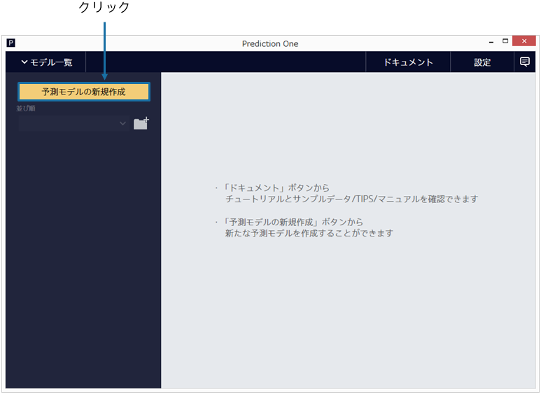
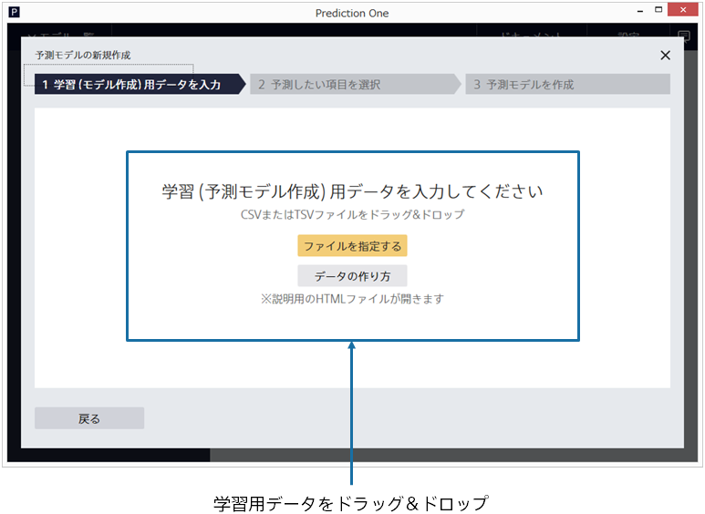
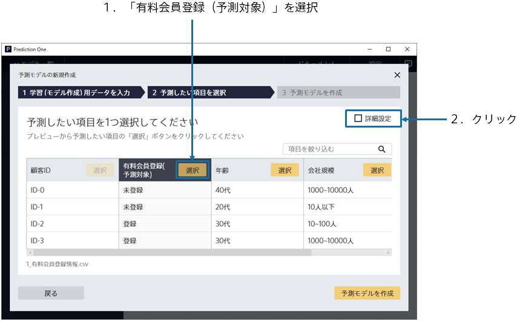
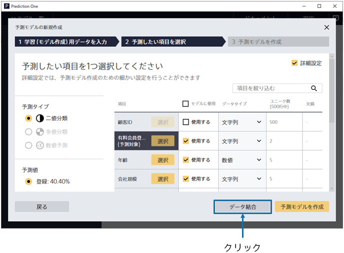

{}

メイン画面が表示されますが、まだ予測モデルは作成されていないので、空の状態です。「予測モデルの新規作成」をクリックしてください。
{}

{}

予測モデル作成(学習)用データである`1_有料会員登録情報.csv`を指定してください。 
{}
データはウィンドウへのドラッグ&ドロップか 「ファイルを指定する」で読み込むことができます。 
{}
{}
サンプルデータは、「アップロード済みのデータから選択」をクリックし、「サンプル」タブのデータ一覧から選択してください。
{}

{}
{}

{}

データ読み込みが完了すると、この画面が表示されます。 
予測したい項目を 1 つ選択してください。(このチュートリアルでは、「有料会員登録(予測対象)」という項目を選択してください) 
選択後、右上にある**詳細設定**のチェックボックスをクリックし、詳細設定モードに入ります。 

詳細設定モード画面右下の **「データ結合」ボタン**をクリックしてください。 
{}
