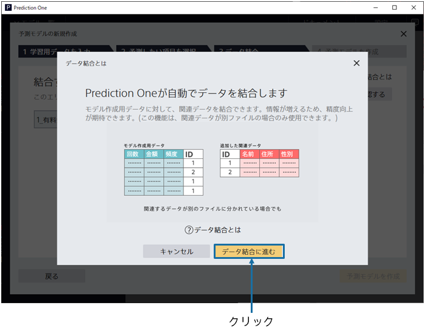
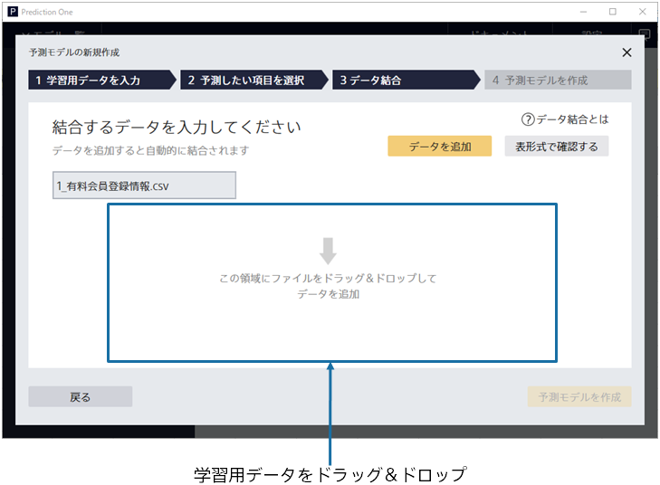
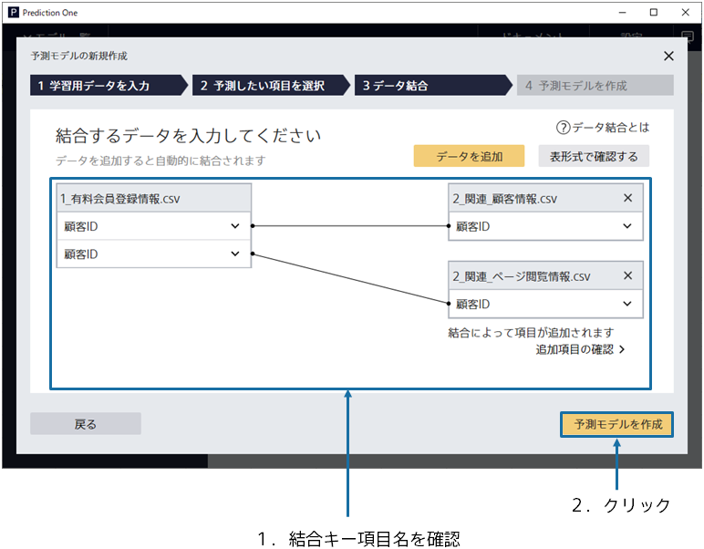
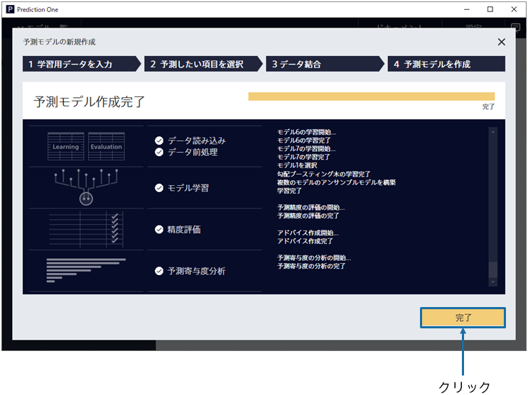

{}

「データ結合」ボタンをクリックすると、データ結合に関するアニメーションウィンドウが立ち上がります。「データ結合に進む」ボタンをクリックしてください。
データ結合画面へ遷移します。

関連データである`2_関連_顧客情報.csv`と`2_関連_ページ閲覧情報.csv`を指定してください。 
ウィンドウへのドラッグ&ドロップか「データを追加」ボタンから読み込むことができます。 

{}

{}

{}

データ読み込みが完了すると、2 つの関連データが画面に追加されます。
また、予測モデル作成(学習)用データと関連データを対応付けている結合キー項目が表示されます。 
結合キー項目が正しく選択されていることを確認し、「予測モデルを作成」ボタンをクリックしてください。 
{}

{}

学習が開始されますので、完了までお待ちください。前処理 → 予測モデル学習 → 精度評価 → 予測寄与度分析の４つの処理が実行されます。 
待ち時間の見積もりが上部に表示されます。データ量が多いほど時間がかかります。 
学習完了後、完了ボタンをクリックしてください。 
{}
