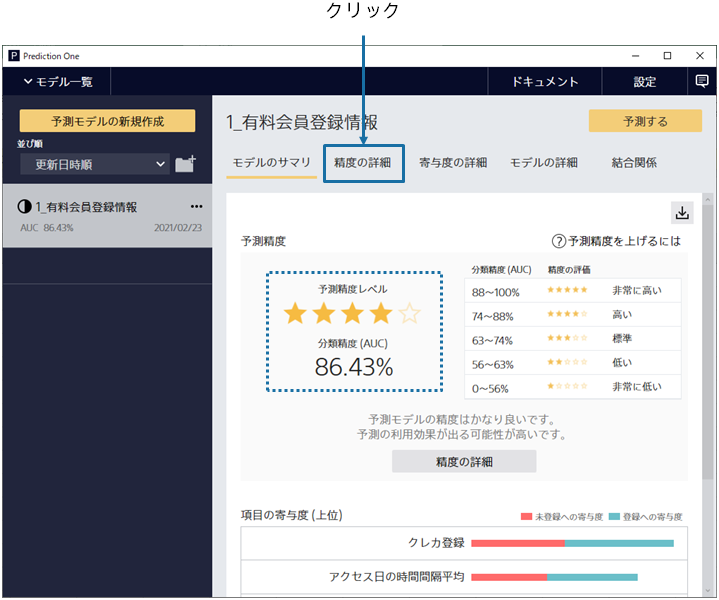
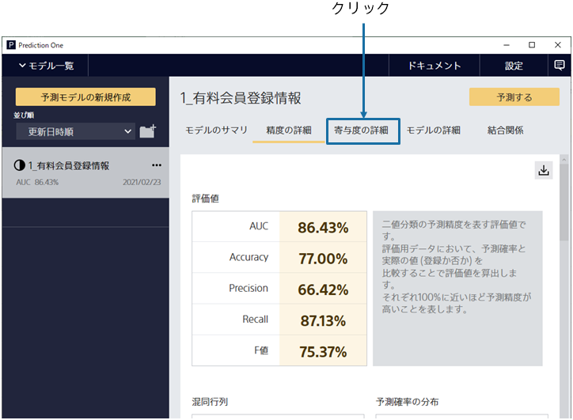

{}

予測モデルの学習後、予測精度の評価までを自動で行います。この画面ではモデルのサマリを確認できます。

予測精度は作成した予測モデルの予測結果と実際の結果を比較することで算出されます。
予測精度レベルの星の数から、良い精度で有料会員の登録を予測できる事がわかりました！
{}

{}

「精度」を選択すると、さらに詳細な評価を見ることができます。
さまざまな観点での予測精度の評価値や、予測精度に関する表やグラフが生成されます。下にスクロールすることで、閲覧できます。
{}

{}

予測精度が高いことはわかりました。では、なぜ予測精度が高いのでしょうか。
「寄与度」をクリックしてください。
{}

{}

入力項目として、「クレカ登録」が有効で、さらに右側の内容から
ユニーク数が多いと購入しやすい等がわかります。

関連データから追加された項目が寄与度の上位にランクインしている事から、
関連データを活用した予測モデルが作成されていることがわかります。

次に「予測する」をクリックしてください。

{}
