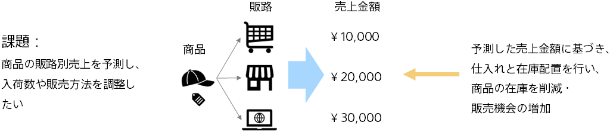

### Introduction: Improvement of restocking plans based on product sales prediction

It is important for businesses to predict sales accurately.

Budgets are created based on sales prediction and allocated to each division, so they have important meaning from management to sales. If the accuracy of sales prediction is low, it becomes a problem.

Predictive analytics enables you to predict sales based on historical performance data and data such as products and sales channels.

- There are many cases where the prediction accuracy is better than when the person in charge predicts with experience and intuition while looking at the data
- In addition, Prediction One can automatically combine and process data even if each piece of information, such as product information and sales channel information, is separated into separate pieces of data.

For example, highly accurate prediction of product sales will lead to more accurate plans for the number of products to be delivered and placed, and improvements in sales strategies.

