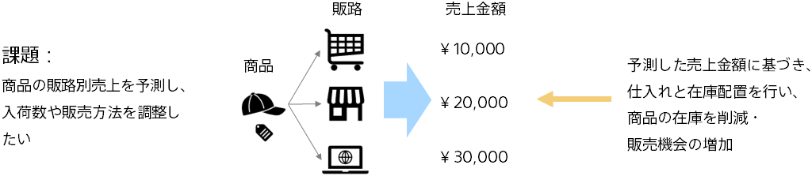

### はじめに～商品売上予測による入荷数計画の改善～

事業において、売上を精度よく予測することは大切です。​

売上予測をもとに予算を作り、各部門等に配分するため、経営から販売の現場まで重要な意味を持ちます。売上予測の精度が低いと、問題になってしまいます。

予測分析を行うと、過去の実績データや商品や販路などのデータに基づいて、売上を予測できます。

- 担当者がデータを見ながら経験と勘で予測する場合に比べて、予測精度が良くなるケースが多くあります
- さらに、商品の情報、販路の情報など各情報が別の複数データに分かれていても Prediction One はデータ結合・加工処理を自動で行うことができます。

たとえば、商品の売上金額を高精度に予測することで、従来よりも正確な入荷・配置数計画や、販売戦略の改善に繋がります。

